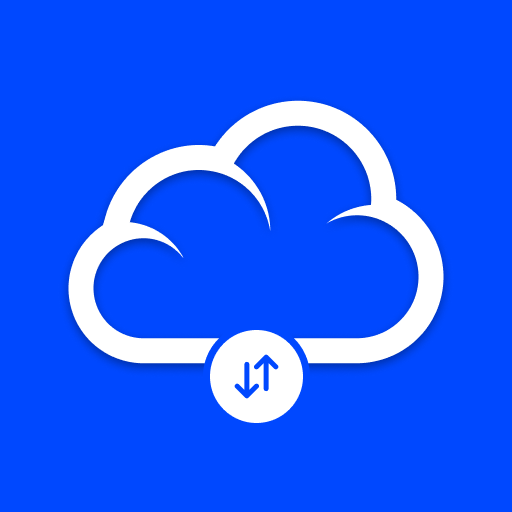
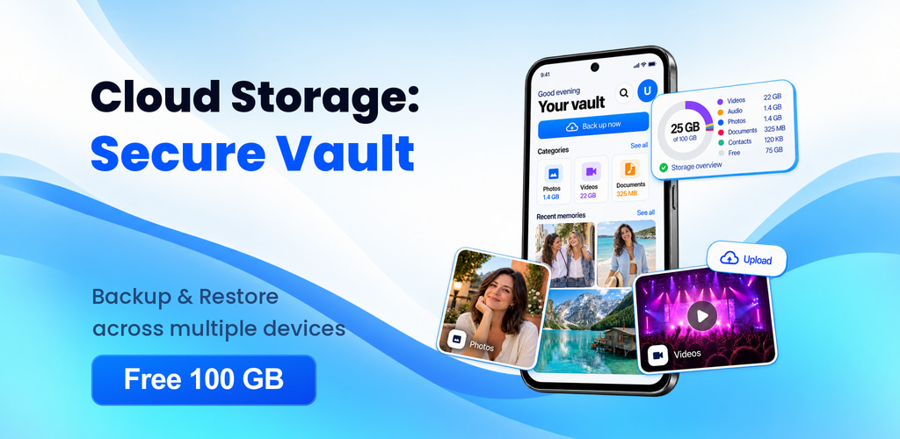
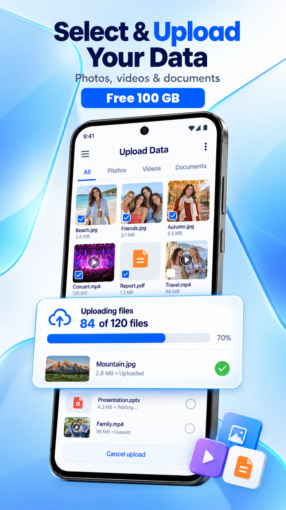
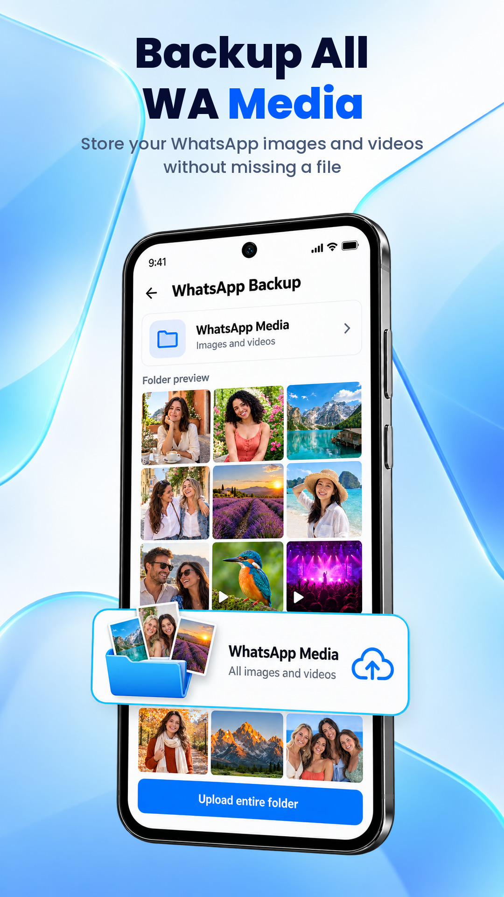
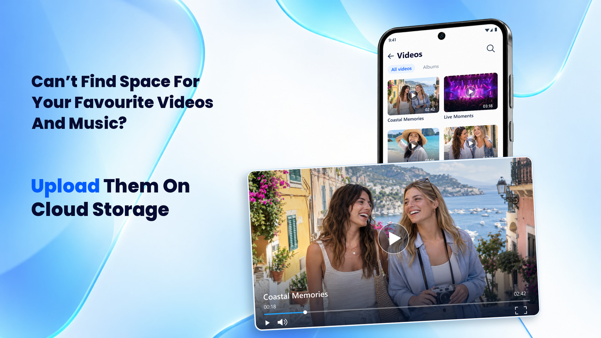
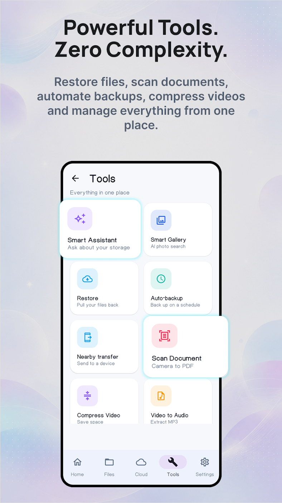

# PlayStore Metadata

> **Generated file: do not edit by hand.** Full visible text of the tab as it renders by default, produced by `node tools/export-docs.js` on 2026-09-22.
> Live page: https://zaeem-ahmad-growth.github.io/Cloud-Storage-App/tabs/02-playstore-metadata/ · Source: [tabs/02-playstore-metadata/index.html](../../tabs/02-playstore-metadata/index.html) · Drawn by [assets/app.js](../../assets/app.js) from [assets/data.js](../../assets/data.js) · Where each section comes from: [code map](../code-map.md#02-playstore-metadata)
> Controls on the page (market pickers, version switches, filters, "show more") change the view; this snapshot shows their default state. The data behind every state is in [assets/data.js](../../assets/data.js), described in the [data dictionary](../data-dictionary.md).

**PlayStore Metadata** · Finalized from the ASO Playbook · United States · English · Listing copied 15 Sept 2026

# Cloud Storage: Secure Vault

Finalized · results pending · Cell Cave · Productivity · Contains ads · In-app purchases $9.99 - $49.99 per item · Rated Everyone · 4 screenshots · Feature graphic

[Google Play listing ↗](https://play.google.com/store/apps/details?id=com.softwarealliance.cloudvault&hl=en&gl=US) · [Privacy policy ↗](https://cloud-vault.tech/privacy.html) · [Developer site ↗](https://cellcave.github.io/cell-cave-website/) · com.softwarealliance.cloudvault

The finalized metadata for this app, targeted from the ASO Playbook’s US keyword board. Every keyword it carries comes from that board, which was built out of the 11 competitors’ own listings, their titles and Play’s autocomplete — 10 of the 37 keywords here were mined from competitors directly. Competitor ranks on this tab are the 15 Sep 2026 baseline; results are pending.

27/30 · title characters

80/80 · short description characters

2,681/4,000 · full description characters

37/94 · board keywords targeted

10/24 · finalized keywords targeted

3 · targeted keywords where your competitors rank

5 · targeted keywords that sit in a competitor’s title

Feature graphic · [original ↗](https://play-lh.googleusercontent.com/hNR2efqDB7DKTDcxyCV967DAEfEDQaphf5xOzO0Wkwvzp2euPSnPlMc6AsGY0GvF4Ho_y2OYJQzKAAqHk2RPrnM)

Screenshot 1 · [original ↗](https://play-lh.googleusercontent.com/VIpZ2wVQ5U2FK2DTSmUUOwg5XSj3Os1i2C16LvBbnQZpdsf3EDxD3QcmL_k256UOCZESLHsLC4I1zRVn8sVl9A)

Screenshot 2 · [original ↗](https://play-lh.googleusercontent.com/W0vhjzGOaSIJmbX8V0Kyx-oopN7csaEtdJC4n_GcCwTPEvJ3U6ysev4jrkRCkzA2197EHyZ7xZrw44mfiYrg)

Screenshot 3 · [original ↗](https://play-lh.googleusercontent.com/A5zVrUYmRoZlakxBqGbfZg1oOIwoIoRAExDKRRiZtgG-o1o92vDE51fWFxYItJ_0H2pHc0VRM4VgPFwRIaugCw)

Screenshot 4 · [original ↗](https://play-lh.googleusercontent.com/vK6Ov71jOTBFlZjHBiKtXKGRf_jYjZb2DyIMnzq4t1kif4aOs8UN87RSvI7tCksMZ5B8kY4oO1h6t2Nivw_R2g)

Metadata · United States

## Title, short description and full description

The finalized metadata for this app. Every keyword it targets from the playbook’s US board is marked.

targeted keyword

Cloud Storage: Secure Vault · Cell Cave · Productivity

Title · 27 / 30

Cloud Storage: Secure Vault

Short description · 80 / 80

Secure, private backup for photos, videos & data. Restore to any phone in a tap.

Full description · 2,681 / 4,000

Running out of space? Move your photos, videos and files to secure cloud storage and free up space on your phone in minutes. Sign up and get free cloud storage instantly — automatic photo backup, a private file vault and easy sharing, all in one simple cloud drive.

Backup your phone to a private cloud — restore files anytime, free up storage.

#### WHY CLOUD STORAGE: SECURE VAULT?

Your phone is not a safe place for your memories. Phones get lost, broken and stolen — your cloud backup doesn’t. Cloud Storage, Secure Vault keeps every photo, video and document safe online and within reach on any device.

#### 100 GB FREE CLOUD STORAGE

- Sign up and get 100 GB of free cloud storage right away.
- Get limited features without account creation, no trial period, no credit card, no countdown timer.
- Paid plans go up to 1 TB if you ever outgrow it, but the free tier stays free.

#### AUTOMATIC PHOTO & VIDEO BACKUP

- Back up photos and videos automatically in the background
- Original quality — no compression, no stripped metadata
- Never lose a memory again, even if you lose your phone
- Free up storage space with one tap once your gallery backup is complete

#### PREVIEW AND PLAY, RIGHT FROM THE CLOUD

- Most backup apps bury your files somewhere you can't actually open them. This one doesn't.
- Browse full-quality photos, stream your video backup, and read documents directly inside the app before you download anything.

#### NEW PHONE? RESTORE IN MINUTES

- Data backup before a factory reset or a device switch.
- Sign in on the new handset and restore.
- Transfer data to a new phone with no cables, no PC and nothing left behind.

#### SECURE CLOUD STORAGE

- Your data is encrypted in transit and at rest
- Lock the app with PIN or biometrics
- A private cloud vault for your most sensitive photos and documents
- We don’t sell your data.
- Export your data or delete your account and everything in it whenever you decide to.

#### SHARE WITHOUT LIMITS

- Share files and albums with a simple link
- Control access and revoke it anytime

#### FREE UP SPACE, KEEP EVERYTHING

Storage full? Don’t delete your memories — move them. Cloud Storage: Secure Vault shows you what’s using your storage space, uploads it safely to the cloud, and clears it from your device. Gigabytes freed, nothing lost.

#### ONE SAFE PLACE FOR EVERYTHING

- Photo storage and video storage in original quality
- Document storage for work and personal files
- File storage for everything else — zips, audio, any format
- Sync across all your devices automatically

Get started free today — download Cloud Storage: Secure Vault, claim your free cloud storage, back up your phone and free up space in minutes. Your files, safe forever.

### Board keywords in the full description

453 words · density = uses × words in phrase ÷ total words

| Phrase | Uses | Density | Tier |
| --- | --- | --- | --- |
| cloud storage | 10 | 4.4% | Core |
| free cloud storage | 4 | 2.6% | Core |
| free up space | 3 | 2.0% | Peripheral |
| secure cloud storage | 2 | 1.3% | Core |
| secure cloud | 2 | 0.9% | Adjacent |
| private cloud | 2 | 0.9% | Adjacent |
| storage space | 2 | 0.9% | Adjacent |
| video backup | 2 | 0.9% | Core |
| drive backup | 1 | 0.4% | Core |
| cloud backup | 1 | 0.4% | Core |
| data backup | 1 | 0.4% | Core |
| cloud drive | 1 | 0.4% | Core |
| photo backup | 1 | 0.4% | Core |
| cloud vault | 1 | 0.4% | Adjacent |
| video storage | 1 | 0.4% | Adjacent |
| photo storage | 1 | 0.4% | Adjacent |
| gallery backup | 1 | 0.4% | Adjacent |
| document storage | 1 | 0.4% | Adjacent |
| file storage | 1 | 0.4% | Adjacent |

### Finalized keywords by field

| In the title | **1** |
| --- | --- |
| secure cloud storage |  |
| Title + short description | **8** |
| cloud storage backup and restore · cloud backup and restore · private cloud storage · cloud backup cloud storage · secure cloud storage backup · cloud photos backup · cloud backup · data backup |  |
| Full description | **1** |
| drive backup |  |
| Reserved for future versions | **14** |
| 100gb cloud storage · 1tb cloud storage · cloud storage drive backup · cloud storage cloud drive · backup and restore app · cloud storage app drive backup · cloud storage backup drive · free cloud storage for android · cloud storage and cloud drive · cloud drive app · cloud storage drive backup app · cloud storage premium · cloud space · cloud storage for android |  |

Targeted keywords · United States · where each one came from

## Every keyword this metadata targets

All board keywords carried by the title, short description and full description, grouped by the field that carries them. The source column shows where each keyword entered the board: mined from a competitor’s listing, lifted from a competitor’s title, suggested by Play autocomplete, or quoted in the 8 Sep report.

| Keyword | Where the keyword came from | Priority | Relevance | Demand | Competitors in top 10 | In competitors’ titles | Smallest app in top 10 |
| --- | --- | --- | --- | --- | --- | --- | --- |
| In the title · 5 keywords · Indexed from the heaviest-weighted field. |  |  |  |  |  |  |  |
| secure cloud storage Core | 8 Sep report | 46 | 90 | 63 | 0 / 11 | none | **34K** S3Drive: Cloud storage · #3 |
| cloud storage Core | 8 Sep report | 35 | 87 | 60 | 0 / 11 | **10** · CloudGate, Fazcon, ANZ Cloud Drive, Cloud Backup (Mapi Directions), Cloud Storage & Drive (Fuzon), Cloud Storage Backup & Drive, Cloud Storage Drive Backup, DataHatch, Cloud Storage-Sync, Cloud storage (Golden) | **34K** S3Drive: Cloud storage · #10 |
| secure cloud Adjacent | 8 Sep report | 30 | 70 | 35 | 0 / 11 | none | **under 1K** Secure Cloud Home · #3 |
| cloud vault Adjacent | 8 Sep report | 27 | 68 | 49 | 0 / 11 | none | **under 1K** CloudVault: Drive Backup · #2 |
| secure storage Adjacent | Competitor metadata | 23 | 66 | 40 | 0 / 11 | none | **2.5K** Secure Digital Storage · #5 |
| Title + short description · 20 keywords · All of the keyword’s words appear across the two strongest fields. |  |  |  |  |  |  |  |
| cloud storage backup and restore Core | Autocomplete | 70 | 100 | 57 | 2 / 11 | none | **3.9K** Cloud Backup and Restore · #4 |
| backup and restore Core | Competitor metadata | 49 | 78 | 88 | 0 / 11 | none | **27K** Cloud Backup and Data Restore · #2 |
| cloud backup and restore Core | Autocomplete | 46 | 85 | 68 | 0 / 11 | none | **27K** Cloud Backup and Data Restore · #4 |
| data backup and restore Core | Autocomplete | 44 | 76 | 68 | 0 / 11 | none | **under 1K** App Backup and Restore Pro · #4 |
| private cloud storage Core | 8 Sep report | 43 | 90 | 63 | 0 / 11 | none | **34K** S3Drive: Cloud storage · #4 |
| phone backup and restore Core | Autocomplete | 43 | 76 | 55 | 0 / 11 | none | **under 1K** App Backup and Restore Pro · #8 |
| cloud backup cloud storage Core | Competitor title | 40 | 100 | 0 | 2 / 11 | none | **27K** Cloud Backup and Data Restore · #6 |
| secure cloud storage backup Core | Competitor title | 40 | 90 | 56 | 0 / 11 | none | **27K** Cloud Backup and Data Restore · #8 |
| cloud photos backup Core | Autocomplete | 39 | 87 | 47 | 0 / 11 | none | **3.9K** Cloud Backup and Restore · #7 |
| cloud backup Core | 8 Sep report | 38 | 87 | 60 | 0 / 11 | **1** · Cloud Backup (Mapi Directions) | **27K** Cloud Backup and Data Restore · #10 |
| data backup Core | 8 Sep report | 38 | 83 | 40 | 0 / 11 | none | **under 1K** App Backup and Restore Pro · #8 |
| cloud photos Core | 8 Sep report | 37 | 90 | 38 | 0 / 11 | none | **34K** S3Drive: Cloud storage · #10 |
| cloud storage photos Core | Autocomplete | 36 | 93 | 35 | 1 / 11 | none | **75K** Cloud Storage Backup & Restore · #8 |
| phone backup Core | 8 Sep report | 35 | 79 | 38 | 0 / 11 | none | **27K** Cloud Backup and Data Restore · #7 |
| cloud storage backup Core | Competitor metadata | 34 | 88 | 35 | 0 / 11 | **1** · Cloud Storage Backup & Drive | **27K** Cloud Backup and Data Restore · #8 |
| backup photos Core | Competitor metadata | 33 | 85 | 66 | 0 / 11 | none | **170K** Ente Photos - Encrypted Backup · #4 |
| backup photos and videos Core | 8 Sep report | 31 | 80 | 55 | 0 / 11 | none | **170K** Ente Photos - Encrypted Backup · #5 |
| cloud storage data backup Core | Autocomplete | 29 | 90 | 48 | 0 / 11 | none | **3M** Cloud Storage: Data Backup · #1 |
| private cloud Adjacent | 8 Sep report | 19 | 69 | 38 | 0 / 11 | none | **34K** S3Drive: Cloud storage · #2 |
| data restore Adjacent | Competitor metadata | 14 | 47 | 40 | 0 / 11 | none | **under 1K** App Backup and Restore Pro · #8 |
| Full description · 12 keywords · Exact phrase used in the indexed full description. |  |  |  |  |  |  |  |
| drive backup Core | Competitor metadata | 40 | 88 | 40 | 0 / 11 | **3** · Cloud Storage Drive Backup, Cloud Storage-Sync, Cloud storage (Golden) | **27K** Cloud Backup and Data Restore · #9 |
| cloud drive Core | 8 Sep report | 35 | 90 | 56 | 0 / 11 | **3** · Fazcon, ANZ Cloud Drive, Cloud Storage & Drive (Fuzon) | **522K** Total Drive - Cloud Storage · #4 |
| free cloud storage Core | 8 Sep report | 29 | 87 | 44 | 0 / 11 | none | **405K** Icedrive: Secure Cloud Storage · #9 |
| photo backup Core | 8 Sep report | 29 | 82 | 49 | 0 / 11 | none | **170K** Ente Photos - Encrypted Backup · #5 |
| video storage Adjacent | Competitor metadata | 22 | 71 | 38 | 0 / 11 | none | **34K** S3Drive: Cloud storage · #9 |
| photo storage Adjacent | 8 Sep report | 18 | 63 | 49 | 0 / 11 | none | **170K** Ente Photos - Encrypted Backup · #10 |
| gallery backup Adjacent | 8 Sep report | 18 | 65 | 40 | 0 / 11 | none | **170K** Ente Photos - Encrypted Backup · #2 |
| document storage Adjacent | 8 Sep report | 16 | 53 | 33 | 0 / 11 | none | **36K** DocVault - Document Manager · #3 |
| storage space Adjacent | Competitor metadata | 16 | 56 | 49 | 0 / 11 | none | **48K** Storage Space & Analyzer · #5 |
| file storage Adjacent | 8 Sep report | 15 | 63 | 40 | 0 / 11 | none | **9.8M** File Manager · #7 |
| video backup Core | 8 Sep report | 13 | 80 | 19 | 0 / 11 | none | **91.4M** Dumpster: Photo/Video Recovery · #6 |
| free up space Peripheral | 8 Sep report | 2 | 17 | 55 | 0 / 11 | none | **159K** Phone Storage Cleaner: Cleanup · #10 |

This metadata targets 37 of the board’s 94 US keywords: 8 mined from competitors’ listings, 2 lifted from competitors’ titles, 7 from Play autocomplete and 20 quoted in the 8 Sep report. 5 of them appear word for word in at least one competitor’s title, and your competitors hold top-10 ranks on 3.

Composition · from the ASO Playbook

## How this metadata follows the ASO Playbook

What each field is built to carry, the evidence behind the title decision, and the playbook practices this metadata applies.

|  | Text | Board keywords it carries | Playbook source |
| --- | --- | --- | --- |
| Title | **Cloud Storage: Secure Vault** 27 / 30 | **5** secure cloud storage cloud storage secure cloud cloud vault secure storage | Title strategy: the generic head term first, paired with a low-competition term. Playbook practice: the title is the heaviest-weighted field and leads with the highest-volume generic keyword. |
| Short description | Secure, private backup for photos, videos & data. Restore to any phone in a tap. 80 / 80 | **20** cloud storage backup and restore backup and restore cloud backup and restore data backup and restore private cloud storage phone backup and restore cloud backup cloud storage secure cloud storage backup cloud photos backup cloud backup + 10 more | Proposed ASO package: the recommended short description, used word for word. Playbook practice: complementary keywords, not title repeats, phrased as a conversion message. |
| Full description | 2,681 characters · 453 words | **12** drive backup cloud drive free cloud storage photo backup video storage photo storage gallery backup document storage storage space file storage + 2 more | Keyword board in priority order, front-loaded into the opening paragraph, headers and bullet starts, at the density recorded below. |

### Title strategy: generic + low competition

“Cloud Storage: Secure Vault” pairs a head term with a term your competitors don’t contest.

| **cloud storage** Generic head term | Autocomplete demand 60 (suggested after “cloud s”) · board priority 35 · 0 of 11 competitors in the top 10 · 1 non-brand apps in the top 10. |
| --- | --- |
| **secure vault** Low-competition term | Autocomplete demand 40 (suggested after “secure vau”) · 0 of 11 competitors among its 12 results. |
| **cloud vault** Covered by the title’s words | Board priority 27 · relevance 68 · 0 of 11 competitors in the top 10 · 4 non-brand apps in the top 10. |
| **secure cloud storage** Covered by the title’s words | Board priority 46 · relevance 90 · 0 of 11 competitors in the top 10 · entry bar 34K. |

### Playbook practices this metadata applies

- Keywords come from the board, not from guesswork: 10 of the 37 targeted keywords were mined from the 11 competitors’ listings and titles.
- The short description is the playbook’s recommended short description, word for word.
- Head term first: the title opens with “cloud storage”, the generic term the category is searched by.
- Title and short description together carry 9 finalized keywords in the two strongest fields.
- Claims match the listing: no “No ads” line against an ads-supported app, no template placeholder, and the account wording matches the sign-up flow.
- Every metadata policy rule checked is met (12), with 4 values recorded for reference.

### Metadata policy record

| Status | Rule | Detail |
| --- | --- | --- |
| ✓ Met | **Title within 30 characters** | 27 / 30. |
| ✓ Met | **Title free of emoji, all caps, “best”, “#1”, “free” and sale wording** | None present. |
| ✓ Met | **Title distinct from other apps’ titles** | No exact match among 522 app titles on the board’s results. |
| ✓ Met | **Short description within 80 characters** | 80 / 80. |
| ✓ Met | **Full description within 4,000 characters** | 2,681 / 4,000. |
| ✓ Met | **No template placeholders** | None present. |
| ✓ Met | **Ad wording matches Google Play’s “Contains ads” label** | No “No ads” claim in the text. |
| ✓ Met | **Account wording consistent** | Sign-up unlocks the free storage; “limited features without account creation” describes the no-account level. |
| ✓ Met | **No keyword stuffing: no phrase repeated without purpose** | Every repeated phrase names a feature the app ships; no phrase list, no comma-separated keyword block. |
| • Recorded | **Head-term density, measured against the competitive set** | “cloud storage” runs 4.4% of description words (10 uses in 453 words). Your 11 competitors run 3.7–10.5% (median 4.9%), and 11 of them sit above 3%, 7 of them above this listing. It is the app’s core niche term, so the level is recorded, not treated as a violation. |
| ✓ Met | **Every other phrase below 3% of description words** | Highest after the head term: “free cloud storage” 2.6%, “free up space” 2.0%, “secure cloud storage” 1.3%. |
| • Recorded | **Storage amounts declared** | “100 GB FREE CLOUD STORAGE” · in-app prices $9.99 - $49.99 per item. |
| • Recorded | **Screenshots** | 4 published (8 phone slots available); your competitors publish 5–14. |
| ✓ Met | **Feature graphic published** | Published. |
| • Recorded | **Category** | Productivity · 9 of your 11 competitors use the same category. |
| ✓ Met | **Privacy policy linked** | Linked. |

Keyword analysis · United States · from “Keyword opportunity board, relevance first”

## Finalized keywords

The 24 highest-priority keywords on the US board that pass the relevance bar (core or adjacent intent, relevance 80 or above), split by whether this metadata targets them. Each row carries the playbook’s proof and the competitors that rank for it.

### Targeted in this metadata · 10 of 24

| # | Keyword | Priority | Relevance | Winnable | Demand | Entry bar | Competitors ranking (US) | Targeted in |
| --- | --- | --- | --- | --- | --- | --- | --- | --- |
| 1 | cloud storage backup and restore Core Autocomplete | **70** | 100 | 8/10 | 57 after “cloud storage b” | **3.9K** Cloud Backup and Restore · #4 | **Cloud Storage Backup & Drive** #7 **Fazcon** #10 **Cloud Storage-Sync** #17 **Cloud Backup (Mapi Directions)** #25 **Cloud Storage & Drive (Fuzon)** #26 | Title + short · all words |
| 7 | secure cloud storage Core 8 Sep report | **46** | 90 | 5/10 | 63 after “secure clo” | **34K** S3Drive: Cloud storage · #3 | None in results | Title · all words · long ×2 |
| 8 | cloud backup and restore Core Autocomplete | **46** | 85 | 6/10 | 68 after “cloud bac” | **27K** Cloud Backup and Data Restore · #4 | None in results | Title + short · all words |
| 9 | private cloud storage Core 8 Sep report | **43** | 90 | 3/10 | 63 after “private clo” | **34K** S3Drive: Cloud storage · #4 | None in results | Title + short · all words |
| 16 | drive backup Core Competitor metadata | **40** | 88 | 5/10 | 40 after “drive bac” | **27K** Cloud Backup and Data Restore · #9 | None in results | Long description ×1 |
| 17 | cloud backup cloud storage Core Competitor title | **40** | 100 | 5/10 | 0 not suggested | **27K** Cloud Backup and Data Restore · #6 | **Cloud Backup (Mapi Directions)** #2 **Fazcon** #9 **Cloud Storage-Sync** #11 **CloudGate** #14 **Cloud Storage Backup & Drive** #16 | Title + short · all words |
| 18 | secure cloud storage backup Core Competitor title | **40** | 90 | 3/10 | 56 after “secure cloud” | **27K** Cloud Backup and Data Restore · #8 | None in results | Title + short · all words |
| 22 | cloud photos backup Core Autocomplete | **39** | 87 | 3/10 | 47 after “cloud photos” | **3.9K** Cloud Backup and Restore · #7 | None in results | Title + short · all words |
| 23 | cloud backup Core 8 Sep report | **38** | 87 | 2/10 | 60 after “cloud b” | **27K** Cloud Backup and Data Restore · #10 | None in results | Title + short · all words · long ×1 |
| 24 | data backup Core 8 Sep report | **38** | 83 | 4/10 | 40 after “data bac” | **under 1K** App Backup and Restore Pro · #8 | None in results | Title + short · all words · long ×1 |

### Reserved for future metadata versions · 14 of 24

| # | Keyword | Priority | Relevance | Winnable | Demand | Entry bar | Competitors ranking (US) |
| --- | --- | --- | --- | --- | --- | --- | --- |
| 2 | 100gb cloud storage Core Competitor title | **64** | 100 | 3/10 | 75 after “100gb c” | **under 1K** Cloud Storage: 1 TB Backup · #10 | **Fazcon** #5 **Cloud Storage & Drive (Fuzon)** #11 **CloudGate** #13 |
| 3 | 1tb cloud storage Core Competitor metadata | **53** | 90 | 4/10 | 100 after “1tb” | **34K** S3Drive: Cloud storage · #8 | None in results |
| 4 | cloud storage drive backup Core Competitor title | **53** | 100 | 4/10 | 55 after “cloud storage d” | **27K** Cloud Backup and Data Restore · #7 | **Cloud Storage-Sync** #1 **Cloud Storage Drive Backup** #2 **Fazcon** #6 |
| 5 | cloud storage cloud drive Core Competitor title | **52** | 97 | 5/10 | 40 after “cloud storage clo” | **under 1K** Cloud storage - Cloud Drive · #2 | **Fazcon** #1 **Cloud Storage & Drive (Fuzon)** #7 |
| 6 | backup and restore app Core Autocomplete | **48** | 80 | 10/10 | 67 after “backup a” | **27K** Cloud Backup and Data Restore · #5 | None in results |
| 10 | cloud storage app drive backup Core Competitor title | **43** | 100 | 4/10 | 0 not suggested | **3.6K** Cloud Storage App Drive Backup · #1 | **Cloud storage (Golden)** #1 **Cloud Storage Drive Backup** #3 **Fazcon** #8 **Cloud Storage Backup & Drive** #12 |
| 11 | cloud storage backup drive Core Competitor title | **42** | 97 | 5/10 | 27 after “cloud storage backup d” | **75K** Cloud Storage Backup & Restore · #4 | **Cloud Storage Backup & Drive** #2 **Cloud Storage-Sync** #8 |
| 12 | free cloud storage for android Core Autocomplete | **42** | 87 | 2/10 | 79 after “free clo” | **34K** S3Drive: Cloud storage · #7 | None in results |
| 13 | cloud storage and cloud drive Core Autocomplete | **42** | 93 | 3/10 | 49 after “cloud storage a” | **34K** S3Drive: Cloud storage · #6 | **Cloud Storage & Drive (Fuzon)** #11 |
| 14 | cloud drive app Core Autocomplete | **42** | 90 | 3/10 | 59 after “cloud dri” | **34K** S3Drive: Cloud storage · #6 | None in results |
| 15 | cloud storage drive backup app Core Autocomplete | **41** | 90 | 2/10 | 60 after “cloud storage d” | **34K** S3Drive: Cloud storage · #6 | None in results |
| 19 | cloud storage premium Core Autocomplete | **40** | 93 | 4/10 | 33 after “cloud storage p” | **34K** S3Drive: Cloud storage · #6 | **Fazcon** #8 |
| 20 | cloud space Core 8 Sep report | **39** | 87 | 4/10 | 35 after “cloud spa” | **under 1K** Cloud Storage : Cloud Backup · #4 | None in results |
| 21 | cloud storage for android Core Autocomplete | **39** | 87 | 1/10 | 77 after “cloud s” | **34K** S3Drive: Cloud storage · #10 | None in results |

A keyword counts as targeted when its exact phrase, or all of its words, appear in the title or across title and short description, or its exact phrase appears in the full description. # is the keyword’s position on the finalized list. The plan-size keywords (“100gb cloud storage”, “1tb cloud storage”) are on the list because this metadata advertises 100 GB free and 1 TB plans.

Roadmap · United States

## Launch keyword ladder of this metadata

The playbook’s US ladder with the keywords this metadata targets at each rung: T = in the title, T+S = every word across title and short description, S = short description, L = full description, and a dash = not in this version. The count after each keyword is how many of your competitors hold a top-10 rank there.

Phase 0 · launch → 10K · weeks 0–6

- cloud storage backup and restore *P70*T+S *· 2 comp. top-10*
- 100gb cloud storage *P64*— *· 1 comp. top-10*
- cloud storage cloud drive *P52*— *· 2 comp. top-10*
- cloud storage app drive backup *P43*— *· 3 comp. top-10*

This metadata targets **1** in the title or short description and **0** in the full description; **3** are not in this version. Competitors hold 8 top-10 ranks across these keywords.

Phase 1 · 10K → 100K

- backup and restore *P49*T+S *· 0 comp. top-10*
- backup and restore app *P48*— *· 0 comp. top-10*
- secure cloud storage *P46*T *· 0 comp. top-10*
- cloud backup and restore *P46*T+S *· 0 comp. top-10*
- data backup and restore *P44*T+S *· 0 comp. top-10*
- phone backup and restore *P43*T+S *· 0 comp. top-10*

This metadata targets **5** in the title or short description and **0** in the full description; **1** is not in this version. Competitors hold 0 top-10 ranks across these keywords.

Phase 2 · 100K → 1M

- 1tb cloud storage *P53*— *· 0 comp. top-10*
- cloud storage drive backup *P53*— *· 3 comp. top-10*
- private cloud storage *P43*T+S *· 0 comp. top-10*
- cloud storage backup drive *P42*— *· 2 comp. top-10*
- cloud storage and cloud drive *P42*— *· 0 comp. top-10*
- cloud drive app *P42*— *· 0 comp. top-10*

This metadata targets **1** in the title or short description and **0** in the full description; **5** are not in this version. Competitors hold 5 top-10 ranks across these keywords.

Phase 3 · 1M+

- free cloud storage for android *P42*— *· 0 comp. top-10*
- cloud storage drive backup app *P41*— *· 0 comp. top-10*
- cloud storage for android *P39*— *· 0 comp. top-10*
- cloud backup *P38*T+S *· 0 comp. top-10*
- cloud drive storage *P38*— *· 0 comp. top-10*
- cloud storage drive *P36*— *· 0 comp. top-10*

This metadata targets **1** in the title or short description and **0** in the full description; **5** are not in this version. Competitors hold 0 top-10 ranks across these keywords.

Competitor rankings · United States · keywords in this metadata

## How your competitors rank on the keywords you use

Every board keyword this metadata carries, with the rank each of your 11 competitors holds for it in US search. Keywords where at least one competitor ranks come first, then the rest; each group is sorted by relevance, then priority.

#1–3 · #4–10 · #11–20 · #21–30 · not in results

| Keyword · where this metadata uses it | Relevance | Priority | CloudGate | Fazcon | ANZ Cloud Drive | Cloud Backup (Mapi Directions) | Cloud Storage & Drive (Fuzon) | Cloud Storage Backup & Drive | Cloud Storage Drive Backup | DataHatch | Cloud Storage-Sync | Cloud storage (Golden) | Nova Cloud | Competitors in top 10 | Smallest app in top 10 |
| --- | --- | --- | --- | --- | --- | --- | --- | --- | --- | --- | --- | --- | --- | --- | --- |
| Competitors rank on these · 3 |  |  |  |  |  |  |  |  |  |  |  |  |  |  |  |
| cloud storage backup and restore Title + short · all words | 100 | 70 | · | 10 | · | 25 | 26 | 7 | · | · | 17 | · | · | **2** / 11 | **3.9K** Cloud Backup and Restore · #4 |
| cloud backup cloud storage Title + short · all words | 100 | 40 | 14 | 9 | · | 2 | · | 16 | · | · | 11 | · | · | **2** / 11 | **27K** Cloud Backup and Data Restore · #6 |
| cloud storage photos Title + short · all words | 93 | 36 | · | 6 | · | · | · | · | · | · | · | · | · | **1** / 11 | **75K** Cloud Storage Backup & Restore · #8 |
| No competitor in the results · 34 |  |  |  |  |  |  |  |  |  |  |  |  |  |  |  |
| secure cloud storage Title · all words · long ×2 | 90 | 46 | · | · | · | · | · | · | · | · | · | · | · | **0** / 11 | **34K** S3Drive: Cloud storage · #3 |
| private cloud storage Title + short · all words | 90 | 43 | · | · | · | · | · | · | · | · | · | · | · | **0** / 11 | **34K** S3Drive: Cloud storage · #4 |
| secure cloud storage backup Title + short · all words | 90 | 40 | · | · | · | · | · | · | · | · | · | · | · | **0** / 11 | **27K** Cloud Backup and Data Restore · #8 |
| cloud photos Title + short · all words | 90 | 37 | · | · | · | · | · | · | · | · | · | · | · | **0** / 11 | **34K** S3Drive: Cloud storage · #10 |
| cloud drive Long description ×1 | 90 | 35 | · | · | · | · | · | · | · | · | · | · | · | **0** / 11 | **522K** Total Drive - Cloud Storage · #4 |
| cloud storage data backup Title + short · all words | 90 | 29 | · | · | · | · | · | · | · | · | · | · | · | **0** / 11 | **3M** Cloud Storage: Data Backup · #1 |
| drive backup Long description ×1 | 88 | 40 | · | · | · | · | · | · | · | · | · | · | · | **0** / 11 | **27K** Cloud Backup and Data Restore · #9 |
| cloud storage backup Title + short · all words | 88 | 34 | · | · | · | · | · | · | · | · | · | · | · | **0** / 11 | **27K** Cloud Backup and Data Restore · #8 |
| cloud photos backup Title + short · all words | 87 | 39 | · | · | · | · | · | · | · | · | · | · | · | **0** / 11 | **3.9K** Cloud Backup and Restore · #7 |
| cloud backup Title + short · all words · long ×1 | 87 | 38 | · | · | · | · | · | · | · | · | · | · | · | **0** / 11 | **27K** Cloud Backup and Data Restore · #10 |
| cloud storage Title · exact phrase · long ×10 | 87 | 35 | · | · | · | · | · | · | · | · | · | · | · | **0** / 11 | **34K** S3Drive: Cloud storage · #10 |
| free cloud storage Long description ×4 | 87 | 29 | · | · | · | · | · | · | · | · | · | · | · | **0** / 11 | **405K** Icedrive: Secure Cloud Storage · #9 |
| cloud backup and restore Title + short · all words | 85 | 46 | · | · | · | · | · | · | · | · | · | · | · | **0** / 11 | **27K** Cloud Backup and Data Restore · #4 |
| backup photos Title + short · all words | 85 | 33 | · | · | · | · | · | · | · | · | · | · | · | **0** / 11 | **170K** Ente Photos - Encrypted Backup · #4 |
| data backup Title + short · all words · long ×1 | 83 | 38 | · | · | · | · | · | · | · | · | · | · | · | **0** / 11 | **under 1K** App Backup and Restore Pro · #8 |
| photo backup Long description ×1 | 82 | 29 | · | · | · | · | · | · | · | · | · | · | · | **0** / 11 | **170K** Ente Photos - Encrypted Backup · #5 |
| backup photos and videos Title + short · all words | 80 | 31 | · | · | · | · | · | · | · | · | · | · | · | **0** / 11 | **170K** Ente Photos - Encrypted Backup · #5 |
| video backup Long description ×2 | 80 | 13 | · | · | · | · | · | · | · | · | · | · | · | **0** / 11 | **91.4M** Dumpster: Photo/Video Recovery · #6 |
| phone backup Title + short · all words | 79 | 35 | · | · | · | · | · | · | · | · | · | · | · | **0** / 11 | **27K** Cloud Backup and Data Restore · #7 |
| backup and restore Title + short · all words | 78 | 49 | · | · | · | · | · | · | · | · | · | · | · | **0** / 11 | **27K** Cloud Backup and Data Restore · #2 |
| data backup and restore Title + short · all words | 76 | 44 | · | · | · | · | · | · | · | · | · | · | · | **0** / 11 | **under 1K** App Backup and Restore Pro · #4 |
| phone backup and restore Title + short · all words | 76 | 43 | · | · | · | · | · | · | · | · | · | · | · | **0** / 11 | **under 1K** App Backup and Restore Pro · #8 |
| video storage Long description ×1 | 71 | 22 | · | · | · | · | · | · | · | · | · | · | · | **0** / 11 | **34K** S3Drive: Cloud storage · #9 |
| secure cloud Title · all words · long ×2 | 70 | 30 | · | · | · | · | · | · | · | · | · | · | · | **0** / 11 | **under 1K** Secure Cloud Home · #3 |
| private cloud Title + short · all words · long ×2 | 69 | 19 | · | · | · | · | · | · | · | · | · | · | · | **0** / 11 | **34K** S3Drive: Cloud storage · #2 |
| cloud vault Title · all words · long ×1 | 68 | 27 | · | · | · | · | · | · | · | · | · | · | · | **0** / 11 | **under 1K** CloudVault: Drive Backup · #2 |
| secure storage Title · all words | 66 | 23 | · | · | · | · | · | · | · | · | · | · | · | **0** / 11 | **2.5K** Secure Digital Storage · #5 |
| gallery backup Long description ×1 | 65 | 18 | · | · | · | · | · | · | · | · | · | · | · | **0** / 11 | **170K** Ente Photos - Encrypted Backup · #2 |
| photo storage Long description ×1 | 63 | 18 | · | · | · | · | · | · | · | · | · | · | · | **0** / 11 | **170K** Ente Photos - Encrypted Backup · #10 |
| file storage Long description ×1 | 63 | 15 | · | · | · | · | · | · | · | · | · | · | · | **0** / 11 | **9.8M** File Manager · #7 |
| storage space Long description ×2 | 56 | 16 | · | · | · | · | · | · | · | · | · | · | · | **0** / 11 | **48K** Storage Space & Analyzer · #5 |
| document storage Long description ×1 | 53 | 16 | · | · | · | · | · | · | · | · | · | · | · | **0** / 11 | **36K** DocVault - Document Manager · #3 |
| data restore Short · exact phrase | 47 | 14 | · | · | · | · | · | · | · | · | · | · | · | **0** / 11 | **under 1K** App Backup and Restore Pro · #8 |
| free up space Long description ×3 | 17 | 2 | · | · | · | · | · | · | · | · | · | · | · | **0** / 11 | **159K** Phone Storage Cleaner: Cleanup · #10 |

37 board keywords appear in this metadata. At least one of your 11 competitors ranks on 3 of them; none appears in the results for the other 34. Ranks are the 15 Sep 2026 US results used across the playbook; a dot means the app was not among the results Play returned (8–30 per search). Hover a rank for the app.

The listing · this metadata vs the Proposed ASO package

## How this metadata follows the Proposed ASO package

What was adopted from the playbook’s package, what was kept by decision, and how both measure on the US board. Priority coverage is the share of the US board’s total priority a version covers, weighted by field strength.

|  | This metadata | Proposed ASO package | Status |
| --- | --- | --- | --- |
| Title | **Cloud Storage: Secure Vault** 27 / 30 | **Cloud Storage & Backup Drive** 28 / 30 | Kept by decision Generic head term + low-competition term |
| Short description | Secure, private backup for photos, videos & data. Restore to any phone in a tap. 80 / 80 | Secure, private backup for photos, videos & data. Restore to any phone in a tap. 80 / 80 | Adopted word for word |
| Full description | 2,681 characters · 453 words | 2,851 characters · 513 words | App’s own copy |
| Priority coverage | **27%** | **35%** | Recorded |
| Finalized keywords targeted | **10** / 24 | **14** / 24 | Recorded |
| …in the title or short description | **9** | **14** | Recorded |
| …of those, with a competitor in the top 10 | **2** | **5** | Recorded |
| “cloud storage” density | 4.4% | 2.7% | Recorded |
| “free up space / storage” mentions | 5 | 1 | Recorded |

Rank check · United States · 8 Sep → 15 Sep · competitor and evidence apps only

## Did the first run hold up?

This metadata builds on the 8 Sep report’s copy, so its keyword choices rest on that report’s rankings. This re-checks those rankings for the keywords the metadata uses, records what it took from the 8 Sep package, and tests the 8 Sep ladder against today’s competitor results.

31/50 · 8 Sep ranks reproduced within ±1 on 15 Sep (19 identical)

18/28 · of those ranks sit on keywords this metadata uses

21/33 · 8 Sep draft sentences still in the description

13/19 · 8 Sep ladder keywords this metadata targets

### What this metadata took from the 8 Sep package

| Title | Closest to 8 Sep option 2, Cloud Drive: Secure File Vault (50% word overlap), led by the generic head term. The 8 Sep recommended option 1, Cloud Storage - Photo Backup, now belongs to another app. |
| --- | --- |
| Short | The 15 Sep proposed short description, word for word. It replaces text built on the 8 Sep alternate short description, Free up space: auto backup photos & videos to a safe online drive. Sync & share.. |
| Long | 21 of the draft’s 33 sentences remain, with the draft’s placeholder and “No ads” line removed. |

### What held and what changed

- **The ranking data held.** 31 of 50 quoted ranks reproduced within one position a week later, so the keyword choices in this metadata rest on stable results.
- **11 of 19 ladder claims still hold** when each phase’s proof is re-tested on today’s US results (table below).
- **Relevance changed the order.** “cloud vault”, “backup app”, “free up phone storage”, “file storage”, “drive storage”, “photo storage” now fall below the relevance bar, and 5 of today’s top 5 finalized keywords (“cloud storage backup and restore”, “100gb cloud storage”, “1tb cloud storage”, “cloud storage drive backup”, “cloud storage cloud drive”) were not on the 8 Sep ladder.
- **The copy is finished.** The draft’s placeholder and “No ads” line are gone and the account wording matches the sign-up flow, so the metadata now says only what the listing supports.

### 8 Sep ranks for the keywords in this metadata, looked up again

| App | Keyword | In this metadata | 8 Sep | 15 Sep | Change |
| --- | --- | --- | --- | --- | --- |
| S3Drive | private cloud | Title + short · all words · long ×2 | #2 | #2 | same |
| S3Drive | cloud storage | Title · exact phrase · long ×10 | #6 | #10 | ▼ down 4 |
| S3Drive | file storage | Long description ×1 | #6 | #12 | ▼ down 6 |
| S3Drive | video backup | Long description ×2 | #6 | — | out of top 12 |
| S3Drive | cloud drive | Long description ×1 | #7 | #11 | ▼ down 4 |
| Total Drive | cloud storage | Title · exact phrase · long ×10 | #10 | #11 | ▼ down 1 |
| Icedrive | secure cloud | Title · all words · long ×2 | #5 | #5 | same |
| Icedrive | free cloud storage | Long description ×4 | #10 | #9 | ▲ up 1 |
| MobiDrive | cloud drive | Long description ×1 | #5 | #10 | ▼ down 5 |
| Ente Photos | photo backup | Long description ×1 | #4 | #5 | ▼ down 1 |
| Ente Photos | gallery backup | Long description ×1 | #5 | #2 | ▲ up 3 |
| Ente Photos | backup photos and videos | Title + short · all words | #5 | #5 | same |
| Ente Photos | cloud photos | Title + short · all words | #8 | #8 | same |
| Swift Backup | data backup | Title + short · all words · long ×1 | #4 | #4 | same |
| Swift Backup | phone backup | Title + short · all words | #10 | #3 | ▲ up 7 |
| Cloud Backup and Data Restore | data backup | Title + short · all words · long ×1 | #5 | #5 | same |
| Cloud Backup and Data Restore | cloud backup | Title + short · all words · long ×1 | #10 | #10 | same |
| Cloud Backup and Restore | cloud backup | Title + short · all words · long ×1 | #1 | #1 | same |
| Cloud Secure | secure cloud | Title · all words · long ×2 | #2 | #2 | same |
| Phone Backup (JR Beetroots) | phone backup | Title + short · all words | #3 | #2 | ▲ up 1 |
| SMS Backup & Restore | phone backup | Title + short · all words | #6 | #5 | ▲ up 1 |
| Autosync | data backup | Title + short · all words · long ×1 | #6 | #7 | ▼ down 1 |
| G Cloud Backup | cloud vault | Title · all words · long ×1 | #7 | #5 | ▲ up 2 |
| Solid Explorer | file storage | Long description ×1 | #9 | #14 | ▼ down 5 |
| Cx File Explorer | file storage | Long description ×1 | #7 | #6 | ▲ up 1 |
| Cx File Explorer | document storage | Long description ×1 | #8 | #10 | ▼ down 2 |
| Cleanup: Phone Storage Cleaner | free up space | Long description ×3 | #2 | #2 | same |
| Storage Cleaner: Cleanup Phone | free up space | Long description ×3 | #5 | #6 | ▼ down 1 |

### The 8 Sep ladder, checked against today’s US competitor results

| 8 Sep phase | Keyword | 8 Sep proof | Holds on 15 Sep? | Priority · relevance today | Competitors ranking today | In this metadata |
| --- | --- | --- | --- | --- | --- | --- |
| **Phase 0** launch → 10K | secure cloud storage | Proof: 5K–34K-install apps hold top-5 on all of these right now. | ! Does not hold no app of 34K installs or fewer in the top 5 | 46 · 90 | None in results | Title · all words · long ×2 |
| **Phase 0** launch → 10K | private cloud storage | Proof: 5K–34K-install apps hold top-5 on all of these right now. | ! Does not hold no app of 34K installs or fewer in the top 5 | 43 · 90 | None in results | Title + short · all words |
| **Phase 0** launch → 10K | cloud vault | Proof: 5K–34K-install apps hold top-5 on all of these right now. | ✓ Holds Cloud Vault For Photos & Files (3.7K) is top-5 | 27 · 68 | None in results | Title · all words · long ×1 |
| **Phase 0** launch → 10K | cloud space | Proof: 5K–34K-install apps hold top-5 on all of these right now. | ✓ Holds Cloud Storage : Cloud Backup (1) is top-5 | 39 · 87 | None in results | Not used |
| **Phase 0** launch → 10K | data backup | Proof: 5K–34K-install apps hold top-5 on all of these right now. | ✓ Holds Cloud Backup and Data Restore (27K) is top-5 | 38 · 83 | None in results | Title + short · all words · long ×1 |
| **Phase 0** launch → 10K | backup app | Proof: 5K–34K-install apps hold top-5 on all of these right now. | ! Does not hold no app of 34K installs or fewer in the top 5 | 29 · 65 | None in results | Not used |
| **Phase 1** 10K → 100K | phone backup | Proof: 24K–160K-install apps sit top-10 on each. | ✓ Holds Phone Backup (156K) is top-10 | 35 · 79 | None in results | Title + short · all words |
| **Phase 1** 10K → 100K | cloud backup | Proof: 24K–160K-install apps sit top-10 on each. | ✓ Holds Cloud Backup and Data Restore (27K) is top-10 | 38 · 87 | None in results | Title + short · all words · long ×1 |
| **Phase 1** 10K → 100K | video backup | Proof: 24K–160K-install apps sit top-10 on each. | ! Does not hold no app of 160K installs or fewer in the top 10 | 13 · 80 | None in results | Long description ×2 |
| **Phase 1** 10K → 100K | backup photos and videos | Proof: 24K–160K-install apps sit top-10 on each. | ! Does not hold no app of 160K installs or fewer in the top 10 | 31 · 80 | None in results | Title + short · all words |
| **Phase 1** 10K → 100K | free up phone storage | Proof: 24K–160K-install apps sit top-10 on each. | ✓ Holds Phone Storage Cleaner: Cleanup (159K) is top-10 | 3 · 21 | None in results | Not used |
| **Phase 2** 100K → 1M | cloud storage app | Proof: 34K–513K-install apps already top-10. | ! Does not hold no app of 513K installs or fewer in the top 10 | 28 · 86 | None in results | Not used |
| **Phase 2** 100K → 1M | free cloud storage | Proof: 34K–513K-install apps already top-10. | ✓ Holds Icedrive: Secure Cloud Storage (405K) is top-10 | 29 · 87 | None in results | Long description ×4 |
| **Phase 2** 100K → 1M | cloud drive | Proof: 34K–513K-install apps already top-10. | ! Does not hold no app of 513K installs or fewer in the top 10 | 35 · 90 | None in results | Long description ×1 |
| **Phase 2** 100K → 1M | file storage | Proof: 34K–513K-install apps already top-10. | ! Does not hold no app of 513K installs or fewer in the top 10 | 15 · 63 | None in results | Long description ×1 |
| **Phase 2** 100K → 1M | drive storage | Proof: 34K–513K-install apps already top-10. | ✓ Holds S3Drive: Cloud storage (34K) is top-10 | 24 · 67 | None in results | Not used |
| **Phase 3** 1M+ | cloud storage | Contest ranks #4–6 behind the permanent brand wall; expand locales with translated listings + custom store listings (IN, BR, ID, MX first). | ✓ Holds 3 of the top 3 are brands | 35 · 87 | None in results | Title · exact phrase · long ×10 |
| **Phase 3** 1M+ | photo storage | Contest ranks #4–6 behind the permanent brand wall; expand locales with translated listings + custom store listings (IN, BR, ID, MX first). | ✓ Holds 3 of the top 3 are brands | 18 · 63 | None in results | Long description ×1 |
| **Phase 3** 1M+ | online storage | Contest ranks #4–6 behind the permanent brand wall; expand locales with translated listings + custom store listings (IN, BR, ID, MX first). | ✓ Holds 3 of the top 3 are brands | 33 · 90 | None in results | Not used |

Method

## How this tab was built

**The metadata.** The Google Play listing for com.softwarealliance.cloudvault (English, United States) was copied on 15 Sept 2026, and the team’s finalized wording was applied to it: the short description from the proposed package, the app name in place of the draft placeholder, the ads wording removed and the account wording aligned with sign-up. The title is unchanged. Listing graphics shown are copies of the published icon, feature graphic and screenshots.

**No app ranking.** This tab never measures where your own app ranks. Every rank shown belongs to your 11 competitors or to the evidence apps from the 8 Sep report, all from the same 15 Sep US results the playbook uses. They are the baseline against which this metadata’s results will be read.

**Keyword coverage.** Text is lowercased and “&” is read as “and”. A keyword counts as in the title when its exact phrase or all of its words appear there; as title + short when all its words appear across those two fields; otherwise its exact-phrase uses in the full description are counted. Priority coverage weights these at 1, 0.85, 0.7 and 0.3.

**Where keywords came from.** Each board keyword carries its origin: mined from the 11 competitors’ listings, lifted from a competitor’s title, suggested by Play autocomplete, or quoted in the 8 Sep report. “In competitors’ titles” counts the competitor titles that contain the keyword word for word.

**Finalized keywords.** US board rows with core or adjacent intent and relevance of 80 or more, excluding “unlimited storage” for policy risk, ranked by the board’s priority score (relevance² × opportunity). Targeted = used in any field; reserved = not used in this version.

**Policy record.** Field lengths, promotional wording in the title, placeholders, ad and account wording against the listing’s own labels, and listing assets, following Google Play’s metadata policy. Head-term density is recorded against the competitor set rather than scored against a flat 3% rule, since “cloud storage” is the app’s core niche term.
