# Competitor’s Graphics

> **Generated file: do not edit by hand.** Full visible text of the tab as it renders by default, produced by `node tools/export-docs.js`, which GitHub runs after every push.
> Live page: https://zaeem-ahmad-growth.github.io/Cloud-Storage-App/tabs/04-competitors-graphics/ · Source: [tabs/04-competitors-graphics/index.html](../../tabs/04-competitors-graphics/index.html) · Drawn by [assets/app.js](../../assets/app.js) from [assets/data.js](../../assets/data.js) · Where each section comes from: [code map](../code-map.md#04-competitors-graphics)
> Controls on the page (market pickers, version switches, filters, "show more") change the view; this snapshot shows their default state. The data behind every state is in [assets/data.js](../../assets/data.js), described in the [data dictionary](../data-dictionary.md).

**Competitor’s Graphics** · Google Play listing assets · Our app + 11 competitors · Captured 14 and 25 Sep 2026 · English / US listings

# Competitor’s Graphics

Our own listing assets first, then every icon, feature graphic and screenshot your 11 direct competitors publish on Google Play, with a design read for each app and a link back to every original file.

12 apps · 12 icons · 12 feature graphics · 107 screenshots · 77 portrait · 30 landscape

The strongest starting references serve different purposes: Fazcon for portrait-to-landscape adaptation; MindByte's Cloud Storage Drive Backup for restrained white surfaces and attached UI callouts; Fuzon for expanded category sheets; and Nova Cloud for dimensional purple/cyan materials. These are visual judgments, not conversion rankings.

All 12 icons use a cloud. Eleven place the main symbol on a blue or blue-purple field; Utility Forge places a cyan cloud on white. Our own icon sits in that blue majority, separated mainly by its filled three-lobe cloud and the down/up sync badge rather than by colour. Badges, arrows and capacity text supply most differentiation. A new blue cloud alone will look familiar but may be difficult to distinguish from this group.

Fazcon has the highest displayed download bracket at 5M+, followed by Daily Utility Apps at 1M+. Fuzon and MindByte each show 500K+. The smallest brackets are 1K+ for Golden Associate and 5K+ for ANZ and Nova; our own listing is the smallest in the library at 500+. Cumulative install brackets do not show acquisition cost, current momentum, active users, retention or creative conversion.

The archive contains 12 icons, 12 feature graphics and 107 unique screenshot URLs: 77 portrait and 30 landscape. Our own listing supplies 1 icon, 1 feature graphic and 17 screenshots of that total, 3 portrait and 14 landscape. Every captured feature graphic measures 1024 x 500; every icon measures 512 x 512. Fazcon, Fuzon, Daily Utility Apps, DataHatch and Utility Forge expose landscape screenshots in this snapshot. Missing landscape sets are recorded as not observed, not recreated.

Competitor assets captured 14 September 2026; our own listing assets captured 25 September 2026. Requested listing locale: English / US. Click an image to view it large; each caption links to the full-resolution original on Google Play.

Icon lineup · 512 × 512 originals

## All 12 icons side by side, ours first

Each icon is shown at 96, 64, 48 and 32 pixels on a white plate, the inspection sizes the design guidance below recommends. Watch which silhouettes, badges and capacity labels hold up as they shrink.

|  | [Cloud Storage: Secure Vault](#g-00-cloud-storage-secure-vault) | [CloudGate](#g-01-cloudgate) | [Fazcon](#g-02-fazcon) | [ANZ Cloud Drive](#g-03-anz-cloud-drive) | [Cloud Backup](#g-04-cloud-backup) | [Cloud Storage & Drive](#g-05-cloud-storage-drive) | [Cloud Storage Backup & Drive](#g-06-cloud-storage-backup-drive) | [Cloud Storage Drive Backup](#g-07-cloud-storage-drive-backup) | [DataHatch](#g-08-datahatch) | [Cloud Storage-Sync](#g-09-cloud-storage-sync) | [Cloud storage](#g-10-cloud-storage) | [Nova Cloud](#g-11-nova-cloud) |
| --- | --- | --- | --- | --- | --- | --- | --- | --- | --- | --- | --- | --- |
| 96 px |  | 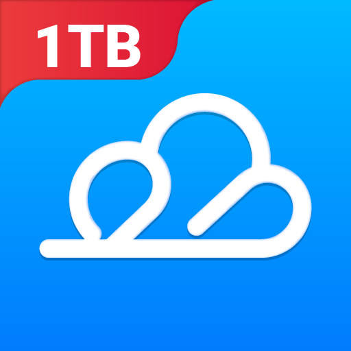 | 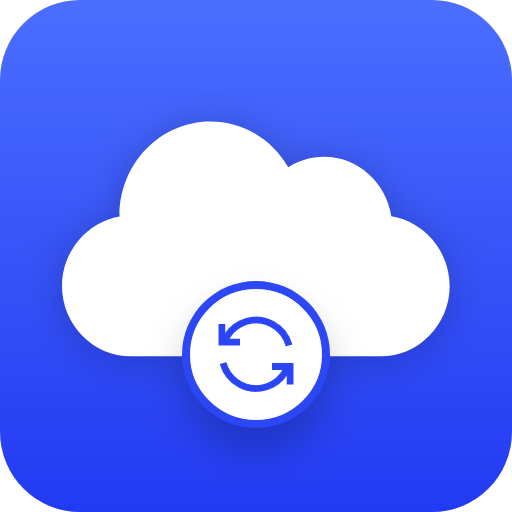 | 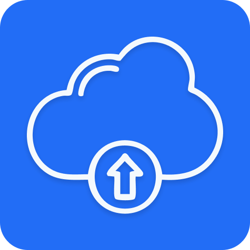 | 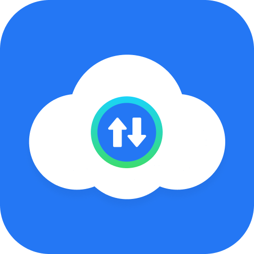 | 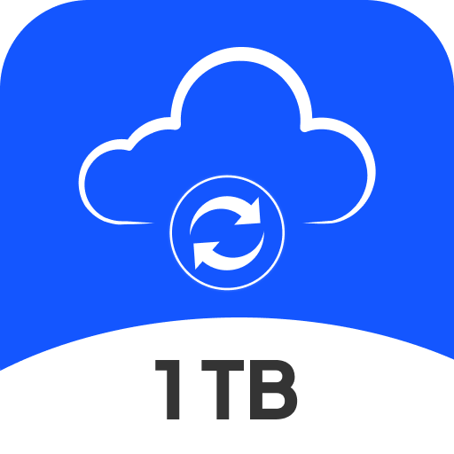 | 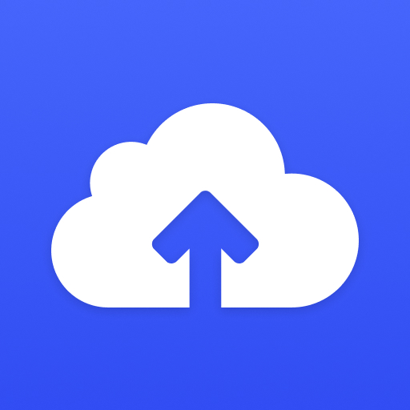 | 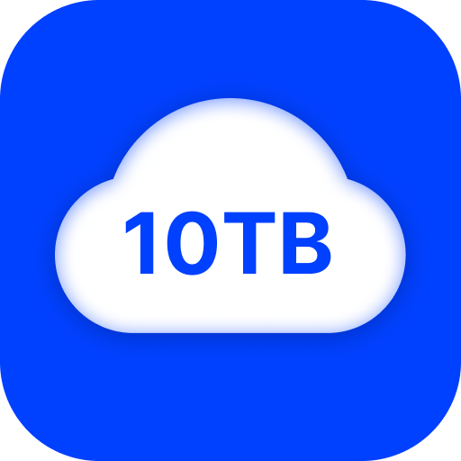 | 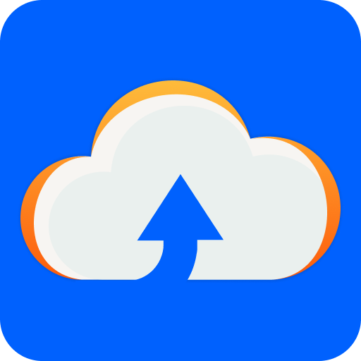 | 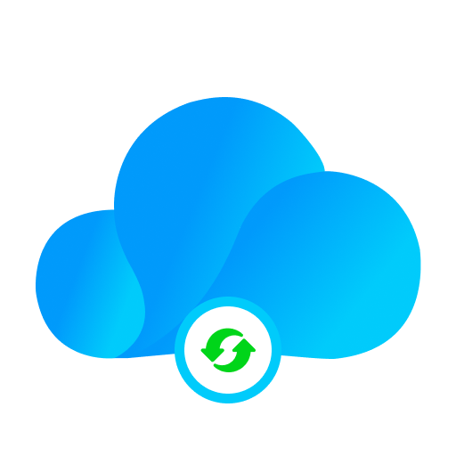 | 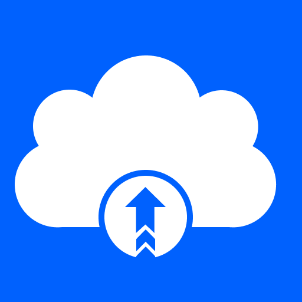 | 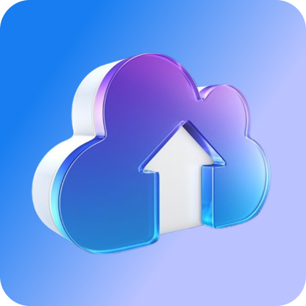 |
| 64 px |  |  |  |  |  |  |  |  |  |  |  |  |
| 48 px |  |  |  |  |  |  |  |  |  |  |  |  |
| 32 px |  |  |  |  |  |  |  |  |  |  |  |  |
| Downloads | **500+** Cell Cave | **100K+** CloudGate Technologies | **5M+** Fazcon Apps | **5K+** Auzi Apps Studios | **100K+** MAPIDIRECTIONS STUDIOS | **500K+** Fuzon Apps | **1M+** Daily Utility Apps | **500K+** MindByte Studios L.L.C-FZ | **10K+** Appseen Studio | **100K+** Utility Forge | **1K+** Golden Associate Pvt. Ltd. | **5K+** Nova Apps Studios |

Feature graphics · 1024 × 500

## All 12 feature graphics, ours first

The banner each listing shows above its screenshots. Click any graphic to view it large.

[00 · Cloud Storage: Secure Vault](#g-00-cloud-storage-secure-vault) · Cell Cave · 500+ downloads · 1024 × 500 · landscape · Original listing asset · [Original image on Google Play ↗](https://play-lh.googleusercontent.com/CE9IBgu9a6-sNwc7Glj9Q9fgkhHlI9g17KoF5IzmidzzqyqUICT-T8e_ERlzZN7RLr79hTdKcZl0r-JpeeoDnEo)

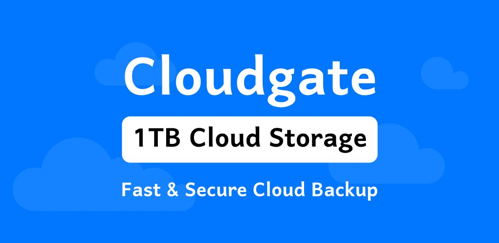

[01 · CloudGate](#g-01-cloudgate) · CloudGate Technologies · 100K+ downloads · 1024 × 500 · landscape · Original listing asset · [Original image on Google Play ↗](https://play-lh.googleusercontent.com/BsYM-klHXxZrBN5q65d0bXrFI-G5bgbcgHr_cWmvurwZxYMFfTvnqOwKzScPLdpn6yztUT_0TuDXoMRsk8e4mA)

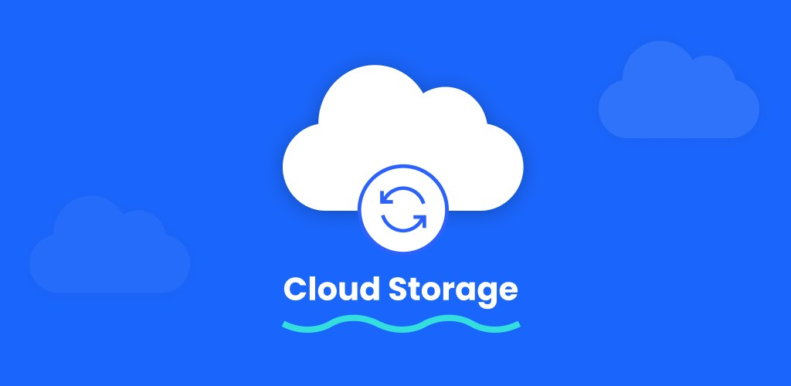

[02 · Fazcon](#g-02-fazcon) · Fazcon Apps · 5M+ downloads · 1024 × 500 · landscape · Original listing asset · [Original image on Google Play ↗](https://play-lh.googleusercontent.com/csMV3RlVIoOsET9_MRnH653eyvSz0H1nx3RgepOjtPp3ffwTXQMEHK-t6A3sbQQSa3LlUaR5GdEnIb9GFNXj)

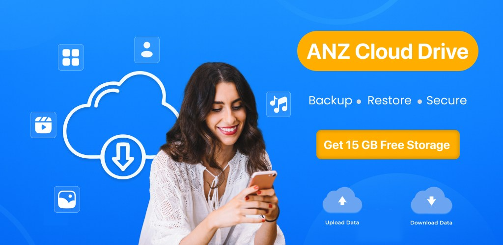

[03 · ANZ Cloud Drive](#g-03-anz-cloud-drive) · Auzi Apps Studios · 5K+ downloads · 1024 × 500 · landscape · Original listing asset · [Original image on Google Play ↗](https://play-lh.googleusercontent.com/iYbU8juNs8C7YAA0CfqDsALsPCs02ynAWzfb4shqaTMpo7ENooGSPlhb9f0CxyoC-PbN3WZkMEyYhbIHmsOwFw)

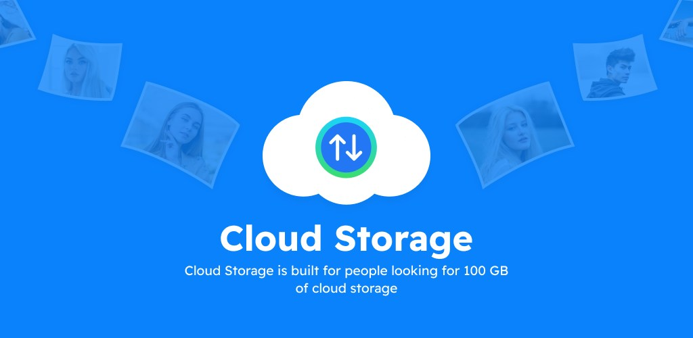

[04 · Cloud Backup](#g-04-cloud-backup) · MAPIDIRECTIONS STUDIOS · 100K+ downloads · 1024 × 500 · landscape · Original listing asset · [Original image on Google Play ↗](https://play-lh.googleusercontent.com/lolf8y50rcG5H2yKAJzav3-QpSyVCTDNFVuSVmF5A40gH6oBMpGuF0s5Ypyss6Qz48PDZVR0w6MbauwbF1-teg)

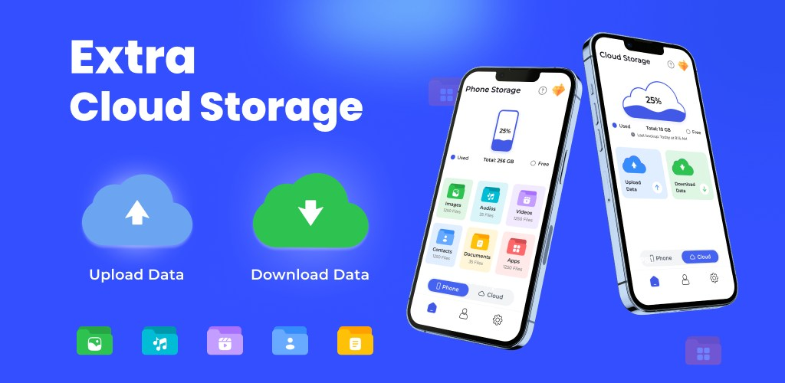

[05 · Cloud Storage & Drive](#g-05-cloud-storage-drive) · Fuzon Apps · 500K+ downloads · 1024 × 500 · landscape · Original listing asset · [Original image on Google Play ↗](https://play-lh.googleusercontent.com/97KF3Y8xYH3qDyIqt-VKxWMh8xPJeBxn0BJQ-GiQjRIwvSAJgFZgr-7y2Eri4_PswSzELkDxqJctV7luH7Vn)

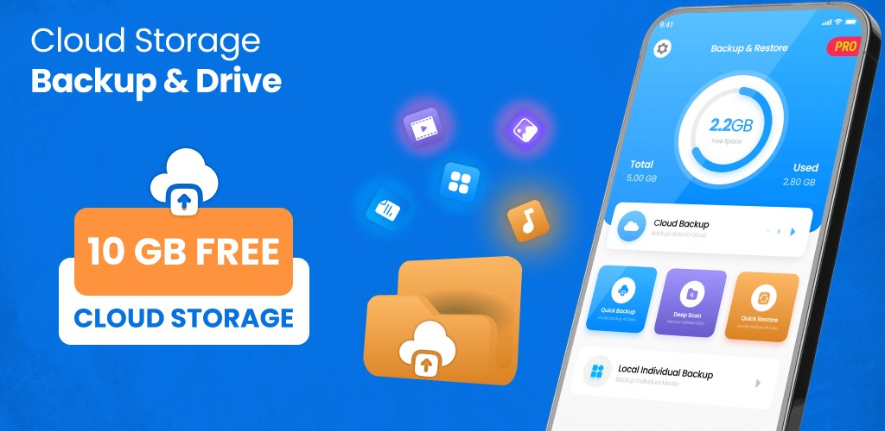

[06 · Cloud Storage Backup & Drive](#g-06-cloud-storage-backup-drive) · Daily Utility Apps · 1M+ downloads · 1024 × 500 · landscape · Original listing asset · [Original image on Google Play ↗](https://play-lh.googleusercontent.com/f2H2fNYVeVrjF9IUdXU-o6WCGcIzfI_8uF_AV-oUhX71PMOcwf-OPA08Nv4WgOEz0Sx9Z4Zx6GZSkWPTJcMu)

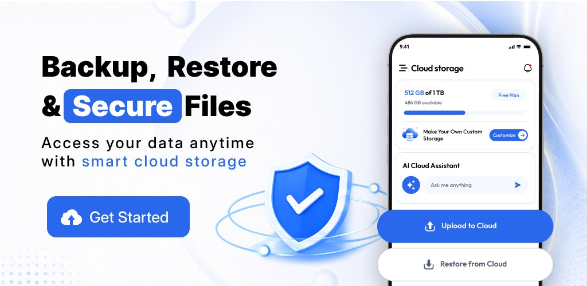

[07 · Cloud Storage Drive Backup](#g-07-cloud-storage-drive-backup) · MindByte Studios L.L.C-FZ · 500K+ downloads · 1024 × 500 · landscape · Original listing asset · [Original image on Google Play ↗](https://play-lh.googleusercontent.com/q59S3ailCKQzezY7VWHpXi6vbk8EwMXbVagNyS7J1Z0x2b7RfwyXqvp2c-r4oo2j5q7YXIkfTBFpFPPNejls)

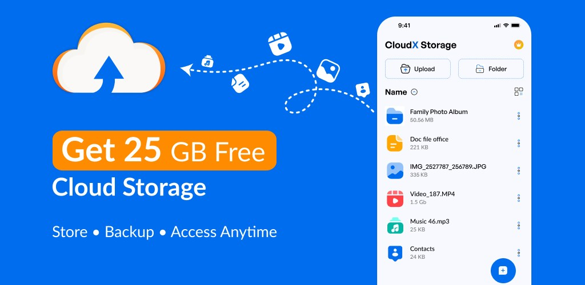

[08 · DataHatch](#g-08-datahatch) · Appseen Studio · 10K+ downloads · 1024 × 500 · landscape · Original listing asset · [Original image on Google Play ↗](https://play-lh.googleusercontent.com/UwuFprt4BPV0RaAmD4mseMnzXpHzFGGz2VZ8nG81x8XvQzyJkAMRXhLZVitIISbOfZQ1utMU7gJxpHpFccsABg)

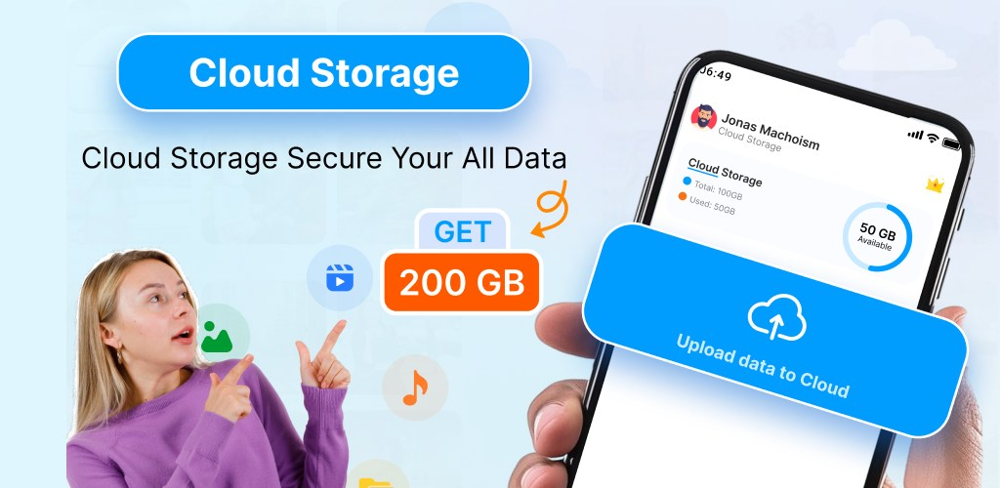

[09 · Cloud Storage-Sync](#g-09-cloud-storage-sync) · Utility Forge · 100K+ downloads · 1024 × 500 · landscape · Original listing asset · [Original image on Google Play ↗](https://play-lh.googleusercontent.com/xaPF-x-4ekTE6ERSZHncvFyDZPt-PM7aDMgXK2ujcra6FR1CITPjWb6teGBTCnj3GFmMdXN0zE-FpPANE_kWIA)

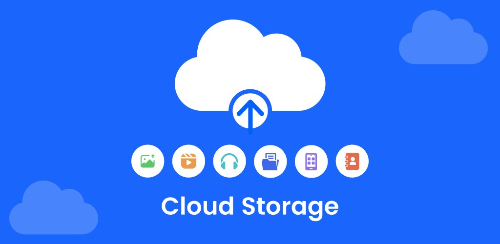

[10 · Cloud storage](#g-10-cloud-storage) · Golden Associate Pvt. Ltd. · 1K+ downloads · 1024 × 500 · landscape · Original listing asset · [Original image on Google Play ↗](https://play-lh.googleusercontent.com/N0jQNcmBcWc0mFVBYlWN8iW_xGA8Bpi1XWVLtdqedhU_S3O47u2MurP58KAMpNVzAtyqv-8uqBcml9YaDmqt)

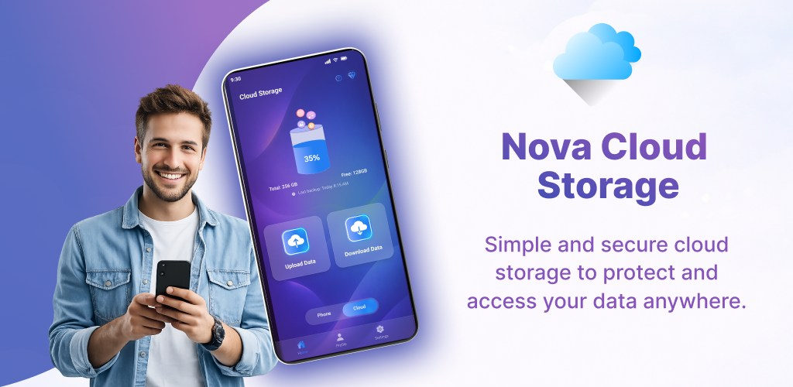

[11 · Nova Cloud](#g-11-nova-cloud) · Nova Apps Studios · 5K+ downloads · 1024 × 500 · landscape · Original listing asset · [Original image on Google Play ↗](https://play-lh.googleusercontent.com/WMyeDEH4ni33Q4BkowqjE01oZnH6hZlwKHL03m1ccamqKIEbQtWhQaOpiDt1NxG4i6BwrqeRzv2WIGi3vktSETo)

Visual library · 131 original assets

## Every asset, app by app

Listing facts as captured on 14 Sep 2026 for the competitors and 25 Sep 2026 for our own listing, a four-part design read, and every icon, feature graphic and screenshot. Filter by app, asset type or orientation, or search the notes. Click an image to view it large.

| # | Reference | Publisher | Downloads | Rating | Portrait | Landscape | Listing |
| --- | --- | --- | --- | --- | --- | --- | --- |
| 00 | [**Cloud Storage: Secure Vault**](#g-00-cloud-storage-secure-vault) Cloud Storage: Secure Vault | Cell Cave | 500+ | Not returned | 3 | 14 | [Google Play ↗](https://play.google.com/store/apps/details?id=com.softwarealliance.cloudvault&hl=en&gl=US) |
| 01 | [**CloudGate**](#g-01-cloudgate) Cloudgate: Cloud Storage Drive | CloudGate Technologies | 100K+ | 4.1 | 6 | 0 | [Google Play ↗](https://play.google.com/store/apps/details?id=com.cloudgate.cloudstorage&hl=en&gl=US) |
| 02 | [**Fazcon**](#g-02-fazcon) Cloud Storage: Cloud Drive App | Fazcon Apps | 5M+ | 4.1 | 7 | 7 | [Google Play ↗](https://play.google.com/store/apps/details?id=com.fazconapps.backup.restore.data&hl=en&gl=US) |
| 03 | [**ANZ Cloud Drive**](#g-03-anz-cloud-drive) ANZ Cloud Drive: Cloud Storage | Auzi Apps Studios | 5K+ | Not returned | 6 | 0 | [Google Play ↗](https://play.google.com/store/apps/details?id=com.filestorage.cloudbackup.clouddrive.photosbackup.storagespace&hl=en&gl=US) |
| 04 | [**Cloud Backup**](#g-04-cloud-backup) Cloud Backup : Cloud Storage | MAPIDIRECTIONS STUDIOS | 100K+ | 4.3 | 5 | 0 | [Google Play ↗](https://play.google.com/store/apps/details?id=com.backup.restore.clould.backup.freecloud.storage&hl=en&gl=US) |
| 05 | [**Cloud Storage & Drive**](#g-05-cloud-storage-drive) Cloud Storage & Cloud Drive | Fuzon Apps | 500K+ | 4.1 | 6 | 4 | [Google Play ↗](https://play.google.com/store/apps/details?id=com.cloudstorageapp.cloudbackup.storagespace.databackup&hl=en&gl=US) |
| 06 | [**Cloud Storage Backup & Drive**](#g-06-cloud-storage-backup-drive) Cloud Storage Backup & Drive | Daily Utility Apps | 1M+ | 4.1 | 7 | 1 | [Google Play ↗](https://play.google.com/store/apps/details?id=com.backup.and.restore.all.apps.photo.backup&hl=en&gl=US) |
| 07 | [**Cloud Storage Drive Backup**](#g-07-cloud-storage-drive-backup) Cloud Storage Drive Backup app | MindByte Studios L.L.C-FZ | 500K+ | 3.7 | 7 | 0 | [Google Play ↗](https://play.google.com/store/apps/details?id=com.cloudstorage.backupapp.storagespace.mycloud.clouldbackup&hl=en&gl=US) |
| 08 | [**DataHatch**](#g-08-datahatch) Cloud Storage Drive: DataHatch | Appseen Studio | 10K+ | 3.6 | 10 | 1 | [Google Play ↗](https://play.google.com/store/apps/details?id=com.datahatch.cloud.storage.drive.data.backup&hl=en&gl=US) |
| 09 | [**Cloud Storage-Sync**](#g-09-cloud-storage-sync) Cloud Storage: Drive Backup | Utility Forge | 100K+ | 4.4 | 9 | 3 | [Google Play ↗](https://play.google.com/store/apps/details?id=com.cloud.storage.extrastorage.gbsfreespace&hl=en&gl=US) |
| 10 | [**Cloud storage**](#g-10-cloud-storage) Cloud Storage App Drive Backup | Golden Associate Pvt. Ltd. | 1K+ | Not returned | 5 | 0 | [Google Play ↗](https://play.google.com/store/apps/details?id=com.cloudstorage.cloudbackup.storagespaceapp&hl=en&gl=US) |
| 11 | [**Nova Cloud**](#g-11-nova-cloud) Nova Cloud: Storage & Backup | Nova Apps Studios | 5K+ | Not returned | 6 | 0 | [Google Play ↗](https://play.google.com/store/apps/details?id=com.securebackup.cloudstorage.drivebackup.filestorage&hl=en&gl=US) |

131 of 131 assets shown

00 · Cell Cave

### Cloud Storage: Secure Vault

“Cloud Storage: Secure Vault” · 500+ downloads · rating Not returned · 3 portrait and 14 landscape screenshots

Open listing on Google Play ↗

#### Icon

A white three-lobe cloud sits on a bright blue gradient with soft wave shapes, with a circular badge of down and up arrows across its lower edge. The badge reads as sync rather than capacity, and the icon carries no capacity text or promotional badge. Ten of the eleven competitors place a capacity or offer badge on the icon; this one does not, which is what the Free 100 GB study recommends.

#### Feature graphic

The app name is set in two lines at the left over a pale blue wave field, with a phone mock showing a Your vault home and a 25 GB of 100 GB storage ring at the right, plus floating photo and video cards, the line Backup & Restore across multiple devices, and a solid blue Free 100 GB button. The promotional Free 100 GB wording runs against the guidance in this tab, which advises keeping free-storage offers off the feature graphic.

#### Screenshot system

Seven phone panels run headline-above-device on one pale blue wave background, mixing three portrait panels with four landscape ones. The sequence covers upload, WhatsApp media backup, video offload, photo security, encrypted file storage and a three-card plan panel. Two further sets of five repeat the same designs at 1280 and 2560 pixels wide and drop the plan panel.

#### Design assessment

The most internally consistent set in this library: one background system, one type treatment, and real interface in every panel rather than decorative mockups. Three things to watch. Panels 2 and 7 build their message on WhatsApp media and name that brand in the artwork, which is worth a separate listing-policy check even though competitor names are fine in research. The Files panel shows a folder named snaptube, another third-party app name, inside an otherwise generic mock file list. The plan panel promises Free 100 GB on sign-in, which agrees with the current full description but still has to match the tier the app actually grants.

our app · filled cloud · sync badge · blue waves · headline above device · real UI · 100 GB offer

Icon and feature graphic

Icon 01 · 512 × 512 · square · Original listing asset · [Original image on Google Play ↗](https://play-lh.googleusercontent.com/tiTl5Bh1EKxT8IuyKDl3syleNmk7-QzVKZ2KKnbFCCrgJN0q3gtc6tBBeKGCjK20N5Ttroy0PwEAZC_PKfxEmg)

Feature Graphic 01 · 1024 × 500 · landscape · Original listing asset · [Original image on Google Play ↗](https://play-lh.googleusercontent.com/CE9IBgu9a6-sNwc7Glj9Q9fgkhHlI9g17KoF5IzmidzzqyqUICT-T8e_ERlzZN7RLr79hTdKcZl0r-JpeeoDnEo)

Portrait screenshots · 3

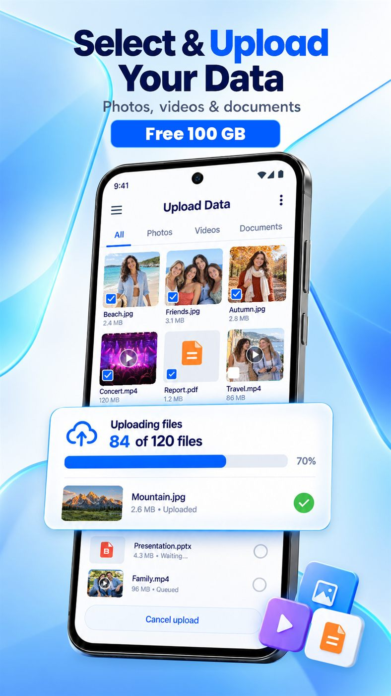

Screenshot 01 · 1080 × 1920 · portrait · Select and upload · [Original image on Google Play ↗](https://play-lh.googleusercontent.com/XpeF1GkqmPFAKLPSWtBvwFxRxKVipQ9QwTMciZzPdNbUHCf3oTFMSpjU1ZTJWgAsEjjzIUiiZg2M4wv0h1zB)

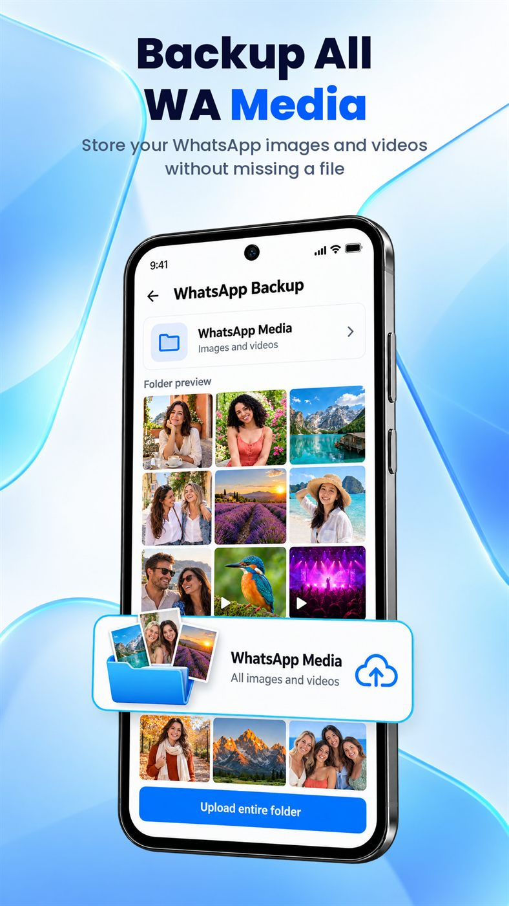

Screenshot 02 · 1080 × 1920 · portrait · WhatsApp media backup · [Original image on Google Play ↗](https://play-lh.googleusercontent.com/uWwHt7KwXo1kRMCihy4D02Vz-KU7eN3oAmQmsNR571GAhSKAmmJQ9Rnq-BDKL2Q1yxCTg7xiB0NJhguBMY6v)

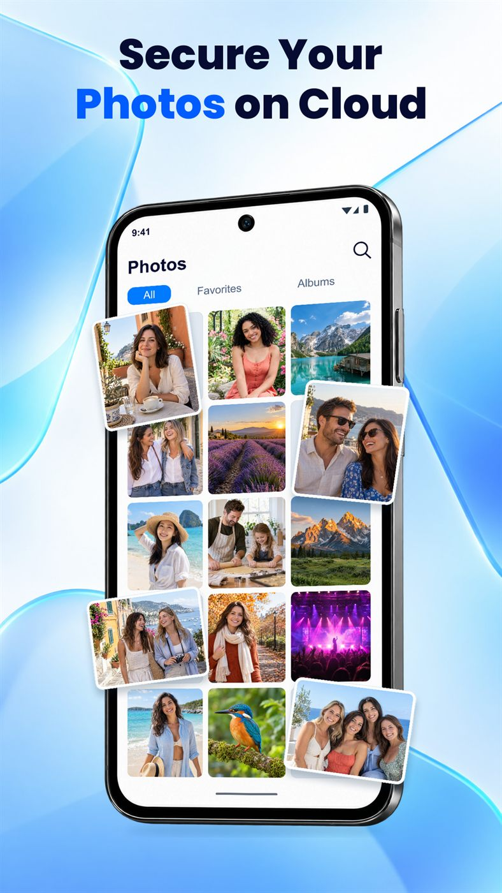

Screenshot 04 · 1080 × 1920 · portrait · Photo grid security · [Original image on Google Play ↗](https://play-lh.googleusercontent.com/C6Wb4MyHYKWxCClDnNC2d8SVcFtXoOxbQyYHg5DqQ7RXvr70Sdx-QSnNF1TKETIKC2OQzSojDEhXvdoEgDp6Vg)

Landscape screenshots · 14

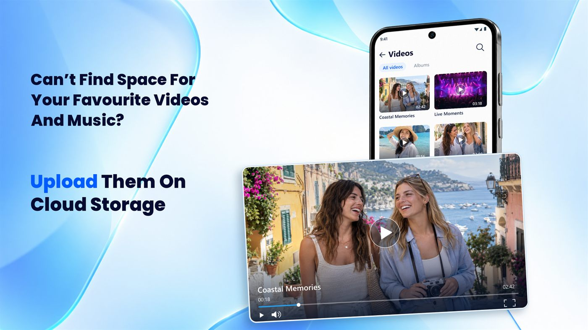

Screenshot 03 · 1920 × 1080 · landscape · Video offload · [Original image on Google Play ↗](https://play-lh.googleusercontent.com/DTDxDpCBvaJ5RzjO-mozgAFZWHP-mqMcqvJ2ACQYJWJ3WyMLo4_RUH-RxypPLGQ_lq7PqtuQMiMO7YMK88EiAw)

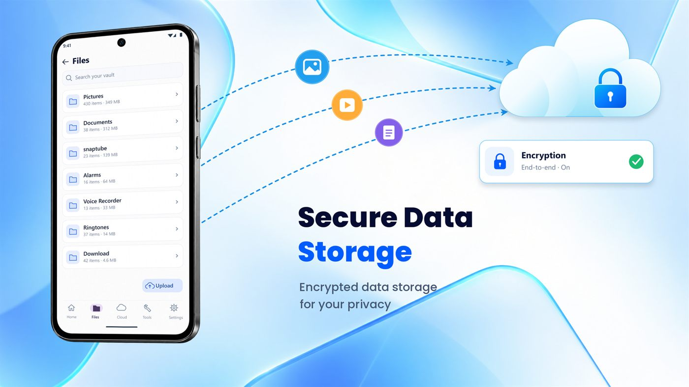

Screenshot 05 · 1920 × 1080 · landscape · Encrypted file storage · [Original image on Google Play ↗](https://play-lh.googleusercontent.com/L__sV4ouqinTdvf1eo47SPbrRuO-Ax0Rm00MfTBX6_r02yri5QakDUxGwDDUX-6x2HJ8G-6tskkbnXFStgMfDA)

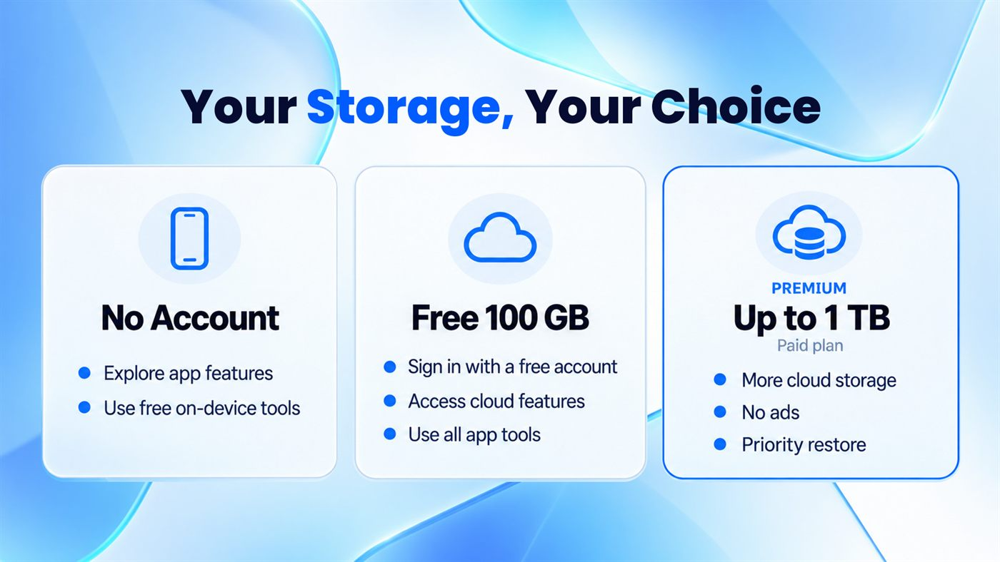

Screenshot 06 · 1920 × 1080 · landscape · Plan tiers · [Original image on Google Play ↗](https://play-lh.googleusercontent.com/_rL6P-Q3g3gjNsRDACJ4s5b7CH1LXRT_iTcW7eBwYmgavxEQ_NXzFV5mCPkUfLL3Zv9HOgjln-kU3tvkyR4hsA)

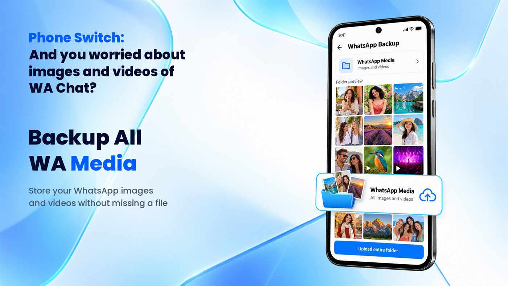

Screenshot 07 · 1920 × 1080 · landscape · WhatsApp media backup, landscape · [Original image on Google Play ↗](https://play-lh.googleusercontent.com/kNXAJ1nJwHEnan0dn4KYuDlLm5YqJ4JeDLLwbMiiXQ3fRxjobjcODwAczmHXuHVlT4aXG4ty80VlfaP4pAmyow)

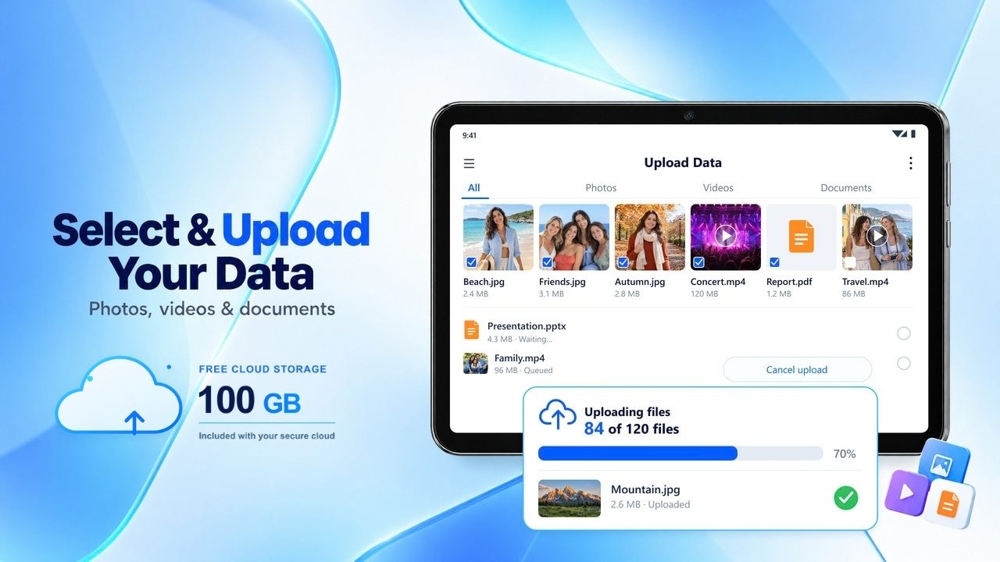

Screenshot 08 · 1280 × 720 · landscape · Select and upload · 1280-wide set · [Original image on Google Play ↗](https://play-lh.googleusercontent.com/T2KIqOFBIQlYvNbJ2uaAaWc4go3rr2Dg95TfWQrnZ7IaiXtfvx-JaAGZ3p-FOhwswJaa3Oo_Xero9BUl6_hDNA)

Screenshot 09 · 1280 × 720 · landscape · WhatsApp media backup · 1280-wide set · [Original image on Google Play ↗](https://play-lh.googleusercontent.com/oItTUOI-cIzm483ebYD5Mafsr1Q4oqNVYhjN49X1qgKnK17xTXmzK052C3uqnn_CqiZp6W-vX_PDhzbipUEE7A)

Screenshot 10 · 1280 × 720 · landscape · Encrypted file storage · 1280-wide set · [Original image on Google Play ↗](https://play-lh.googleusercontent.com/o3Ul2Fg9BrF9JBcQ5T94wBc9V9kNIv5QeZpCVnp4sqIcbRDWzJ3U0B4mYYmInhhBGNavLJUsenjKacEG0ocTunc)

Screenshot 11 · 1280 × 720 · landscape · Video offload · 1280-wide set · [Original image on Google Play ↗](https://play-lh.googleusercontent.com/sBcjPH7TY7XU7QgAMiVYd2KEgS1cL0uewsZOOcFOLO17icyuKuxAgvMpAUXfFp2uC3SSIKOhXjl0JbP0y8_dqx0)

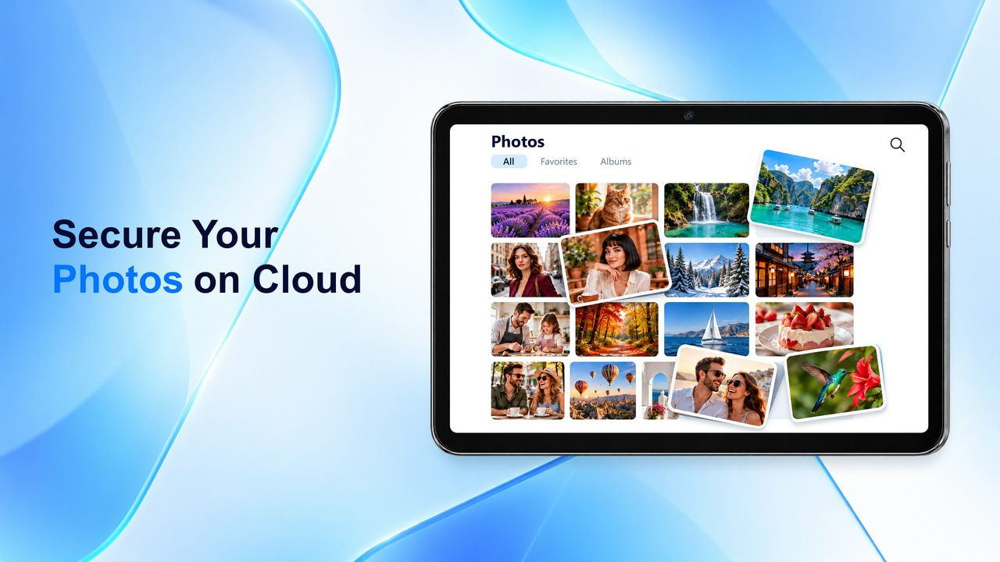

Screenshot 12 · 1280 × 720 · landscape · Photo grid security · 1280-wide set · [Original image on Google Play ↗](https://play-lh.googleusercontent.com/WvudMkKHt-IYTiUrUUNDGvIe01BEPktB1mb2AH1RAQdYqAGmeCMCt7ckFQ3fRHMB8woLHFulo1_AstzIar_BCw)

Screenshot 13 · 2560 × 1440 · landscape · Select and upload · 2560-wide set · [Original image on Google Play ↗](https://play-lh.googleusercontent.com/lMHo8wJUxtwXK3GVHi2fAUbn1EVcbZAAKw8SNgm2vBndiPiLOx8p47ON1Dhb1MQ00EAeLIGxBRR-EARWdjCK)

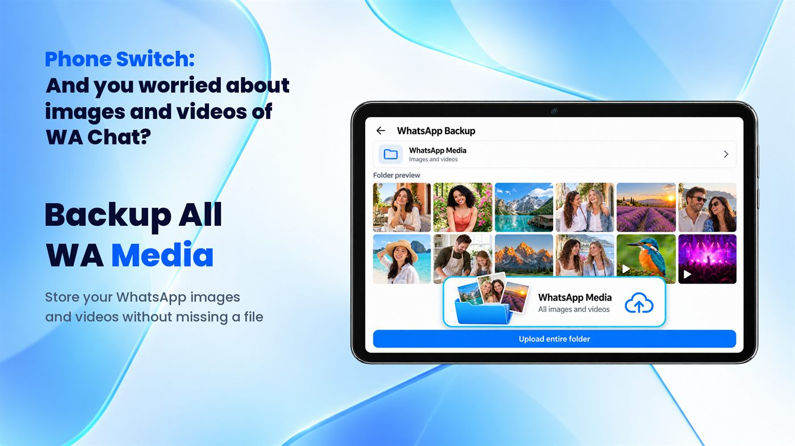

Screenshot 14 · 2560 × 1440 · landscape · WhatsApp media backup · 2560-wide set · [Original image on Google Play ↗](https://play-lh.googleusercontent.com/YTmFN6T6le5IiGrPnL-nSp_owiVDPdHLP7mQk2ZyUYdRGt-7VaVuC6rFJ2FQN-DScjtXTPd3YWHxEki0dLlUbw)

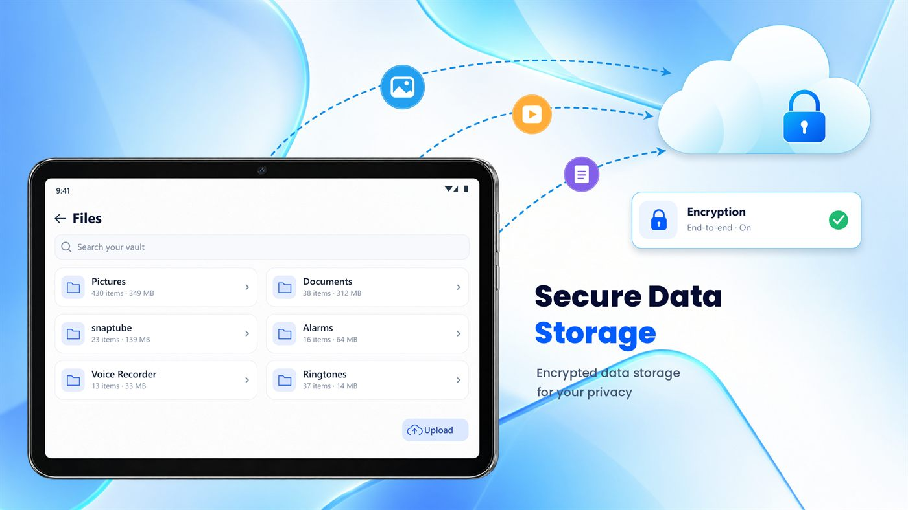

Screenshot 15 · 2560 × 1440 · landscape · Encrypted file storage · 2560-wide set · [Original image on Google Play ↗](https://play-lh.googleusercontent.com/64Rws71F_VNzonabIZeFlJGrFkHIlIkljhYUb-v45x1h7ef1x7YhHCiB0x_IdKgB9RWiST2UgxlRAyfaRkFR)

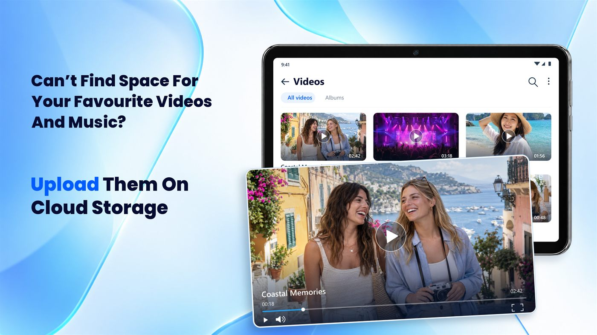

Screenshot 16 · 2560 × 1440 · landscape · Video offload · 2560-wide set · [Original image on Google Play ↗](https://play-lh.googleusercontent.com/Ug8ct8Q2o8VxwARw0I5xAm_0Amol7b077tEg0ARn-U382Ut1opUrTEVYy5Vjn0edwRu3EMU6i17gRblLyKa_oqo)

Screenshot 17 · 2560 × 1440 · landscape · Photo grid security · 2560-wide set · [Original image on Google Play ↗](https://play-lh.googleusercontent.com/jO7QQIj-eWrO3NDum6qPhXLDe7DEXSPgTB9XJVQ3Uvbw1Fmy87Te3F0EpNPRNEITHm4n5tgmBoJIa1vx-YZaig)

01 · CloudGate Technologies

### CloudGate

“Cloudgate: Cloud Storage Drive” · 100K+ downloads · rating 4.1 · 6 portrait and 0 landscape screenshots

Search visibility, United States (15 Sep): **0** top-10 · **2** placements on 94 keywords

Open listing on Google Play ↗

#### Icon

A white continuous cloud outline sits on a cyan-to-blue field. A red corner capacity badge attracts attention before the symbol; the open linework feels light but becomes less distinctive when reduced.

#### Feature graphic

A centered wordmark and capacity strip dominate a blue banner with faint cloud silhouettes. The hierarchy is simple; the smallest supporting line loses prominence at listing scale.

#### Screenshot system

Six portrait panels repeat an indigo background, centered white heading and tall white interface. The sequence moves from capacity to media, plans, backup, vault and scanning. Photo tiles extend beyond the gallery; other panels keep the UI mostly intact.

#### Design assessment

Useful for a consistent portrait template and connected photo popups. The icon/banner promote 1TB while the opening screenshot promotes 100GB free: these need plan context, not blind reuse. No landscape screenshot was captured.

outline cloud · indigo · centered headings · gallery popups · vault · scanner

Icon and feature graphic

Icon 01 · 512 × 512 · square · Original listing asset · [Original image on Google Play ↗](https://play-lh.googleusercontent.com/uyHV-mrKyUmPhlHOaBdf2_f5rnjvlqD7bn4v2Ef9e3pqw4inhT6Lq2q1o3_-Xp5SNMQAe5NWp0bZC_j4q4HHMg)

Feature Graphic 01 · 1024 × 500 · landscape · Original listing asset · [Original image on Google Play ↗](https://play-lh.googleusercontent.com/BsYM-klHXxZrBN5q65d0bXrFI-G5bgbcgHr_cWmvurwZxYMFfTvnqOwKzScPLdpn6yztUT_0TuDXoMRsk8e4mA)

Portrait screenshots · 6

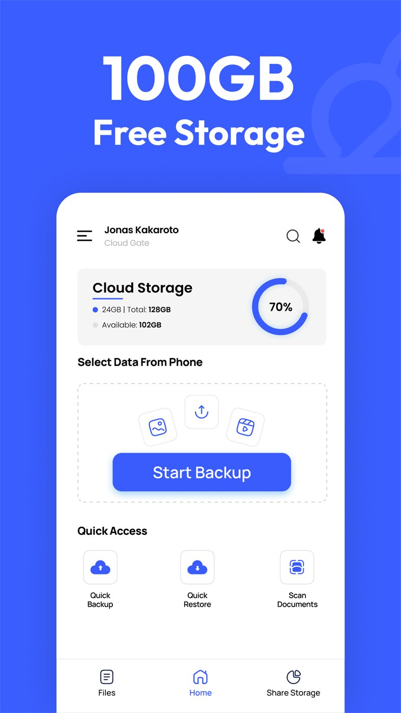

Screenshot 01 · 1080 × 1920 · portrait · Capacity and dashboard · [Original image on Google Play ↗](https://play-lh.googleusercontent.com/4FZGJCFstWIT4Ost1McPye00osHqXXCcqO7e9e5qYKLPmQrCci9aketsWyErkgktNvNK0nHf6DYbOx6hLrg75w)

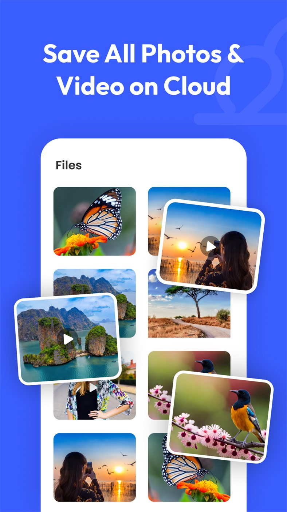

Screenshot 02 · 1080 × 1920 · portrait · Photo gallery with lifted tiles · [Original image on Google Play ↗](https://play-lh.googleusercontent.com/_mNXEfGS-bdpOTXJL8xOw1YCFBCY-wRo4Mx4Fep5m2LI-PJXqSj_TZd8frugPKNDV5976zO8gJTAudcORd1nEg)

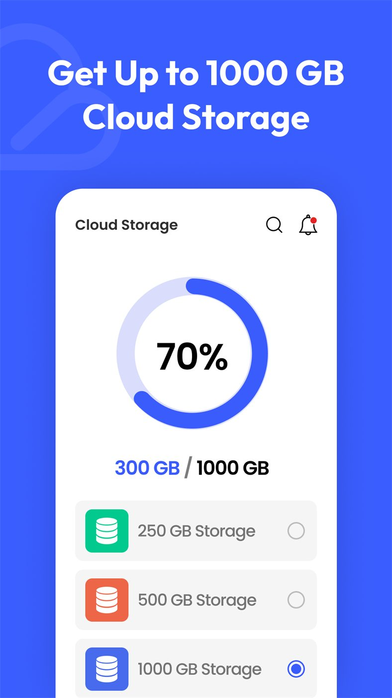

Screenshot 03 · 1080 × 1920 · portrait · Storage plan comparison · [Original image on Google Play ↗](https://play-lh.googleusercontent.com/kAZn7Yv7IoZQtrRgjH8jiyavKzSQ9QOX_SGsepN_3vgwi1g8qBPgRqSg9e0-wrwOo2OdR5alWoWLSxvgKvCuUg)

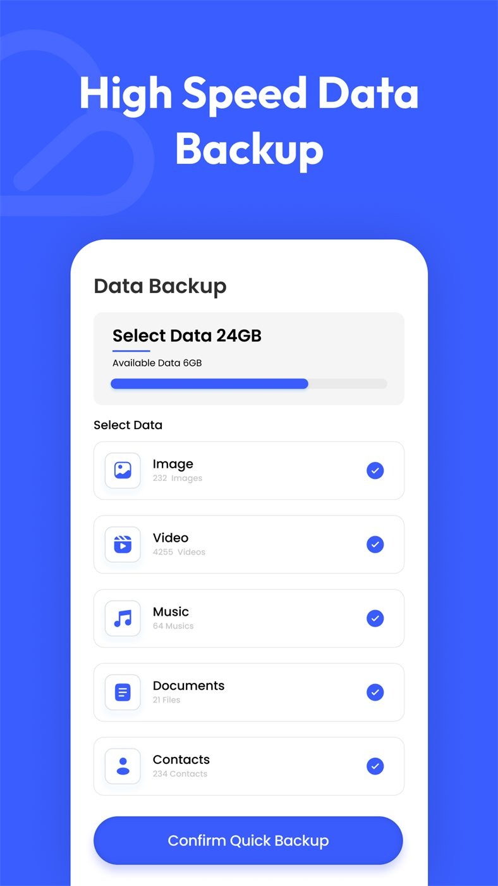

Screenshot 04 · 1080 × 1920 · portrait · Selected-data backup · [Original image on Google Play ↗](https://play-lh.googleusercontent.com/Aev_JpE_UnDqLhG6N-bBtWBPoSaOt2rurMy6mQ9prP_597fNXXuDtN2Fq1okbZWv1FZ8YPWIf2X1jhLkHDnN)

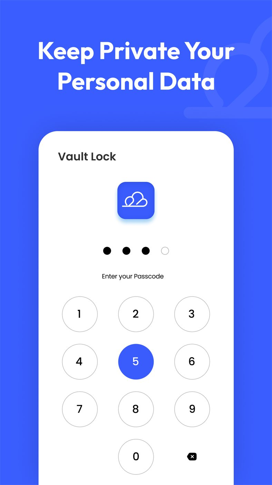

Screenshot 05 · 1080 × 1920 · portrait · PIN vault · [Original image on Google Play ↗](https://play-lh.googleusercontent.com/5vR5_FzAIK0pTFDddKq0GZf5H_fgA50MlXn4s9gRYFo8jrmH2xgS2j01dV-bB1jJsq4woCtafxDBkoFiK6Ur)

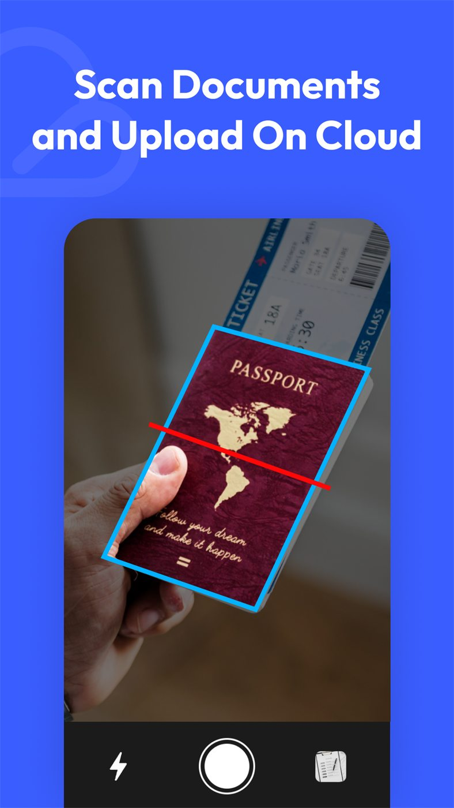

Screenshot 06 · 1080 × 1920 · portrait · Document camera · [Original image on Google Play ↗](https://play-lh.googleusercontent.com/2_zbLTeSNVD-jgUrDo8_uSeAUi-pqmDv5yz-3ttRYnhLra3qa8jJ9jt6N9s8rAM8_SP9essqH6WuGAtrl6cjUI4)

Landscape screenshots: not observed in this snapshot.

02 · Fazcon Apps

### Fazcon

“Cloud Storage: Cloud Drive App” · 5M+ downloads · rating 4.1 · 7 portrait and 7 landscape screenshots

Search visibility, United States (15 Sep): **8** top-10 · **9** placements on 94 keywords

Open listing on Google Play ↗

#### Icon

A solid white cloud and circular sync badge sit on an indigo gradient. The badge overlaps the lower center and preserves a strong cloud silhouette at small sizes.

#### Feature graphic

The blue feature graphic repeats the cloud, sync badge and short brand lockup. It is spacious but explains little beyond the category.

#### Screenshot system

Seven portraits use blue backgrounds, white interface panels, selective bold headings and cyan underline strokes. Lifted progress, document and media elements remain connected to their source. Seven landscapes switch to alternating blue/white compositions with side-by-side phone and problem-led copy; orange highlights provide emphasis.

#### Design assessment

The broadest matched orientation reference in this collection, and the largest displayed install bracket. Useful for adapting information hierarchy across aspect ratios. The landscapes change the visual treatment rather than simply stretching portraits. Decorative rockets, hands and file symbols can compete with the actual feature.

sync badge · blue · portrait and landscape · attached popups · problem-led messaging

Icon and feature graphic

Icon 01 · 512 × 512 · square · Original listing asset · [Original image on Google Play ↗](https://play-lh.googleusercontent.com/-D_rTljw18usqyOwuoCRRpbDBaHvS1DH6A_ML9coasJ6U4MvUVPYIYKSScE9tjzKRJMmfZE6t_filhn3icgf)

Feature Graphic 01 · 1024 × 500 · landscape · Original listing asset · [Original image on Google Play ↗](https://play-lh.googleusercontent.com/csMV3RlVIoOsET9_MRnH653eyvSz0H1nx3RgepOjtPp3ffwTXQMEHK-t6A3sbQQSa3LlUaR5GdEnIb9GFNXj)

Portrait screenshots · 7

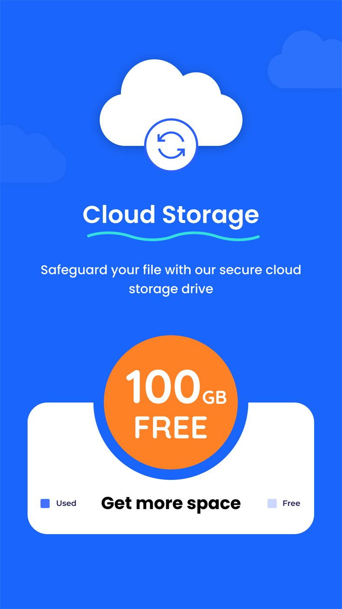

Screenshot 01 · 1080 × 1920 · portrait · Storage offer overview · [Original image on Google Play ↗](https://play-lh.googleusercontent.com/b0QDGZzorOPilMUCU_z0-PyKn6F3bDucFPCx3llNocQOLNiSOpNTNvW-Bt1Kb-XSERNoTl5t1ZLBD5fpA6ApMg)

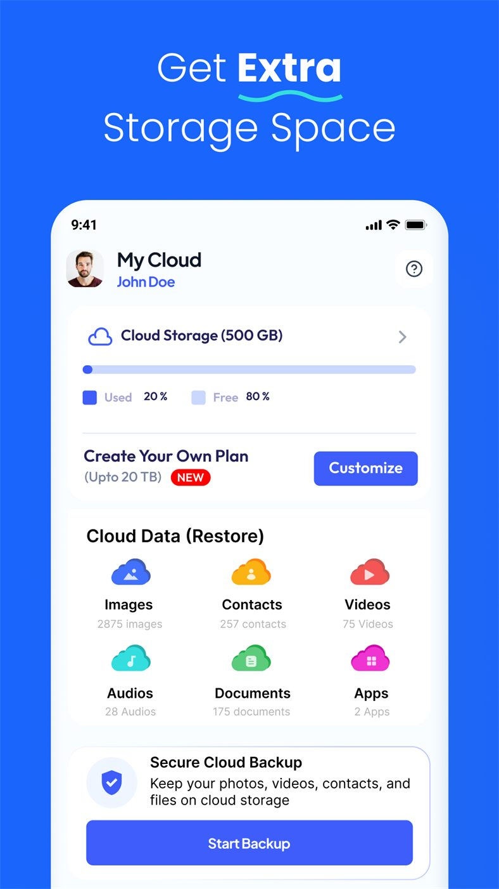

Screenshot 02 · 1080 × 1920 · portrait · Dashboard capacity · [Original image on Google Play ↗](https://play-lh.googleusercontent.com/qiVsViLNbwBvGO8gnx_efVyXgVdi1pHZimgQnVMbT8nFzHotEz62yU6oGYfoVTX0UqtnbI-ypG6N3K6qGa6211M)

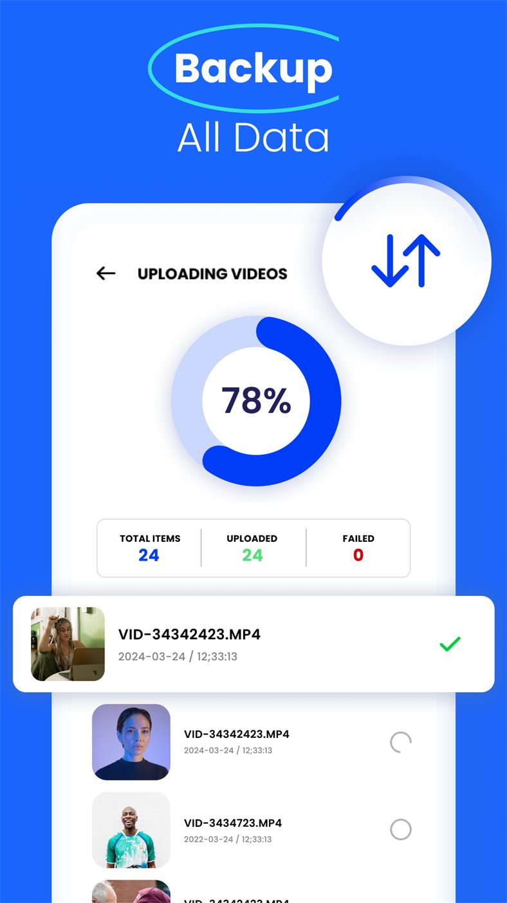

Screenshot 03 · 1080 × 1920 · portrait · Backup progress · [Original image on Google Play ↗](https://play-lh.googleusercontent.com/WmGeSlgR6nM3vCF7xtGiCFSSNtcAEDM1Hlr_eN6W0lsPKrohvREmQQERsRFnaup-EtwJZcdf652e9sqnab7avQ)

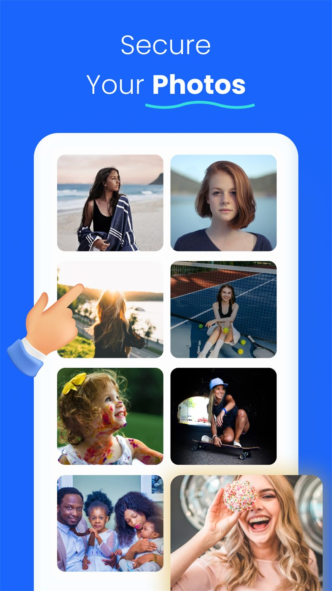

Screenshot 04 · 1080 × 1920 · portrait · Photo gallery · [Original image on Google Play ↗](https://play-lh.googleusercontent.com/WN39XPcikt6-a-Za2L22HW6Hvn8bX7D_RCnBd2QrRlRr_qmbRSS2_h990vbU0iGhQZ65xDZwRQ6L8VSChmvu6A)

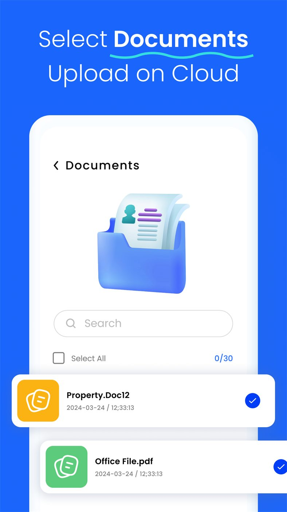

Screenshot 05 · 1080 × 1920 · portrait · Document selection · [Original image on Google Play ↗](https://play-lh.googleusercontent.com/8GO5qAORaoaROjInHgjg_ZKF8XDlDgGG4ff2AOUQbzPX6B1TGkLwqb5HUqKn492AeUrTBXbM9QqGwi-fWuhG)

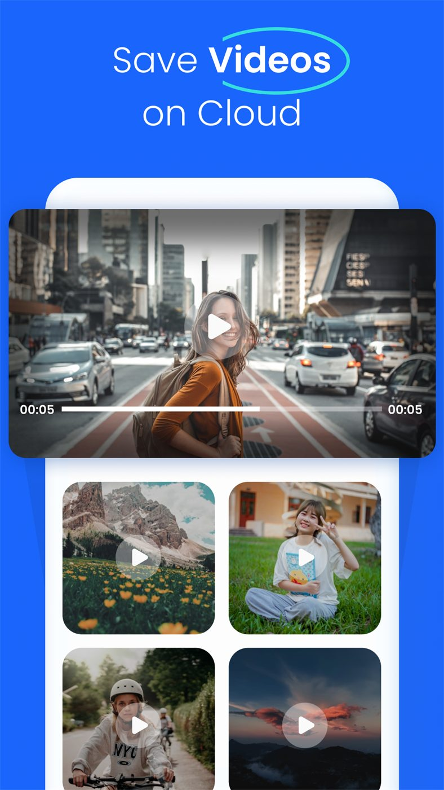

Screenshot 06 · 1080 × 1920 · portrait · Video playback · [Original image on Google Play ↗](https://play-lh.googleusercontent.com/Gs1AqU0mZm9m7kmoJUK38BsO7Z595gsKXYEJGkvd6GMpOzPG6jdLRVO__6Jx8RlHbrG64v2B5VUJ7CBpURQi)

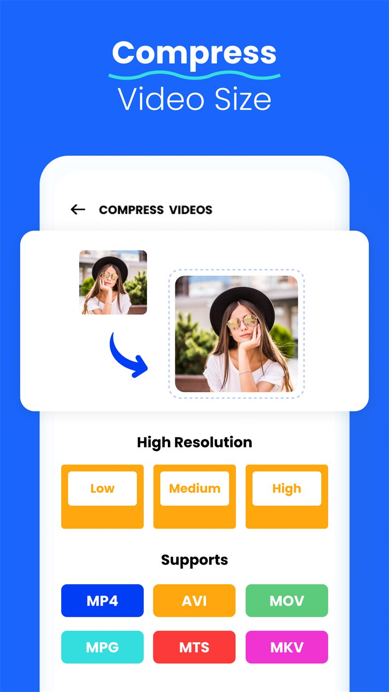

Screenshot 07 · 1080 × 1920 · portrait · Video compression · [Original image on Google Play ↗](https://play-lh.googleusercontent.com/nHrZMZNLNDJPYtQ4N0k-nF_uyYN7T9mwPxofSgD2wHvnnMOoG3r5Ec1EpnERVnNHRJtrqfye6PTHGe3peTLA2w)

Landscape screenshots · 7

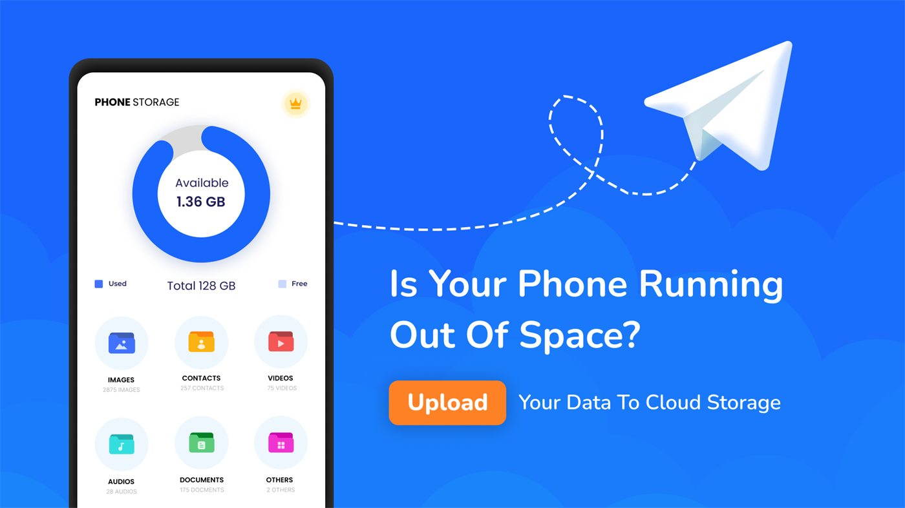

Screenshot 08 · 1920 × 1080 · landscape · Space shortage · [Original image on Google Play ↗](https://play-lh.googleusercontent.com/UDXYgY8Hk3X9ID0ihSEtdOzjcvaIE8M3bkcRr7tdB_BPUodwqFc950LsTQKrmiv6wuhV6jUKZV3tMgmBO2uw)

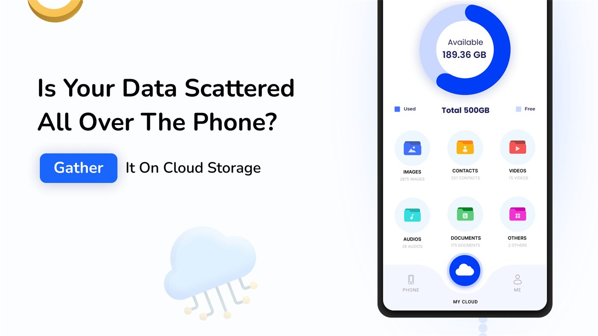

Screenshot 09 · 1920 × 1080 · landscape · File consolidation · [Original image on Google Play ↗](https://play-lh.googleusercontent.com/dJYFBCjVEgnosFIOf9pp1TLglu0RHkD8I_9eDNebXyakWUC7OOZAzpT2m44Zvb0_PazHiEerm6W-BPCIH13FMw)

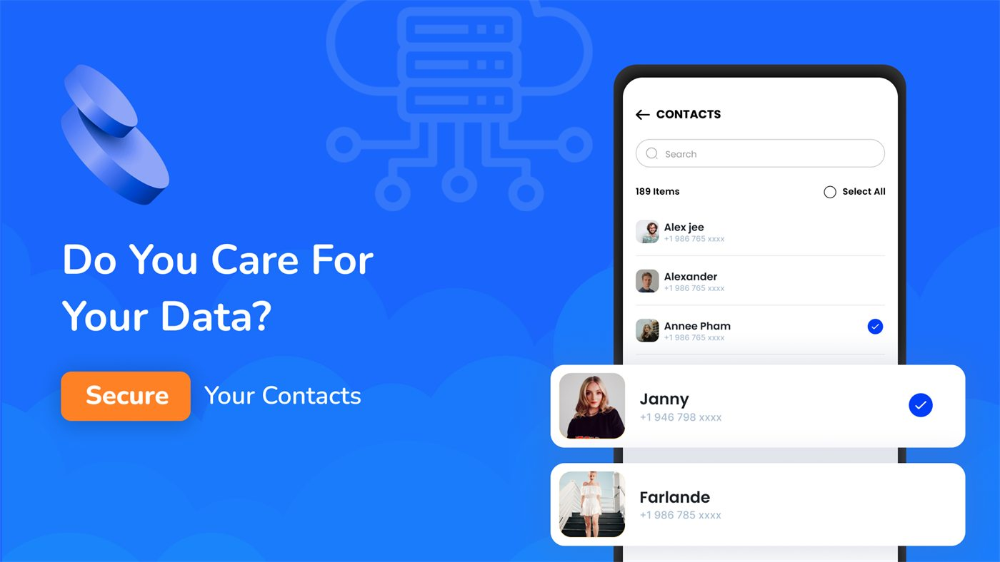

Screenshot 10 · 1920 × 1080 · landscape · Contact protection · [Original image on Google Play ↗](https://play-lh.googleusercontent.com/2LoYvZ7McmZL2DXoH2Gafemoze6GsK6GP4XKHT92lLGUivOoeS1t3ZZreoh1hjiaA8EJeX9jQHtH2uGb09Qovw)

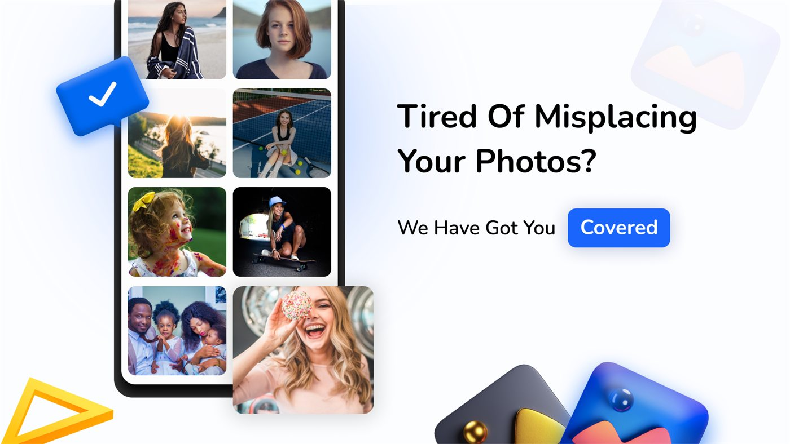

Screenshot 11 · 1920 × 1080 · landscape · Photo organization · [Original image on Google Play ↗](https://play-lh.googleusercontent.com/XoHgRHcOpr2csFbHBfZA0MAmYx1ioCRjbwoQqZj7DxmJP-4b8wJ7xn9Jjnmln3xRhLA_BUfHHmPVbJT5Zm-E)

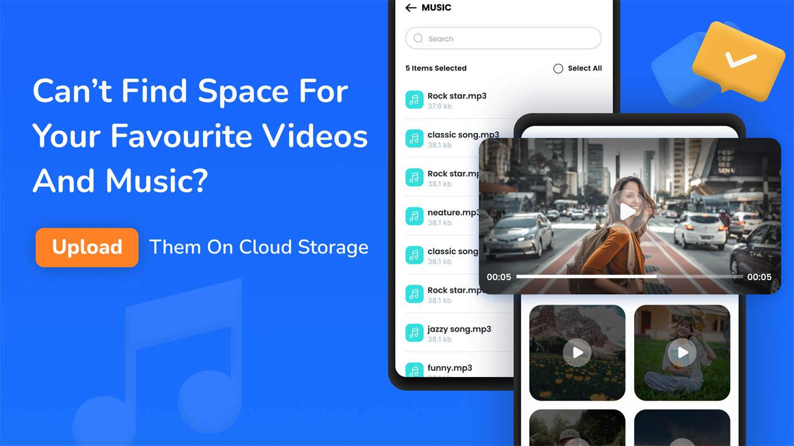

Screenshot 12 · 1920 × 1080 · landscape · Video and music storage · [Original image on Google Play ↗](https://play-lh.googleusercontent.com/515TmMdBiWW_Tkpxt5UXUZ8tvyBTGFBWKpJqNWBdthTKZ8-BLieG2YlKlPc8tMUTmu7kB11SJhBLIwnjAtnr-g)

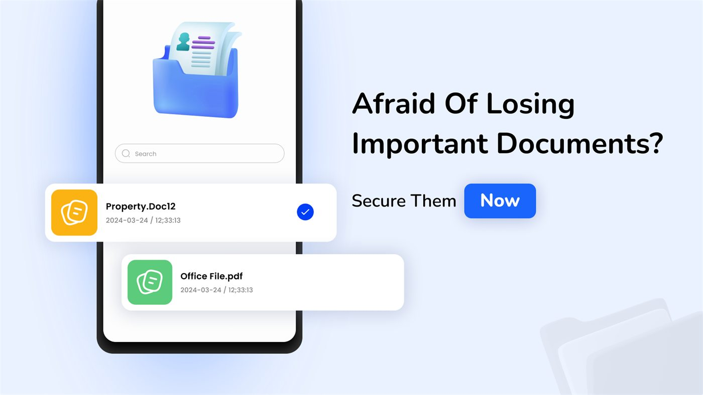

Screenshot 13 · 1920 × 1080 · landscape · Document protection · [Original image on Google Play ↗](https://play-lh.googleusercontent.com/gR2-dHOzqtX0A2Y6bTXEYP7XTQYkFWnz4VcLqfGxfPOvUHmvKCVYud0CpDtGmJqHNOWDq1xBy9oPj6v4l2_P)

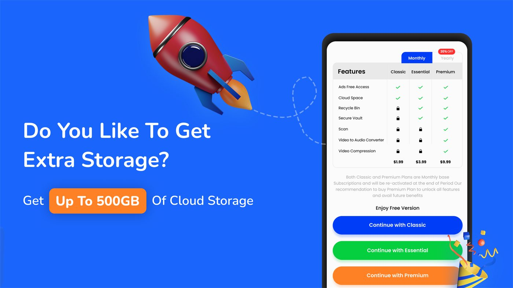

Screenshot 14 · 1920 × 1080 · landscape · Storage expansion · [Original image on Google Play ↗](https://play-lh.googleusercontent.com/45aV8mJj8tEyMp7XIYRetejQfdFkjkIhmToA2ycqGw5ZzetEiyb_sBS4Vs9iLk2gKN9oqHtYfuqKZ0i47qMeDg)

03 · Auzi Apps Studios

### ANZ Cloud Drive

“ANZ Cloud Drive: Cloud Storage” · 5K+ downloads · rating Not returned · 6 portrait and 0 landscape screenshots

Search visibility, United States (15 Sep): **0** top-10 · **0** placements on 94 keywords

Open listing on Google Play ↗

#### Icon

A white cloud outline surrounds blue negative space. A circular upload badge overlaps the lower middle; a second curved line suggests a highlight rather than another cloud lobe.

#### Feature graphic

The blue banner combines cloud symbolism, a person using a phone and orange capacity/name labels. The human figure carries considerable visual weight.

#### Screenshot system

Six portraits share bright blue gradients, white headings and orange keyword pills. The opening panel uses illustration; later panels show file selection, upload progress, recovery and dashboard tiles. Hands and lifted category cards indicate interaction.

#### Design assessment

Useful for orange emphasis against blue and for enlarging a real selection/progress element. Some panels combine a phone, people, arrows and floating icons, reducing focus. The icon uses an up arrow while the opening illustration uses a down arrow; semantic direction should be deliberate. No landscape screenshot was captured.

outline cloud · orange emphasis · blue · selection popup · upload progress

Icon and feature graphic

Icon 01 · 512 × 512 · square · Original listing asset · [Original image on Google Play ↗](https://play-lh.googleusercontent.com/buZ9Z9M8uEHYEgYcmOoKPf5MEW4ibGwjzvd7rGra1Up7iKQM2HV_iin31Df2s6jQ-3D_x7rrluNGuF461_40qg)

Feature Graphic 01 · 1024 × 500 · landscape · Original listing asset · [Original image on Google Play ↗](https://play-lh.googleusercontent.com/iYbU8juNs8C7YAA0CfqDsALsPCs02ynAWzfb4shqaTMpo7ENooGSPlhb9f0CxyoC-PbN3WZkMEyYhbIHmsOwFw)

Portrait screenshots · 6

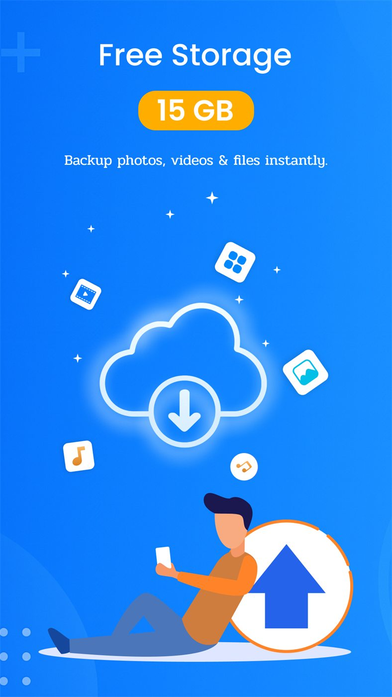

Screenshot 01 · 1080 × 1920 · portrait · Capacity introduction · [Original image on Google Play ↗](https://play-lh.googleusercontent.com/4npmXPEJyuygTO3f3ihFLYZrJa5lyGswVVcxX2eqlyZ6xPcl7GCEwCRDkGwALylla8fH0_dsJpoKNnNu40am)

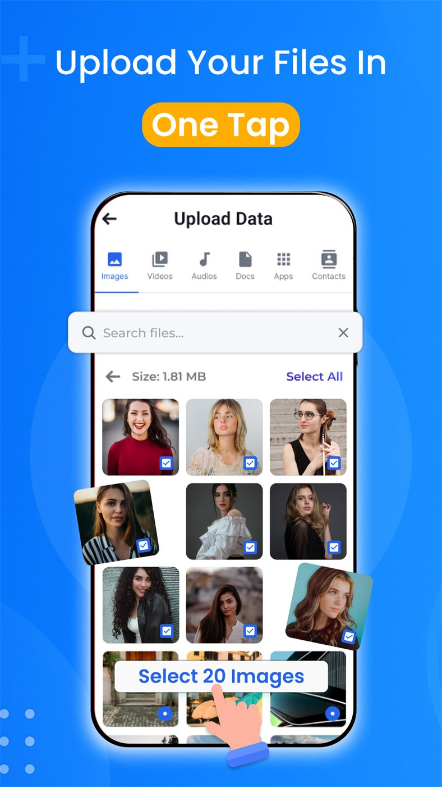

Screenshot 02 · 1080 × 1920 · portrait · Image selection · [Original image on Google Play ↗](https://play-lh.googleusercontent.com/F0jpigZItN5vMEh9dJ9qQ5cEvdbOhfIC-JgRzXdkG19-_WptKNxU3_Kow5prCR8rEo2f8aV_rghzy_bdrTc_)

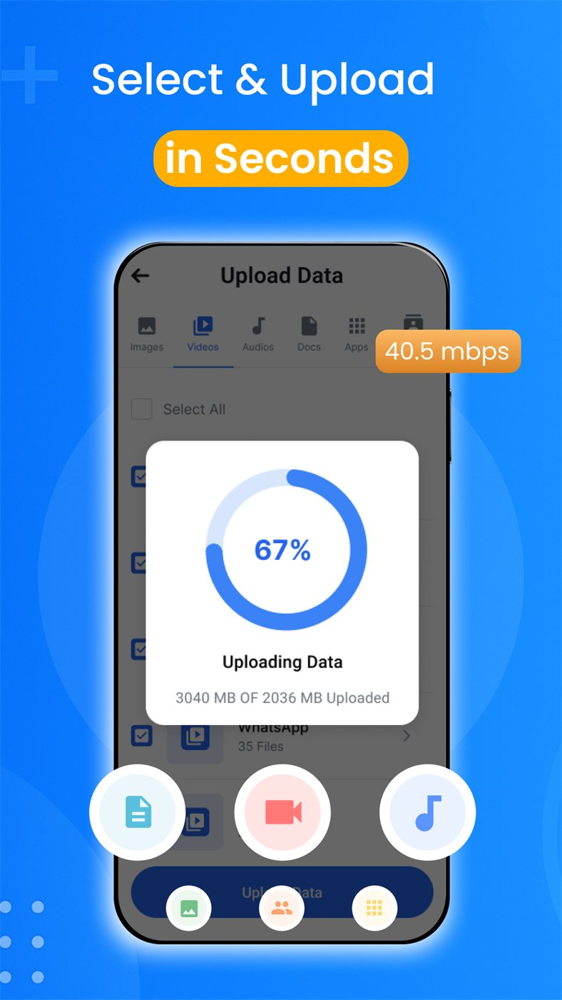

Screenshot 03 · 1080 × 1920 · portrait · Upload progress dialog · [Original image on Google Play ↗](https://play-lh.googleusercontent.com/ZOYIWM1tmPI8YnhASVXL1ur34nXam7X41VyzUgbmNN3Me1SYP22dWZNtBVqhg8ChUnjqe_9VXEi9TuvLKWBV4g)

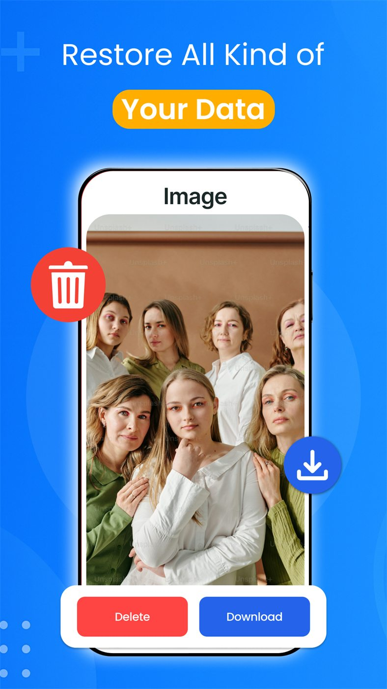

Screenshot 04 · 1080 × 1920 · portrait · Restore and download · [Original image on Google Play ↗](https://play-lh.googleusercontent.com/gocqfNi12q5XsnaZfzs-EyJrkBIxf6g7vToagRAKk3voQ5L2nllVyumZNyzBmP2NMDqu8MHG-9gxCb4juPYB)

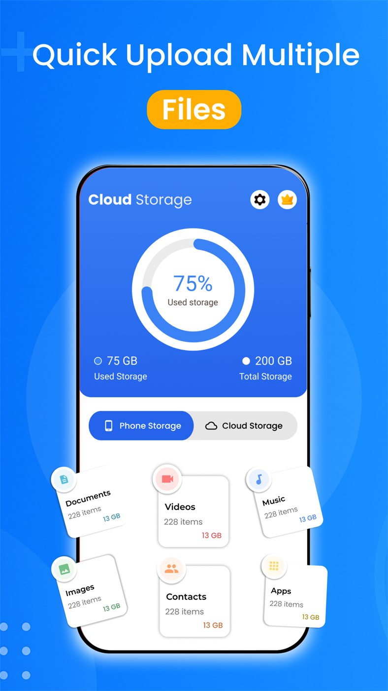

Screenshot 05 · 1080 × 1920 · portrait · Storage dashboard tiles · [Original image on Google Play ↗](https://play-lh.googleusercontent.com/DdyxtE1hau48tSI9jilV3RdPy6ve9SdfJd_33luj-iRIRnq0LQs4gF8Ty9oA8xnIrxmazG4H3d2kBotuD-sC)

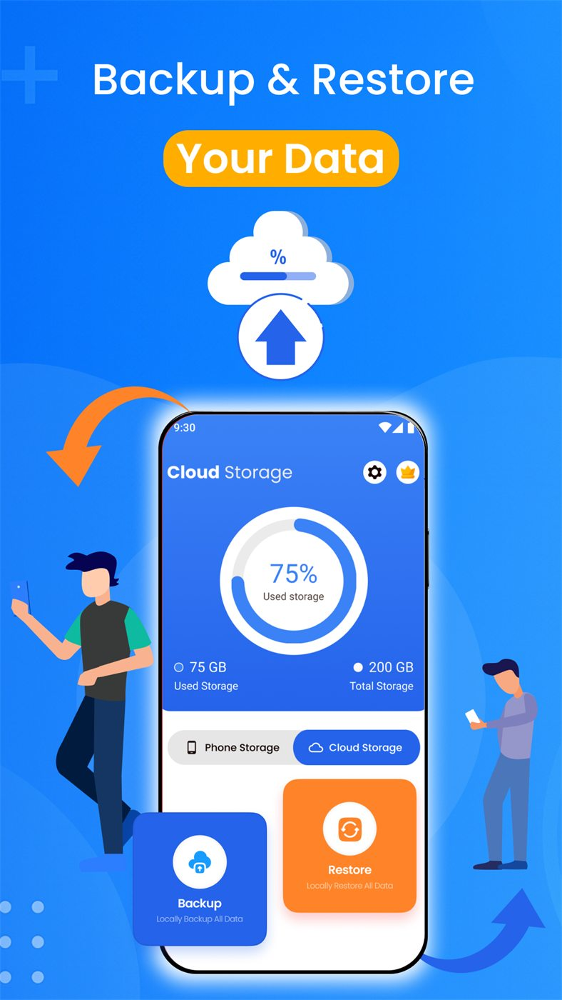

Screenshot 06 · 1080 × 1920 · portrait · Backup and restore overview · [Original image on Google Play ↗](https://play-lh.googleusercontent.com/szWBzr2kN_jwIGppp_ulfTbA2KcDiIOR-9zP--4at4mKuZIKQBIMaQG7tyHMZg8uCYqdYgAK0onpdLq7737jEEw)

Landscape screenshots: not observed in this snapshot.

04 · MAPIDIRECTIONS STUDIOS

### Cloud Backup

“Cloud Backup : Cloud Storage” · 100K+ downloads · rating 4.3 · 5 portrait and 0 landscape screenshots

Search visibility, United States (15 Sep): **1** top-10 · **2** placements on 94 keywords

Open listing on Google Play ↗

#### Icon

A solid white cloud contains an up/down pair in a blue disc with a green-to-cyan ring. The badge is inside the cloud rather than below its baseline.

#### Feature graphic

A centered cloud mark and category name sit on blue, with faint photo tiles near the edges. Small explanatory copy is subordinate to the large symbol.

#### Screenshot system

Five portraits alternate blue areas and white curved cutouts. Angled phones, photo tiles, enlarged controls and a pointing hand create depth. Headings move between top and bottom, producing variety but less consistent scanning.

#### Design assessment

Useful for studying foreground controls against angled devices. Device crops make some UI harder to evaluate. A 50GB offer appears in the upload panel while the banner references 100GB; the library records both without validating either entitlement. No landscape screenshot was captured.

embedded arrows · green ring · angled phone · blue and white curves

Icon and feature graphic

Icon 01 · 512 × 512 · square · Original listing asset · [Original image on Google Play ↗](https://play-lh.googleusercontent.com/73xGWGURdx18edsR7LeAWpis7CT3tWExObGgYI9c4bm-xnIdb7wY6QTBOUT5d1GmWH7pHFoJ5-hG0Eu_abFHIA)

Feature Graphic 01 · 1024 × 500 · landscape · Original listing asset · [Original image on Google Play ↗](https://play-lh.googleusercontent.com/lolf8y50rcG5H2yKAJzav3-QpSyVCTDNFVuSVmF5A40gH6oBMpGuF0s5Ypyss6Qz48PDZVR0w6MbauwbF1-teg)

Portrait screenshots · 5

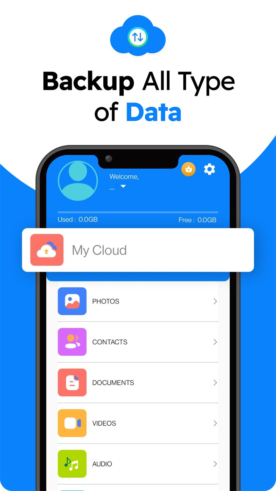

Screenshot 01 · 1080 × 1920 · portrait · Backup category list · [Original image on Google Play ↗](https://play-lh.googleusercontent.com/oTQ-ty7EPkNT3y3d8vy6IclHaMDCYZZRCb3MpgT4KfLaAWCpXj1LO6waXT487pfY5W4tvlFlR8tHsxvWhaAN9g)

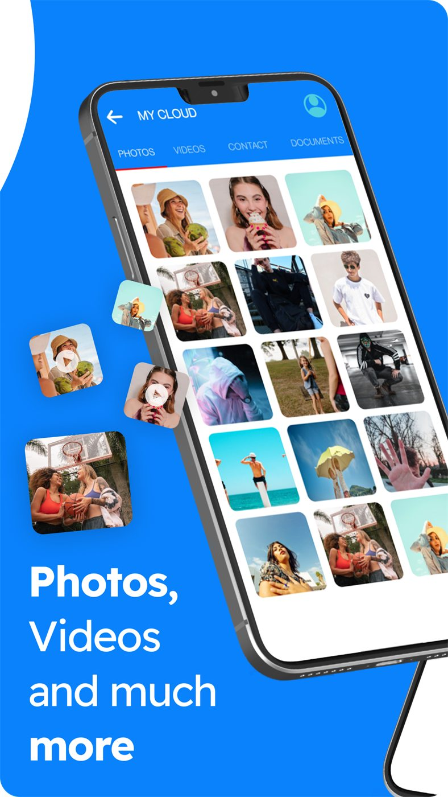

Screenshot 02 · 1080 × 1920 · portrait · Photo and video gallery · [Original image on Google Play ↗](https://play-lh.googleusercontent.com/cf7Ugkze60hgENaO2WGR2dXp50hU3jCUmFpTakDvks5uhcpjPHV__0uDG_gm6JNaafbonL8mwvO1kJeGYRdy1w)

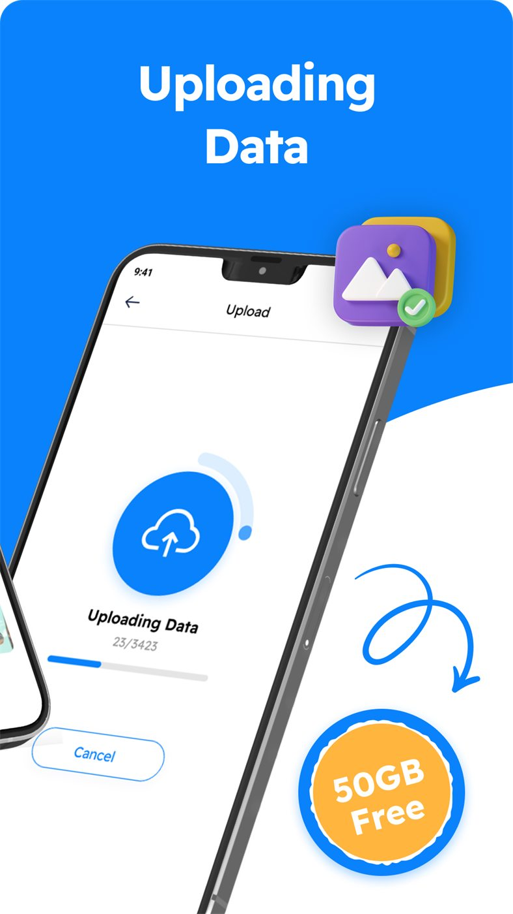

Screenshot 03 · 1080 × 1920 · portrait · Upload progress and offer · [Original image on Google Play ↗](https://play-lh.googleusercontent.com/EPRxL4EjBwebgCewwhDtmD-0Yt_fRmJ99d-TGB1van6f-LOhDVNUKRl6RrW9zs8AHxU5ICkhvGOUQ6im3Nw54Q)

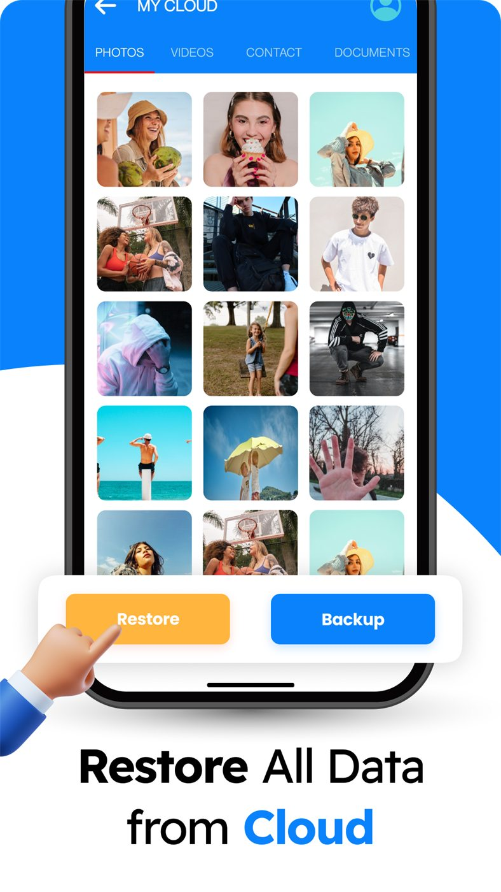

Screenshot 04 · 1080 × 1920 · portrait · Restore controls · [Original image on Google Play ↗](https://play-lh.googleusercontent.com/1YuWm_SKHIqkt2DsVbx8vW2TLkP6P-j2k5lZWXTs0iesT2BV7lKHf7K2TzAo8yeZr1d96Pc9n7iLFp_GuOZdlg)

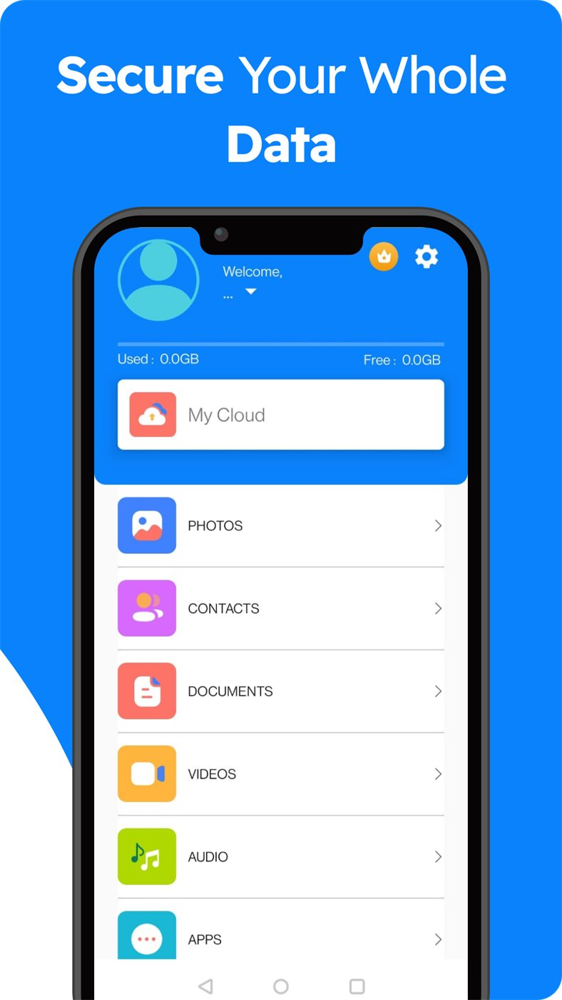

Screenshot 05 · 1080 × 1920 · portrait · Data category overview · [Original image on Google Play ↗](https://play-lh.googleusercontent.com/zltzpKCxzy8y5u9yDEHSy0Or2p6eUZgzqO2a3LZ_Ye41n8U_mHHIGdcpVQTMJgaEadGk5pwLjtMKk6Kz0Ssh)

Landscape screenshots: not observed in this snapshot.

05 · Fuzon Apps

### Cloud Storage & Drive

“Cloud Storage & Cloud Drive” · 500K+ downloads · rating 4.1 · 6 portrait and 4 landscape screenshots

Search visibility, United States (15 Sep): **2** top-10 · **9** placements on 94 keywords

Open listing on Google Play ↗

#### Icon

A white outline cloud and sync circle sit above a white capacity band on blue. The large capacity text takes substantial space from the pictogram.

#### Feature graphic

Two angled phones occupy the right side; a short heading and upload/download clouds sit on the left. Small file-type symbols line the bottom.

#### Screenshot system

Four landscapes use blue-violet backgrounds, lime keyword blocks, people cutouts and phones. Six portraits emphasize white phone UI, lifted category tiles and a bottom sheet over a dimmed screen. Portrait headline placement and phone size vary.

#### Design assessment

Strong reference for the requested feature-associated popup behavior: screenshot 7 expands the category chooser while leaving the parent screen visible. The lime accents make selected words easy to locate, but many small decorative objects compete in the landscapes. Use the popup relationship, not the competitor's screen contents or capacity promise.

sync circle · lime keywords · portrait and landscape · bottom sheet · category tiles

Icon and feature graphic

Icon 01 · 512 × 512 · square · Original listing asset · [Original image on Google Play ↗](https://play-lh.googleusercontent.com/-CevSr-tQWZ9w7hktRu-XizleTFpcbd4NYBTTagVRmvtVY7dNHCBlpoFSjxvdj-6qva9j8zNj-JAWnCTp56Qgg)

Feature Graphic 01 · 1024 × 500 · landscape · Original listing asset · [Original image on Google Play ↗](https://play-lh.googleusercontent.com/97KF3Y8xYH3qDyIqt-VKxWMh8xPJeBxn0BJQ-GiQjRIwvSAJgFZgr-7y2Eri4_PswSzELkDxqJctV7luH7Vn)

Portrait screenshots · 6

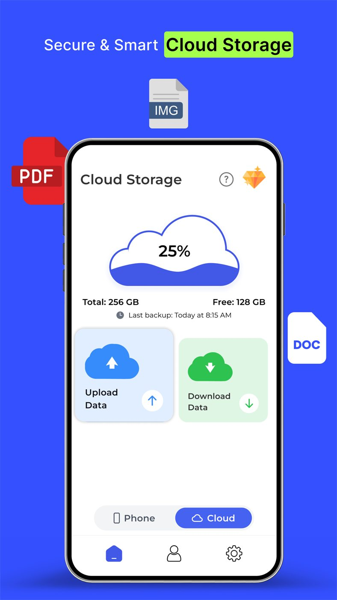

Screenshot 05 · 1080 × 1920 · portrait · Storage home · [Original image on Google Play ↗](https://play-lh.googleusercontent.com/5g0ujOOScPkeoXIzwmAs3W-kX4kgENDEQaCTqaFOgsS1Hld1fyl8E0VNEViV714Zy0u0hBtko76ZBIXNo196zg)

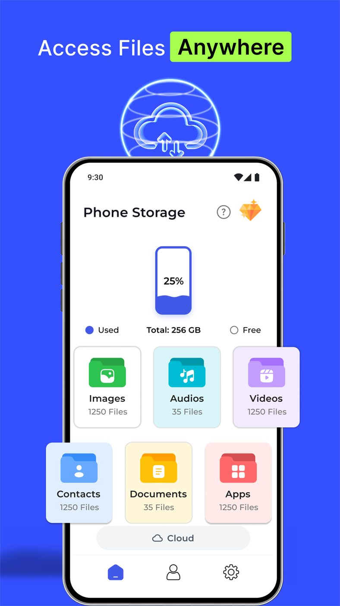

Screenshot 06 · 1080 × 1920 · portrait · Category access · [Original image on Google Play ↗](https://play-lh.googleusercontent.com/inIJnrYEaV-ZAjpwT9zkuOsNSGy1wBI7Cec3q2WqgGvW5sbF2Lh9b1u0AyEBaAjQHoN9vWEFqu0rh4BdxeL1)

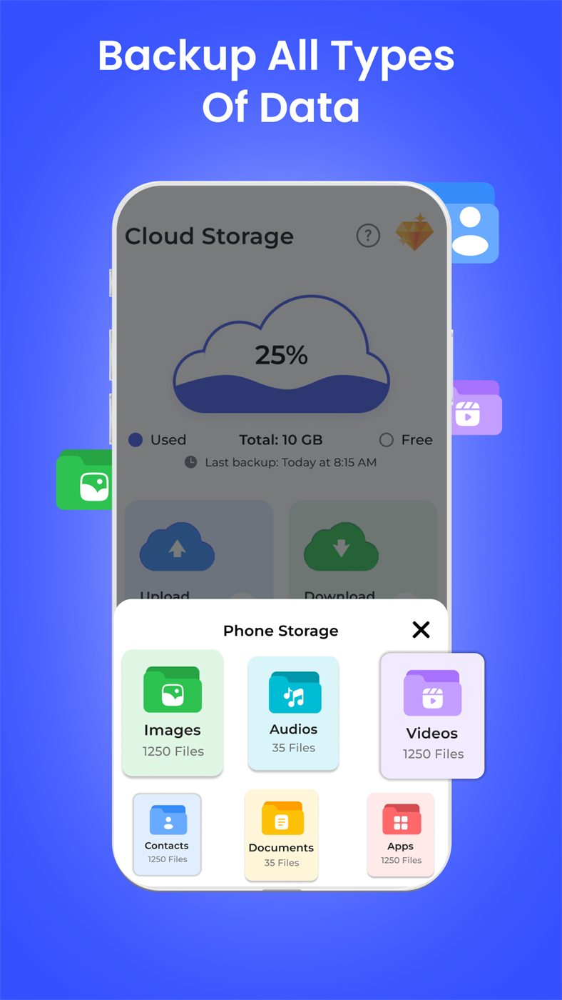

Screenshot 07 · 1080 × 1920 · portrait · Expanded category chooser · [Original image on Google Play ↗](https://play-lh.googleusercontent.com/DxyPEBCHDDanG6uUp9zcz0azY-DwWuAkcmkYVtRAwMd_NRAra76bY3FOsyhrpk4adVBv2mIsq_WOX5FpVuVaBA)

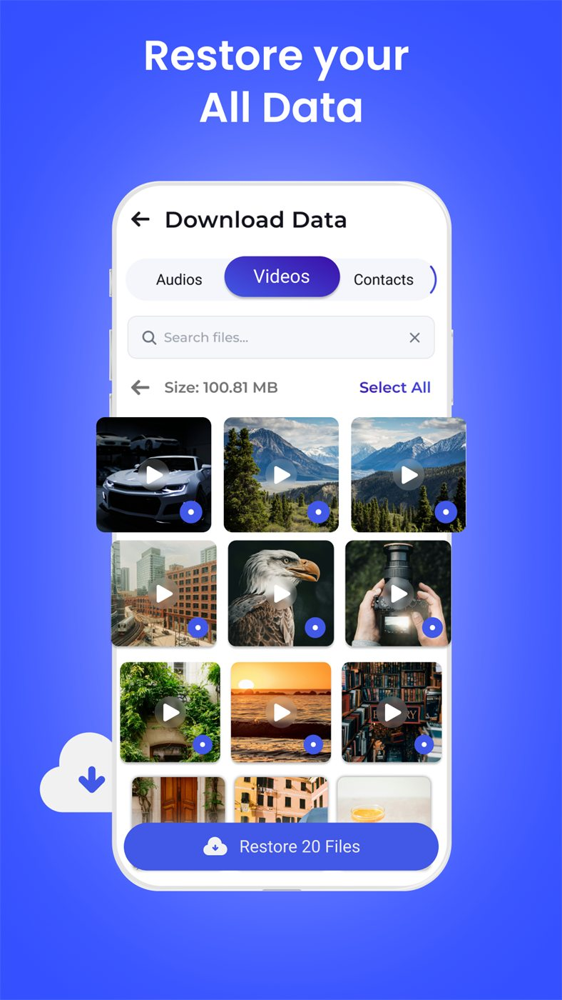

Screenshot 08 · 1080 × 1920 · portrait · Video restore selection · [Original image on Google Play ↗](https://play-lh.googleusercontent.com/Z9b5aTjqfRxlkcGDTAWIUmnLq5uxey81hEkOKZXLKjiiYYw1xRT3lvfswqK4dJOxl6EPE4EqT3Cjnm4Q6jbWDF8)

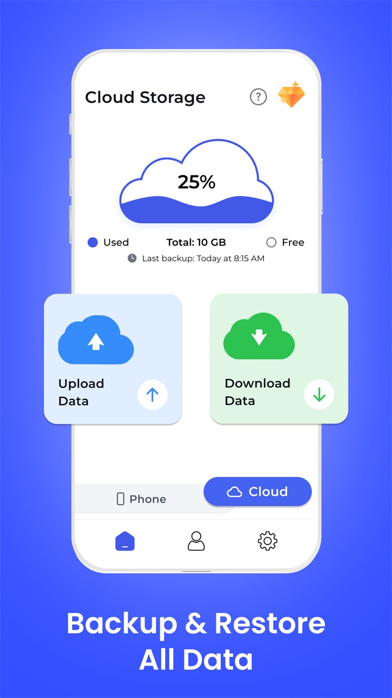

Screenshot 09 · 1080 × 1920 · portrait · Backup and restore dashboard · [Original image on Google Play ↗](https://play-lh.googleusercontent.com/izba_SDeYPplTTOnBAeVuqoTJ1IbUyk9ml9_FvSRTsTH20Wf3dXqSG7LW6LC0ODzUdA7XFkp82F82-3rfGB6_WQ)

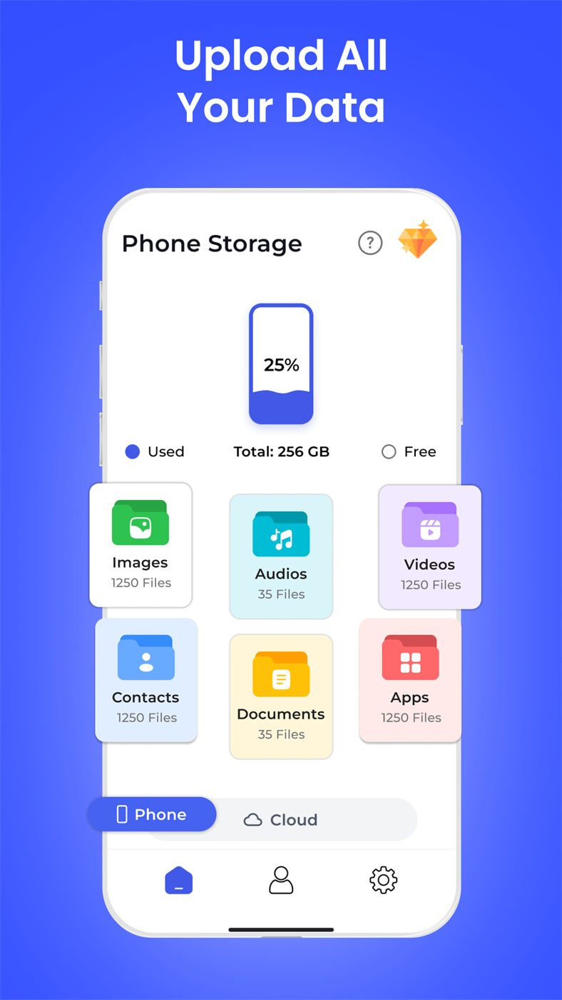

Screenshot 10 · 1080 × 1920 · portrait · Phone upload categories · [Original image on Google Play ↗](https://play-lh.googleusercontent.com/YrIkmAXFXLD7rp5kG8rQ4Uh-jZDZGF7vbuJmtRKW5iO3cArZS2Ryx3XUIM7Sa_vMFYp_FwuDe34UYTkL_4otEA)

Landscape screenshots · 4

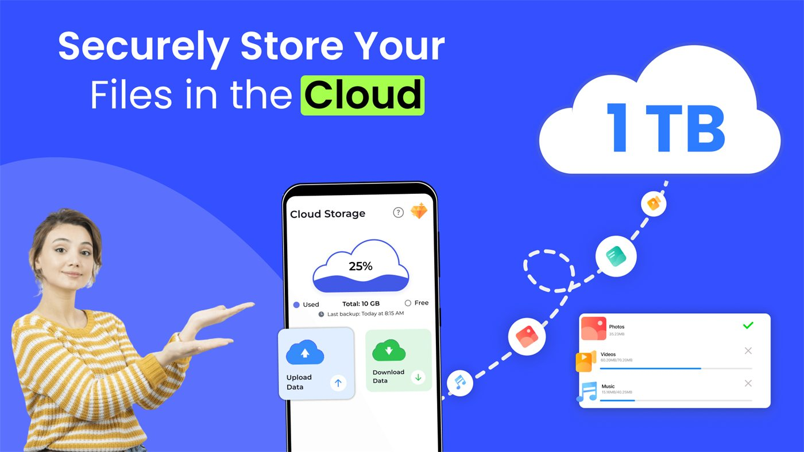

Screenshot 01 · 1920 × 1080 · landscape · Cloud capacity overview · [Original image on Google Play ↗](https://play-lh.googleusercontent.com/TbZSCJ7MxR1jsIWlyXFJhNxa2OxDSOkj2H2UFa32IFJxuHDbIj7WCm7WTIZkHmY5dqhtENcDihFOhbYAe33J)

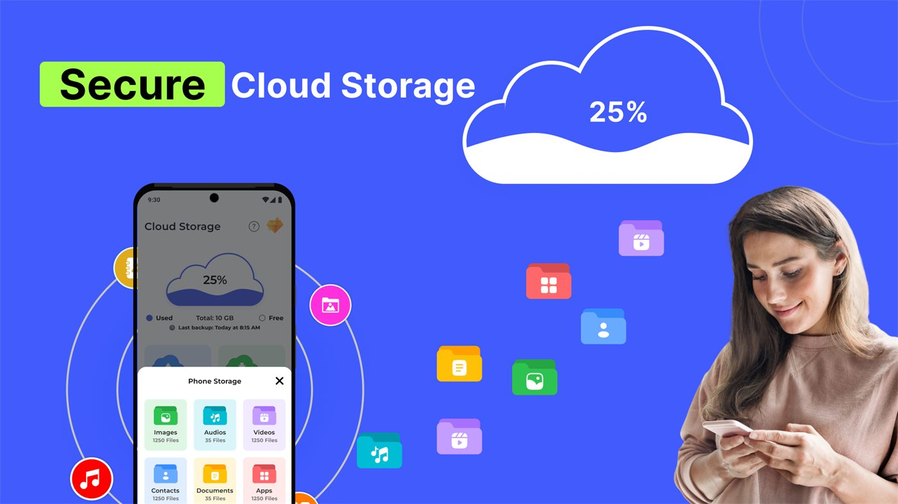

Screenshot 02 · 1920 × 1080 · landscape · Secure storage concept · [Original image on Google Play ↗](https://play-lh.googleusercontent.com/zVtFiPMVBxh7HJCqaWxdKrhhy_tUo9_YBvEQs6xRcZTZyYoSL3lZV9no_cAwyOcpsah7YjL8jIBDcaehNO3d)

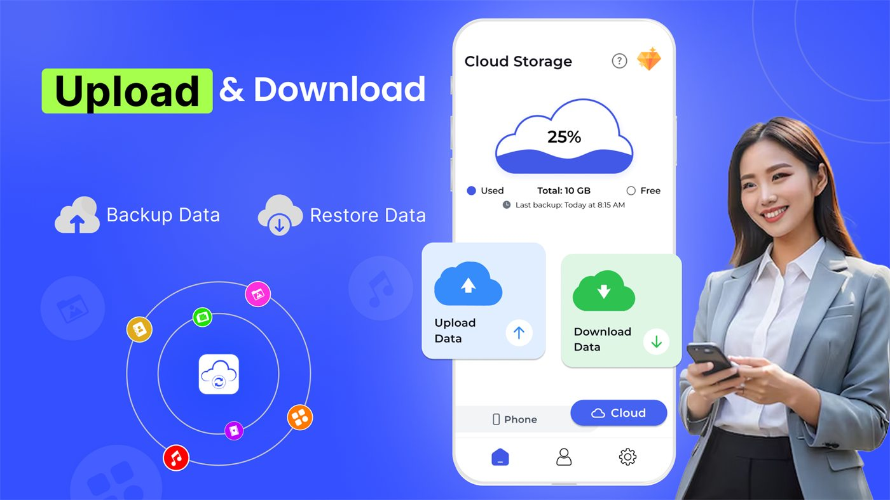

Screenshot 03 · 1920 × 1080 · landscape · Upload and download · [Original image on Google Play ↗](https://play-lh.googleusercontent.com/7S9FTv9NNtVE_I3tcXEtNhCQM-0GGISldMmY43Q16WB61Xx-TlJ_2FN2jEbBxvP2rwCNiLKiZpkET6Qr31pu)

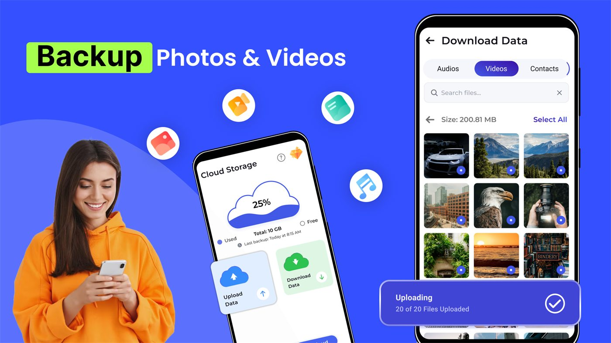

Screenshot 04 · 1920 × 1080 · landscape · Media backup · [Original image on Google Play ↗](https://play-lh.googleusercontent.com/YYUoz6-XhUk4WdZso3oCMawSYsp-uKGfnZzK0fBLlBbwgsrnAexuzkI39E-PE7TK36Fxgd-5aD4IzgYeL9KD)

06 · Daily Utility Apps

### Cloud Storage Backup & Drive

“Cloud Storage Backup & Drive” · 1M+ downloads · rating 4.1 · 7 portrait and 1 landscape screenshots

Search visibility, United States (15 Sep): **2** top-10 · **4** placements on 94 keywords

Open listing on Google Play ↗

#### Icon

A broad white cloud with a single blue upload arrow uses very few components. The purple-blue field supplies contrast without an additional badge or capacity label.

#### Feature graphic

The blue banner combines an orange storage offer, folder symbols and a large angled phone. The composition has clear left/right roles, although the small copy is dense.

#### Screenshot system

One landscape introduces transfer through a phone-to-folder diagram. Seven portraits use vivid blue, black device frames, large action strips and attached popups. The sequence includes overview, restore, media backup, completion and save confirmation.

#### Design assessment

Useful for simple icon reduction and showing task completion as proof. Screenshot 6 keeps a success dialog over the dimmed source gallery; screenshot 7 does the same for saving. The many action strips and pointing hands should be used selectively. Its 1M+ bracket does not establish that these particular creatives caused installs.

single upload arrow · success dialog · dimmed source UI · blue · action strips

Icon and feature graphic

Icon 01 · 512 × 512 · square · Original listing asset · [Original image on Google Play ↗](https://play-lh.googleusercontent.com/WNNDb4VyH2yXBwFME6OTWZKhVFPDnQt2xoJeXPcRZSBcnDoMD1JAHQc1GAzu9pH04wCUhFrxfGD1yEE2Bg9HXA)

Feature Graphic 01 · 1024 × 500 · landscape · Original listing asset · [Original image on Google Play ↗](https://play-lh.googleusercontent.com/f2H2fNYVeVrjF9IUdXU-o6WCGcIzfI_8uF_AV-oUhX71PMOcwf-OPA08Nv4WgOEz0Sx9Z4Zx6GZSkWPTJcMu)

Portrait screenshots · 7

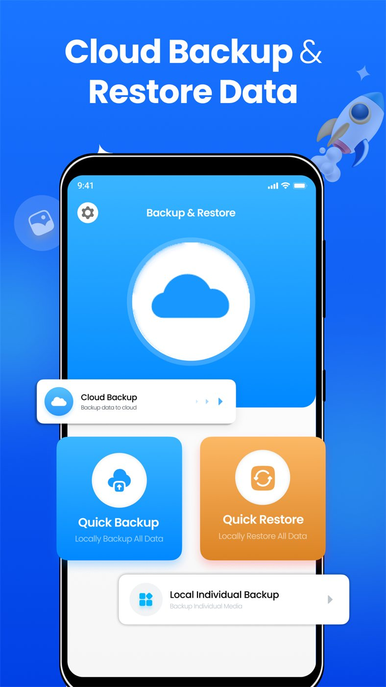

Screenshot 02 · 1080 × 1920 · portrait · Backup and restore home · [Original image on Google Play ↗](https://play-lh.googleusercontent.com/Ih7h3VAUk6vm4Ikw5_rmN0rd6Hrf_lFphnfILf8Nx9H6cElQyYCTEBoKzoa6Vj6FYw_JPr9sxuB39x2o4zuc8CI)

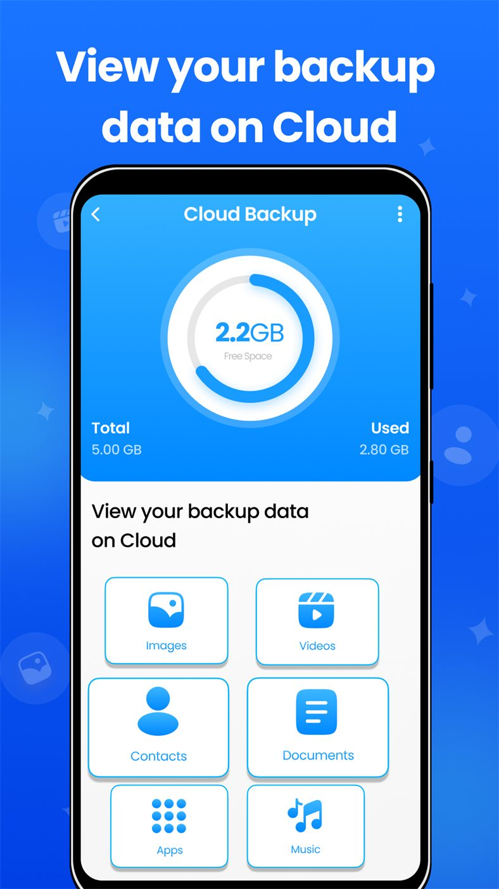

Screenshot 03 · 1080 × 1920 · portrait · Cloud categories · [Original image on Google Play ↗](https://play-lh.googleusercontent.com/M-0XmuIeJzFEMc78dZWr-g87NrVPPjcx3bEIrrYf33imefBz5RfTM4qlXi0MbFmVidP3Ea93HFb8T9j1qle9wQ)

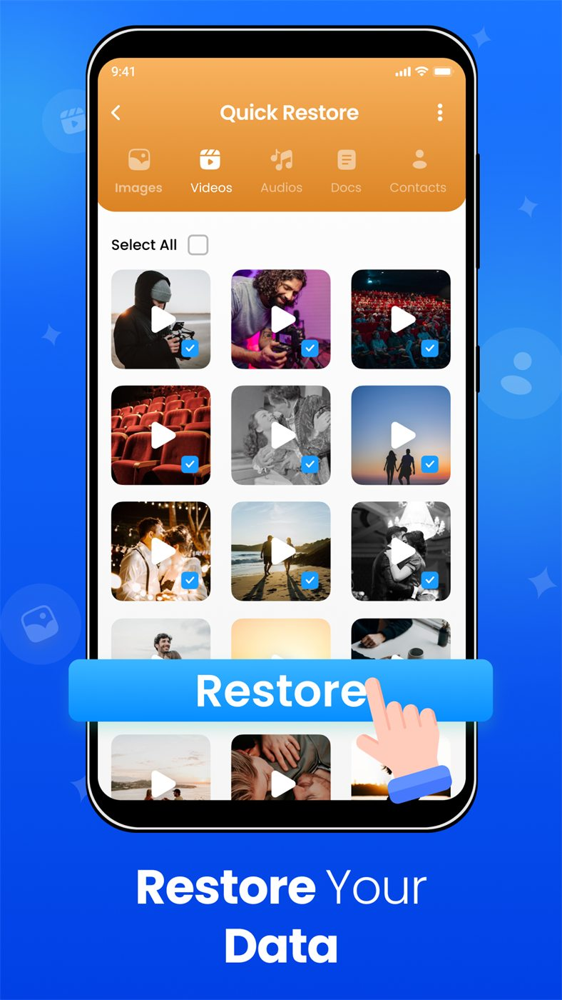

Screenshot 04 · 1080 × 1920 · portrait · Restore gallery · [Original image on Google Play ↗](https://play-lh.googleusercontent.com/GJLg_dxC0q9L1KrBff-X5stY-NmkzH5S7VhiHFK2BrRQCRtu4PB3RBbGwbbCOXSmFag4SDKnb_D5rsX6xVFKnA)

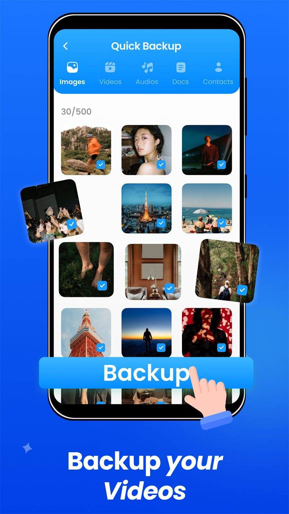

Screenshot 05 · 1080 × 1920 · portrait · Video backup selection · [Original image on Google Play ↗](https://play-lh.googleusercontent.com/3sclhMl5d5xkA4brvQFIeQA8BD4L4UfWxrpoijhXLS7U-5nsUPqtPxnUTCeE3zdORt8hkrN2IzcNJFh-WMb9HA)

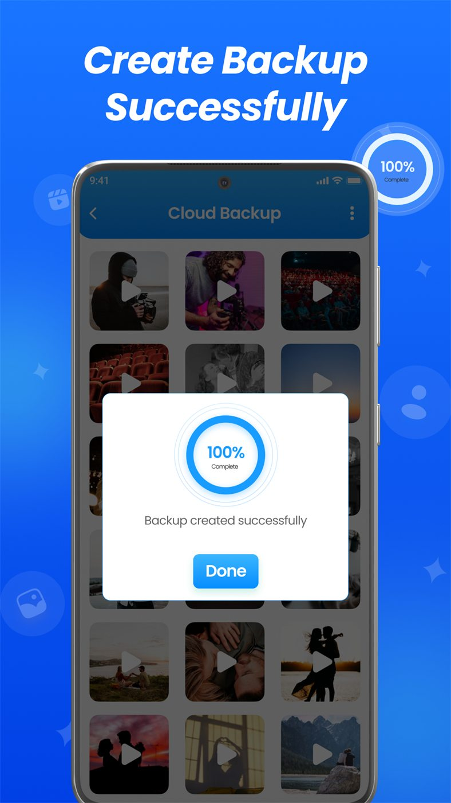

Screenshot 06 · 1080 × 1920 · portrait · Backup success dialog · [Original image on Google Play ↗](https://play-lh.googleusercontent.com/PmBjCyO1P1PirTbk3iqxmJEUYK00bGO2KzuWcdN7NVUIn64J480t5ayLEBs3g7-dXaBVn718D2WyLzs0c4WLcw)

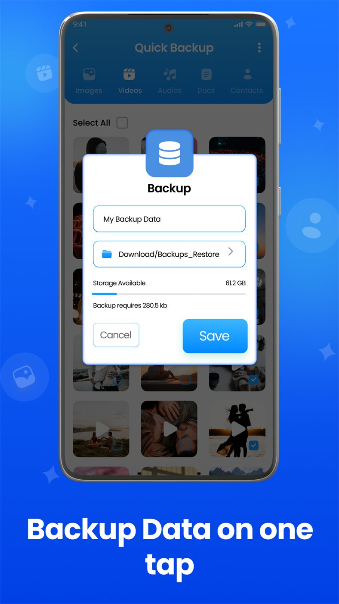

Screenshot 07 · 1080 × 1920 · portrait · Save backup dialog · [Original image on Google Play ↗](https://play-lh.googleusercontent.com/xt4PF2ebD8s4Sn-O2KGtP-xI8Zf50_n4yXbwndzCFcmIFCegS9yDPf_CP5ocP-gQWx-62iL7qwEoeYPR7JGTjg)

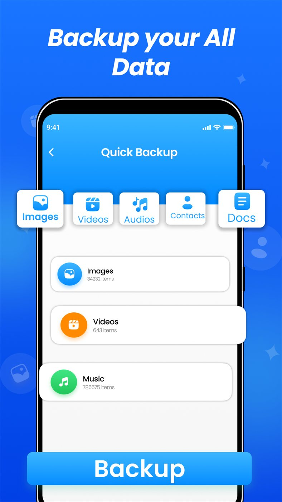

Screenshot 08 · 1080 × 1920 · portrait · Multi-category backup · [Original image on Google Play ↗](https://play-lh.googleusercontent.com/7x-XELJ0pbxWgDa92EGGUK_W7yIyMdEKDObL_44hHBmW3DquCjAwyYisTzfrOeXPAHvHgf1xu_ClhV8rXrqWKg)

Landscape screenshots · 1

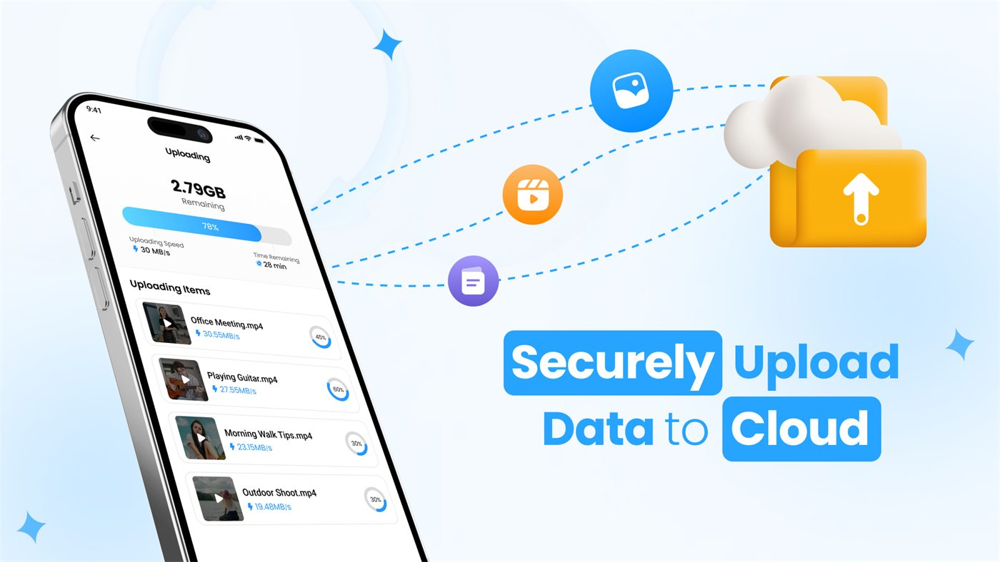

Screenshot 01 · 1920 × 1080 · landscape · Phone-to-cloud transfer · [Original image on Google Play ↗](https://play-lh.googleusercontent.com/fOp-_44ub5OWze6gXp8Nd0GEKy0_oTjzj92PrcWV0IlUYDgHPB_luJxJLTusZBTb_d3U4c00vrGzeqohGRHueA)

07 · MindByte Studios L.L.C-FZ

### Cloud Storage Drive Backup

“Cloud Storage Drive Backup app” · 500K+ downloads · rating 3.7 · 7 portrait and 0 landscape screenshots

Search visibility, United States (15 Sep): **3** top-10 · **3** placements on 94 keywords

Open listing on Google Play ↗

#### Icon

A white softly shaded cloud contains large blue capacity text on a saturated blue square. The symbol is recognizable, but the text becomes the identifying element.

#### Feature graphic

A pale banner pairs bold dark copy, blue keyword highlighting, a shield and a phone. It is visually calmer than the full-blue competitors.

#### Screenshot system

Seven portraits repeat white backgrounds, black headings, blue emphasis blocks and one large phone. Oversized upload/restore buttons, completion feedback, sharing controls and gallery chips remain near their original UI locations. Security, scanning and AI organization extend the story beyond storage.

#### Design assessment

A strong reference for restrained productivity marketing and readable heading contrast. The 10TB icon differs from 1TB imagery in the screenshot set; do not imply an equivalent free allocation. Decorative security symbols illustrate positioning, not verified encryption. No landscape screenshot was captured.

white surfaces · blue keyword blocks · security · scanner · AI gallery · connected popups

Icon and feature graphic

Icon 01 · 512 × 512 · square · Original listing asset · [Original image on Google Play ↗](https://play-lh.googleusercontent.com/5vtGG3F-r0WE_EmA0RrYRDqmc9P4UegxuTUWrXxY7iAco5LKoqYj5h8LyD4aSzvmFZUbCjOzweGTeqSna-hGpUM)

Feature Graphic 01 · 1024 × 500 · landscape · Original listing asset · [Original image on Google Play ↗](https://play-lh.googleusercontent.com/q59S3ailCKQzezY7VWHpXi6vbk8EwMXbVagNyS7J1Z0x2b7RfwyXqvp2c-r4oo2j5q7YXIkfTBFpFPPNejls)

Portrait screenshots · 7

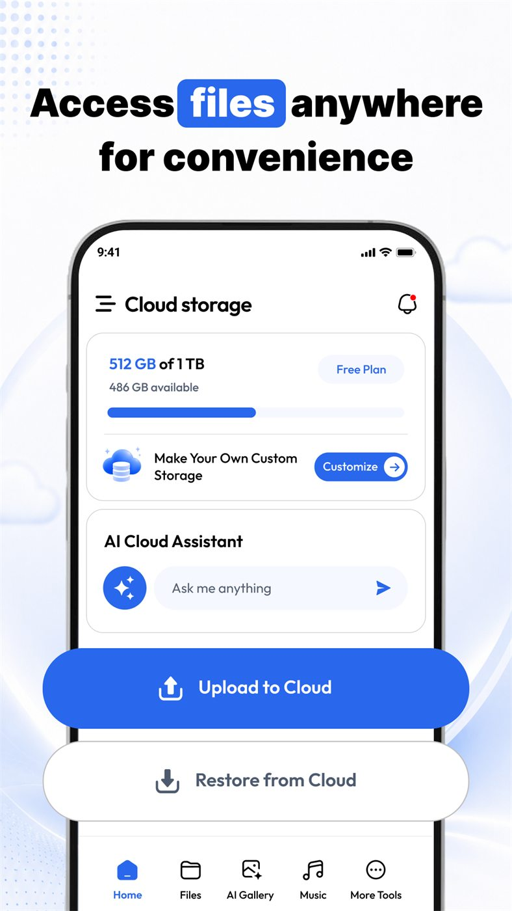

Screenshot 01 · 1080 × 1920 · portrait · Upload and restore access · [Original image on Google Play ↗](https://play-lh.googleusercontent.com/461E4Q17UzLs_NHwuqopjwTefFTcq1fYgLkHfnf7qYCBZrCDWFogDwZn_LU7nPeYj9vBTgtgeuD5f2x2Hnuk)

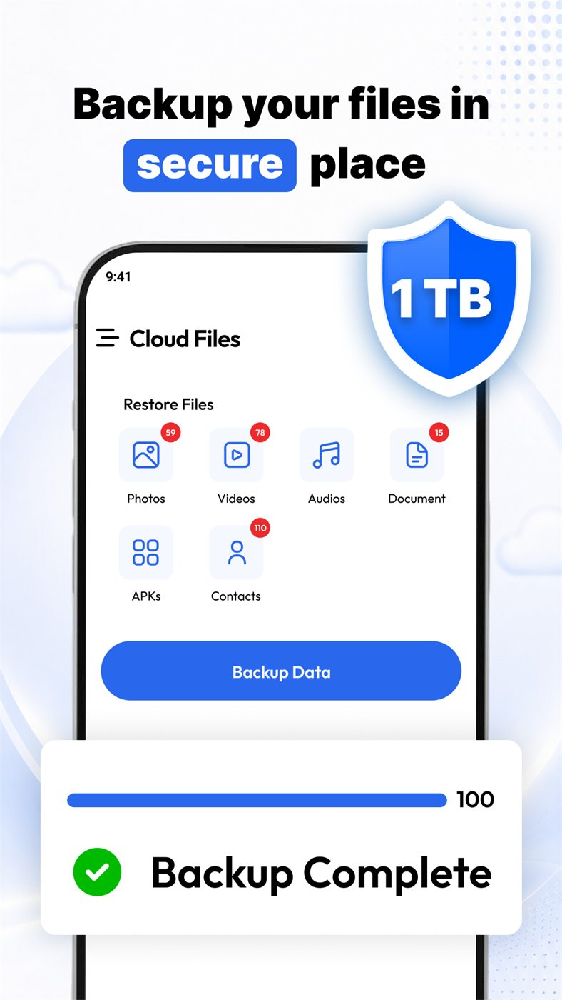

Screenshot 02 · 1080 × 1920 · portrait · Completed backup · [Original image on Google Play ↗](https://play-lh.googleusercontent.com/cGmm0ryxUW4wHCM2vGuIFzbmv6mMyZ7eufnjv87d7Y8opnmdhq867unzQe2WPyPuEL-dyRkhZRiLeuolI62r5XI)

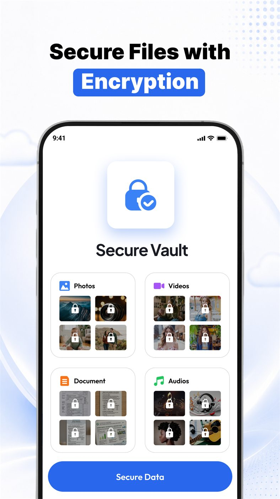

Screenshot 03 · 1080 × 1920 · portrait · Secure vault gallery · [Original image on Google Play ↗](https://play-lh.googleusercontent.com/LGzRD0J39aWJWcaXASJJdeWf45n7Nfj_jOBDatlx1Ij-XzWCCSvE9InzlGAks2OlkhM1QZZrHgk-sxIBnuf53Q)

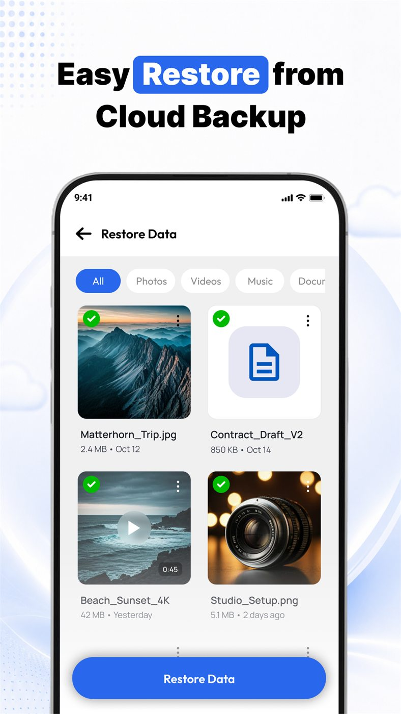

Screenshot 04 · 1080 × 1920 · portrait · Restore selection · [Original image on Google Play ↗](https://play-lh.googleusercontent.com/VZcoEsxRn75XwKn_wz1_5FUs1AOIv8XRTU4gUIwPJ9Hw9yso1UmGkoI_g8KRGdz9K5PkF0pnqgbx9CODnAuoGQ)

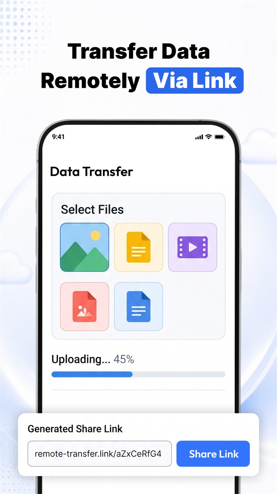

Screenshot 05 · 1080 × 1920 · portrait · Share-link generation · [Original image on Google Play ↗](https://play-lh.googleusercontent.com/9vxk4DRcWrgbv-IWU2M3TKeVWb3TWyjTo2HJoHNuxBHAY9TNKlKEi-hrZ3y8jakiy2jkCPhw1Aqp4ulCc2Z7-A)

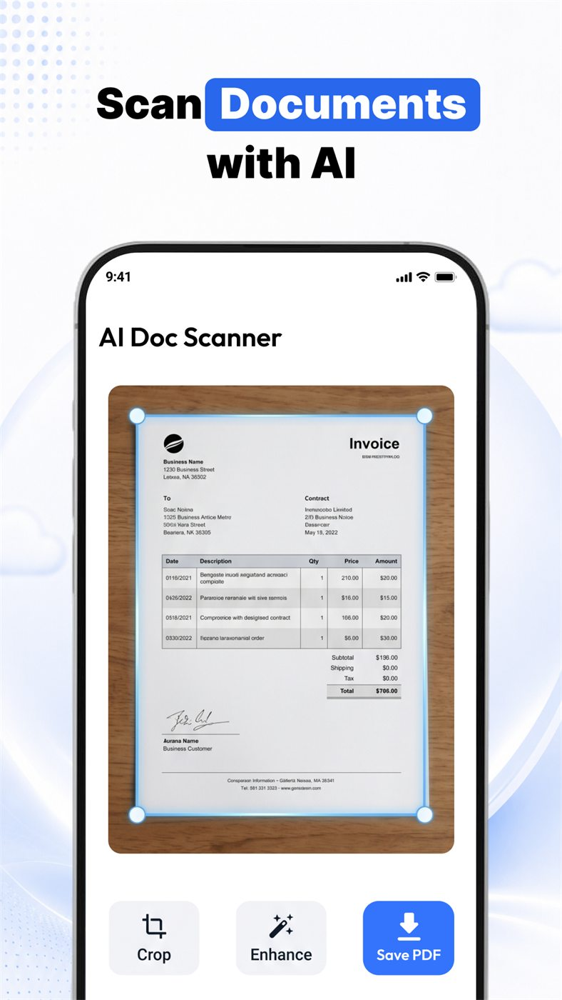

Screenshot 06 · 1080 × 1920 · portrait · Document scanning · [Original image on Google Play ↗](https://play-lh.googleusercontent.com/WRo44VsalY_ebagJe3hlwOKPwnbYMnrXOVBBaiJTZb9B25U-ClEElYcYarJIQXGSI6OV6zlGhPffJt8pWLV3)

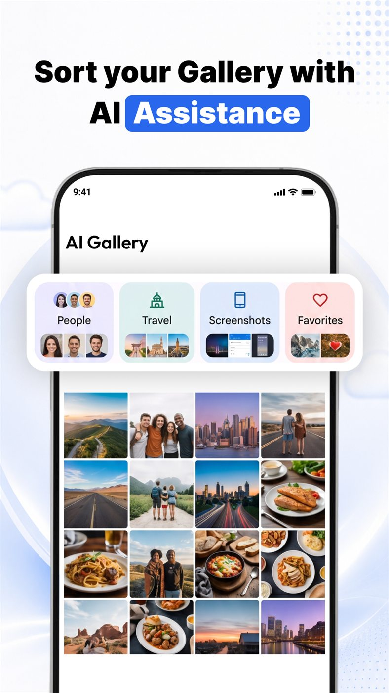

Screenshot 07 · 1080 × 1920 · portrait · AI gallery categories · [Original image on Google Play ↗](https://play-lh.googleusercontent.com/zOY5LePNVYYRwI-aSwJBmQkICj5RBFUFX55ByxBGwIxpy9MWRgweWgt39I_sJ4eGkl0eFkYAl0BOhjiTdyUg8eY)

Landscape screenshots: not observed in this snapshot.

08 · Appseen Studio

### DataHatch

“Cloud Storage Drive: DataHatch” · 10K+ downloads · rating 3.6 · 10 portrait and 1 landscape screenshots

Search visibility, United States (15 Sep): **0** top-10 · **0** placements on 94 keywords

Open listing on Google Play ↗

#### Icon

A blue upload arrow cuts into a pale cloud with an orange rear edge. The orange rim creates separation and a shallow layered effect on the blue field.

#### Feature graphic

A blue banner places an orange capacity strip and cloud on the left, with file-list UI on the right. Dotted transfer paths connect the two.

#### Screenshot system

Ten portraits split into two visible styles: five use blue/lavender backgrounds and black headings; five use stronger blue and white headings. One landscape uses a phone, paper plane and short message. Gallery tiles, transfer progress and video previews recur across both sets.

#### Design assessment

Useful for comparing two treatments of similar feature content without assuming they are a documented A/B test. The lighter set offers quieter framing; the saturated set emphasizes category familiarity. Repetition and mixed heading systems weaken cohesion. The observed orientation count spans distinct published assets, not a single phone carousel.

orange cloud rim · two visual families · photo popups · video previews · transfer progress

Icon and feature graphic

Icon 01 · 512 × 512 · square · Original listing asset · [Original image on Google Play ↗](https://play-lh.googleusercontent.com/gKoEOycA-RzKrL8Gn6IG0DESuc7a5bY1Iz2lcBdxXpvl05O-EXdxITQjVrsN4Lv2eN3Pf-zYjoRXqhO34xds_XA)

Feature Graphic 01 · 1024 × 500 · landscape · Original listing asset · [Original image on Google Play ↗](https://play-lh.googleusercontent.com/UwuFprt4BPV0RaAmD4mseMnzXpHzFGGz2VZ8nG81x8XvQzyJkAMRXhLZVitIISbOfZQ1utMU7gJxpHpFccsABg)

Portrait screenshots · 10

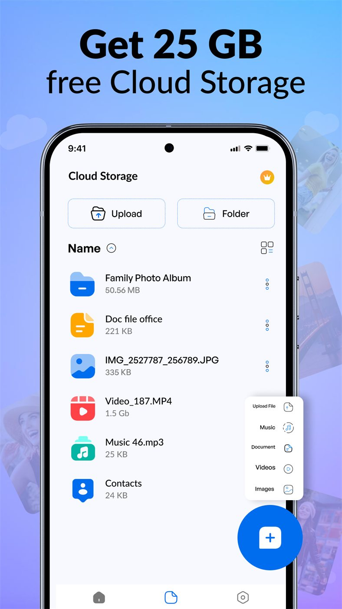

Screenshot 01 · 1080 × 1920 · portrait · Capacity and file list · [Original image on Google Play ↗](https://play-lh.googleusercontent.com/IH4nRVeS9qEkCAtnoew5q0EUEjEKxP5PN8lxHOkYrvkoAG3V6AQ507WgQwcp7J0-9RRnz_vxWa-d8dZM0MUH2Q)

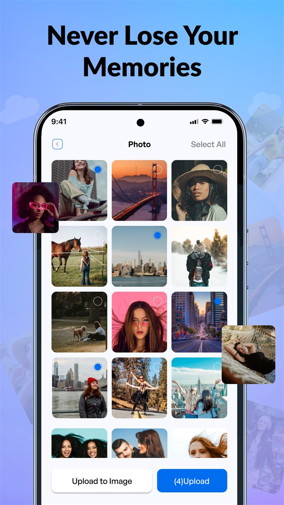

Screenshot 02 · 1080 × 1920 · portrait · Photo memories · [Original image on Google Play ↗](https://play-lh.googleusercontent.com/vorztVeXIt5LvrYFbm3wEaAxiDyNJ8NdVFTyqZCu6HzSDjjFoI9Whzwm6JVmy3N_-bovS1U7p5edA0Pxf9UUZFc)

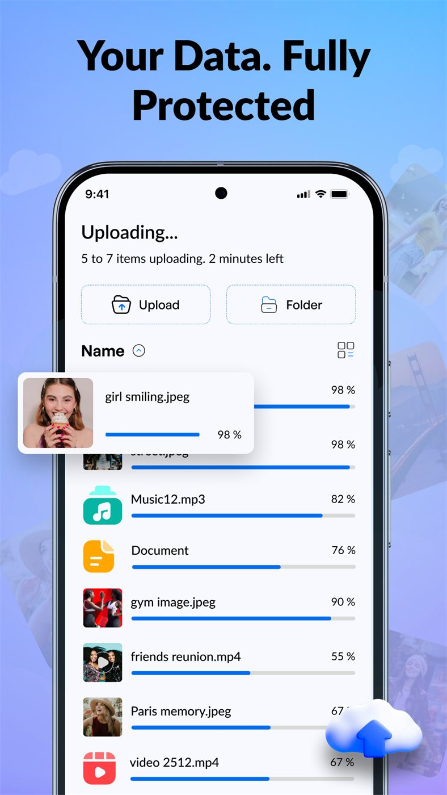

Screenshot 03 · 1080 × 1920 · portrait · Transfer queue · [Original image on Google Play ↗](https://play-lh.googleusercontent.com/zFf6OYj8-kfm3NTsORQ3-Ax6jHWIGEmR3DjCbSVzOjLmEp2jbxSdT6KzwGRF-Dnsvvb9ZsfZXk0_q_w2hQQTJw)

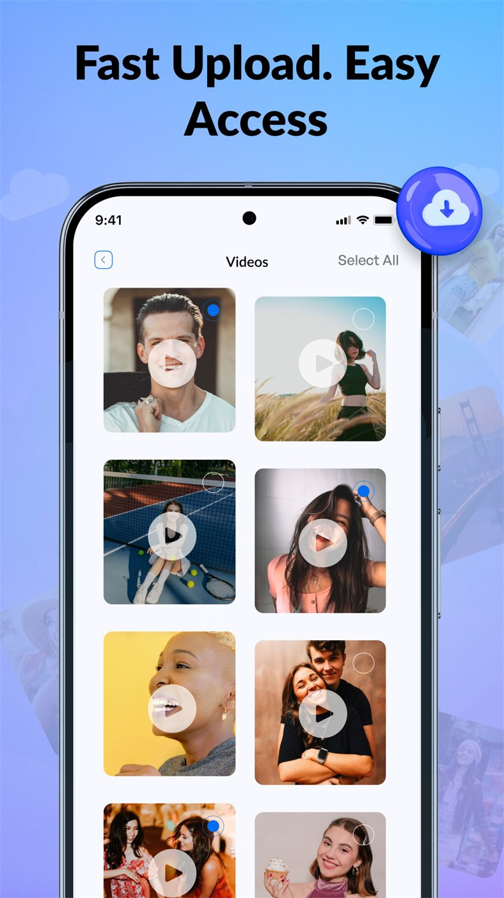

Screenshot 04 · 1080 × 1920 · portrait · Video library · [Original image on Google Play ↗](https://play-lh.googleusercontent.com/ijCVBQDoBN8agT2d6KxiEtamD6RIjmNCln6cId2OMDBjQAZDrqDLHjKcGQos_dLnqftf9JL4APYny13HtEOR_g)

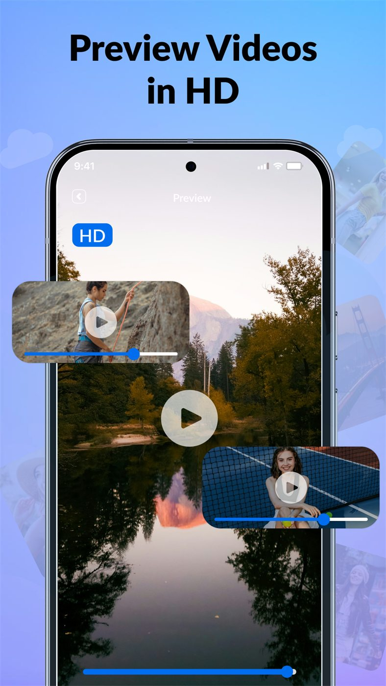

Screenshot 05 · 1080 × 1920 · portrait · Video preview · [Original image on Google Play ↗](https://play-lh.googleusercontent.com/dXnpZ6ZKUdpArYCGnpgtkqbQv0QTD2NKNxy6gzHktoyYD5I5fmtJIr0bOmwVhgVNl4Lco1DNzQA9xDdAJutkQ48)

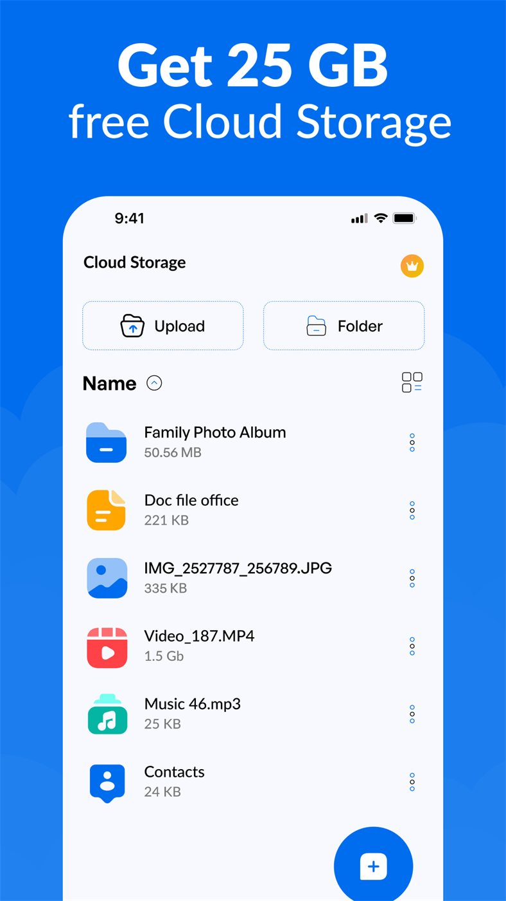

Screenshot 07 · 1080 × 1920 · portrait · Capacity and folders · [Original image on Google Play ↗](https://play-lh.googleusercontent.com/FotlUNhVvDy1NoKnr8AosJZLw8mXmElAI0z0UK14OUqpwGVi6Ik6XeYBiaVfc6xzTvTaTrp8MygOncHI7c1Sd4Q)

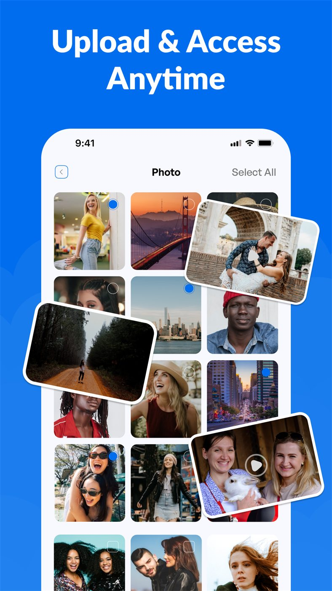

Screenshot 08 · 1080 × 1920 · portrait · Photo upload · [Original image on Google Play ↗](https://play-lh.googleusercontent.com/FLE1zvpGtN-uIRakJclxBxCtefMQQhhlVNu3Vexhq4Bkp2WxDZdQEub840IVThZEjerxZ00Z1bLTUuM0qe9w3IQ)

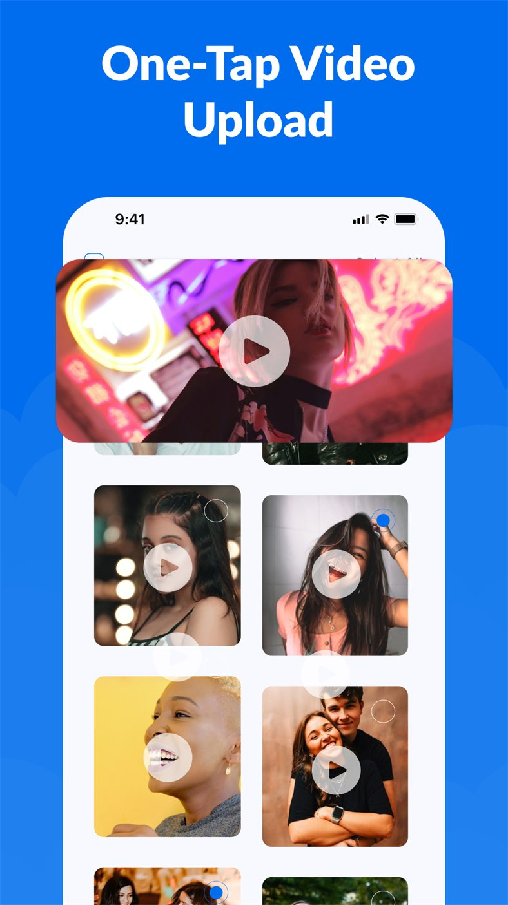

Screenshot 09 · 1080 × 1920 · portrait · Video upload · [Original image on Google Play ↗](https://play-lh.googleusercontent.com/KZSyV-Yx3ggVGQbCZHvpYqYKYAPjoYJRW63uDDowYvTmpPhjIkgwKg1q3SZyXKpazGUHkjDLMsKjnsutgGYE0sc)

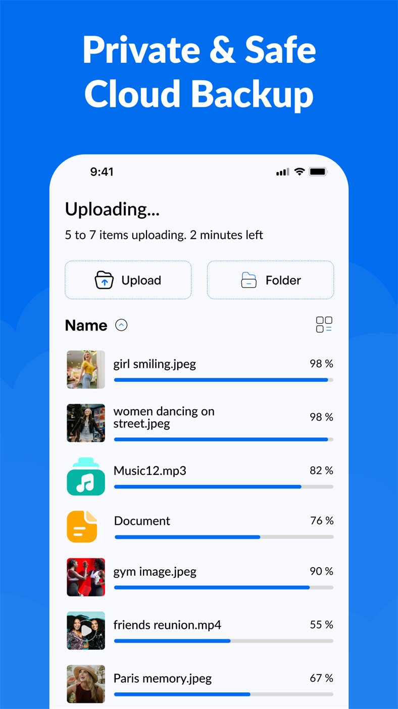

Screenshot 10 · 1080 × 1920 · portrait · Backup queue · [Original image on Google Play ↗](https://play-lh.googleusercontent.com/-0QileAF_0qa_-wNc3xL8SngcmHFrnXu9OhqQs8Qr6x9XoMN6dGMZAkUm3PI-Pdou2hVGh4-VyxPtMja3c3etg)

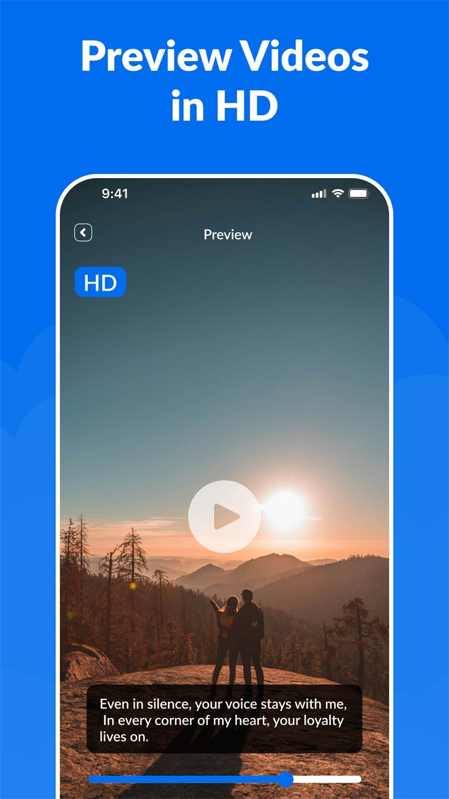

Screenshot 11 · 1080 × 1920 · portrait · Full-screen video preview · [Original image on Google Play ↗](https://play-lh.googleusercontent.com/MminxRy9bXaLrCcYogoyDVlmoDM1f79osff_R_jSiG8cE80kob1YqZyMo1Q1CoyIBao_SuRnXeX_wyhWopzzKFQ)

Landscape screenshots · 1

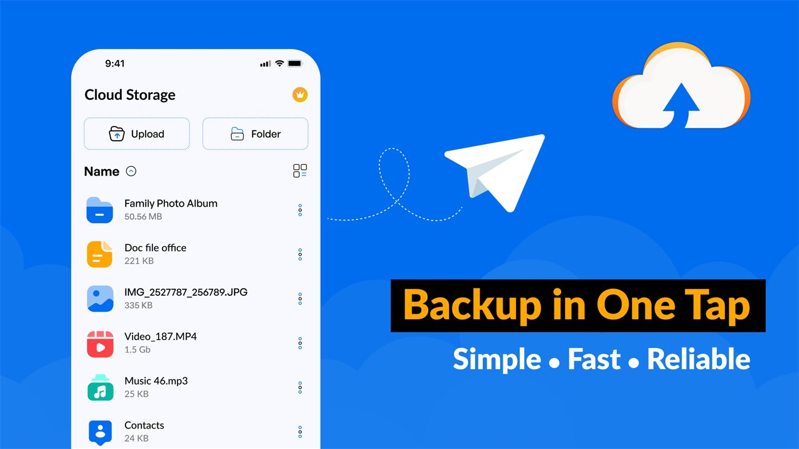

Screenshot 06 · 1920 × 1080 · landscape · One-tap backup concept · [Original image on Google Play ↗](https://play-lh.googleusercontent.com/nSu0TXHyyDQq7SAB10u-Hjzllgfzb_HsH7O45VSdrFv3ubboJInRLeTlco9Vubo9zVm2BOrUwT_KQQ3sTR6LeeI)

09 · Utility Forge

### Cloud Storage-Sync

“Cloud Storage: Drive Backup” · 100K+ downloads · rating 4.4 · 9 portrait and 3 landscape screenshots

Search visibility, United States (15 Sep): **2** top-10 · **5** placements on 94 keywords

Open listing on Google Play ↗

#### Icon

Three overlapping cyan-blue cloud lobes sit on white with a small green sync badge. Tonal layering gives depth without the heavy glossy treatment seen in Nova Cloud.

#### Feature graphic

A pale banner combines a person, tilted phone, oversized upload control and orange capacity badge. It is relatively busy for the available width.

#### Screenshot system

Three landscapes and nine portraits include two portrait families: saturated cyan with white headings, and pale clouds with blue title pills. Five portraits are 1007 pixels wide rather than 1080. Lifted file rows, restore buttons and plan cards repeat across the set.

#### Design assessment

Useful for studying a cloud on white and contrasting compact versus expanded controls. Mixed handset styles, headline systems and widths make this a cautionary consistency reference. Screenshot 8 closely repeats the feature graphic's concept but remains cataloged as a screenshot because of its listing role. Orientation alone must not determine asset type.

cyan layered cloud · green sync badge · mixed screenshot styles · plan cards · white background

Icon and feature graphic

Icon 01 · 512 × 512 · square · Original listing asset · [Original image on Google Play ↗](https://play-lh.googleusercontent.com/AYCfQ7uxqDuq_0NmXKwmdj364O_b71SRTbZnkQ0EsDPsIurU5eoVlMKDeI-Vl2hrIIeZ4v9RP-dGLJ5LS1AZkcc)

Feature Graphic 01 · 1024 × 500 · landscape · Original listing asset · [Original image on Google Play ↗](https://play-lh.googleusercontent.com/xaPF-x-4ekTE6ERSZHncvFyDZPt-PM7aDMgXK2ujcra6FR1CITPjWb6teGBTCnj3GFmMdXN0zE-FpPANE_kWIA)

Portrait screenshots · 9

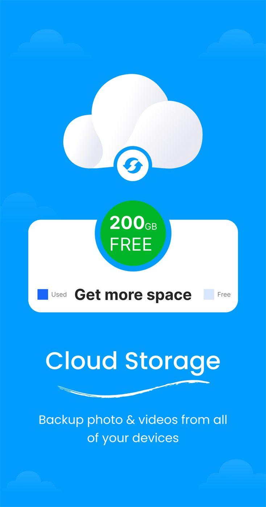

Screenshot 03 · 1007 × 1920 · portrait · Storage introduction · [Original image on Google Play ↗](https://play-lh.googleusercontent.com/6nAVYJsOmszHBViToYAF6rT1n3zelkY3J6jB1XMGySiVtwVuI28ooBZlnxrUvbIu3ubmz07DDgCoHio1kRfVgA)

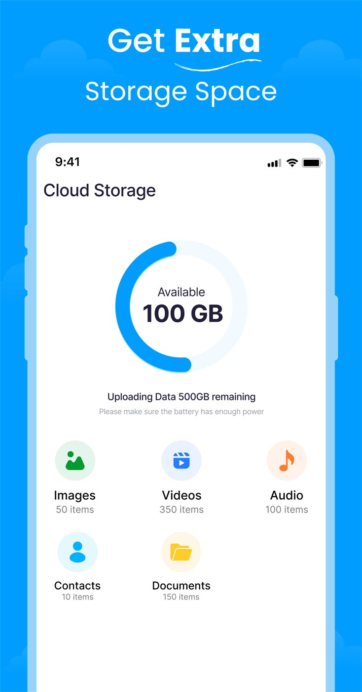

Screenshot 04 · 1007 × 1920 · portrait · Extra-space dashboard · [Original image on Google Play ↗](https://play-lh.googleusercontent.com/Y6L_aR9SzCeLrHzazyXn1uMHdVOdjPCnGADuSWsA8B5CEtmPBkIcdE65RCoqPuRvQ3pnCnOtYN_AskkmAetFQzA)

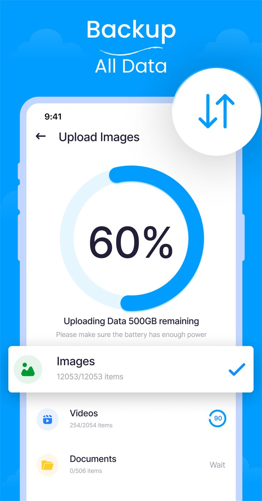

Screenshot 05 · 1007 × 1920 · portrait · Backup progress · [Original image on Google Play ↗](https://play-lh.googleusercontent.com/pK4hG9uTaRS59qyq2iMU-HNyOPO3-dEyGDK0PCl2P-OCkDDq6eIOzg7_o7Q-9wf2KNMPrRXHcER4P837WF3F)

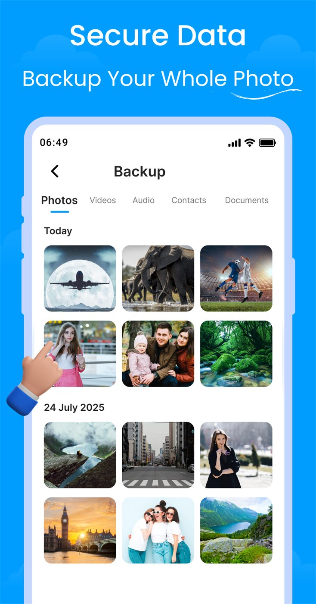

Screenshot 06 · 1007 × 1920 · portrait · Photo library · [Original image on Google Play ↗](https://play-lh.googleusercontent.com/nlVIsQsgcDWLI_fXaVfkTYv0suSv3_P6XBmCCsZH6EPmiQ21Ad8DetZZ_PXNWc9o7K8ocWRBo4U14jRpzPDvDp0)

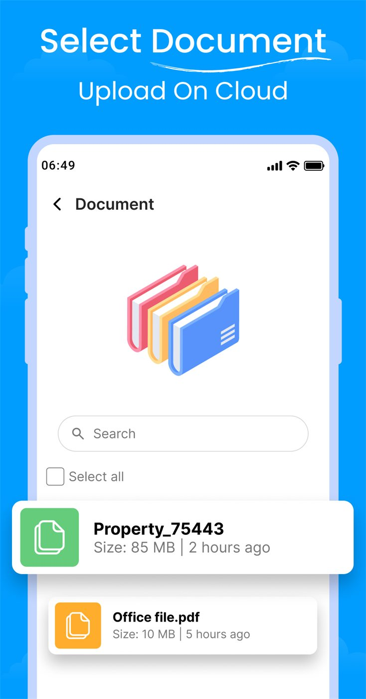

Screenshot 07 · 1007 × 1920 · portrait · Document upload · [Original image on Google Play ↗](https://play-lh.googleusercontent.com/r-0QWRZVhEy5F_Q9TuC07vNZiCwfcB1osJ9emjU3nqvO7B46zZ6oX0ELJaJoe36XK-XlhgHPyHd-WolPhq6g)

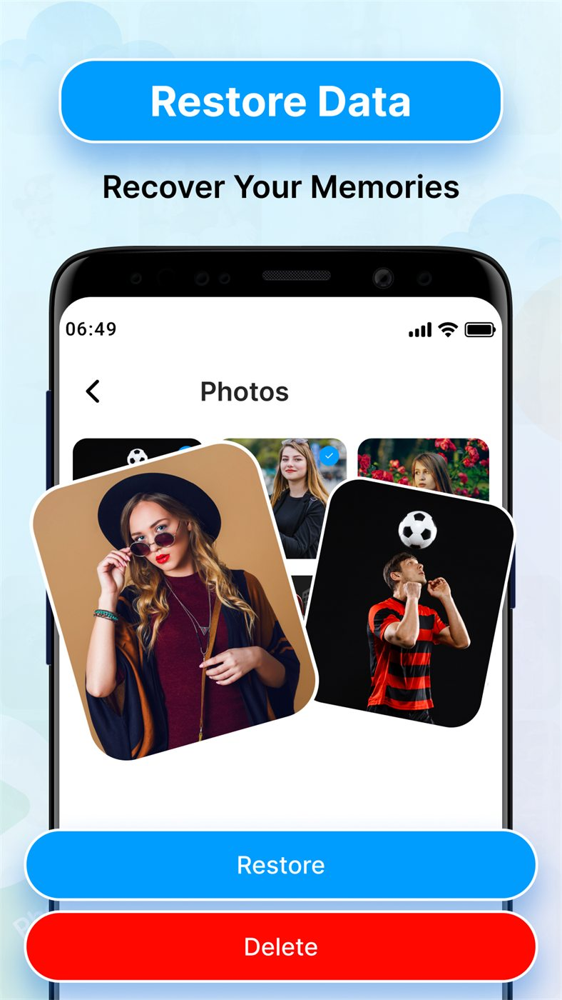

Screenshot 09 · 1080 × 1920 · portrait · Restore photos · [Original image on Google Play ↗](https://play-lh.googleusercontent.com/uAb1uSH1zv2DsWvMMntruvHBUncw_JMr0pI_5bFLFx6NKxSqtUSGVbydJ0fRjkITOUQscoAtvuCEnDTRmnkfDA)

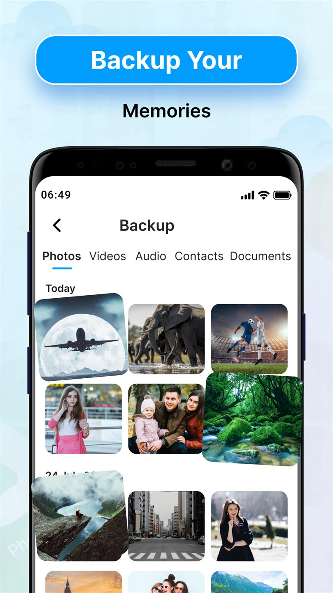

Screenshot 10 · 1080 × 1920 · portrait · Backup gallery · [Original image on Google Play ↗](https://play-lh.googleusercontent.com/eTjR6C3SAM7M1sDCYLmF5EcR0qdMvR27eUgB4VUdwxPbTwpn35kQc-3IJmAe8D5Rg8xZ2fLXT4NqAl54NJ4w)

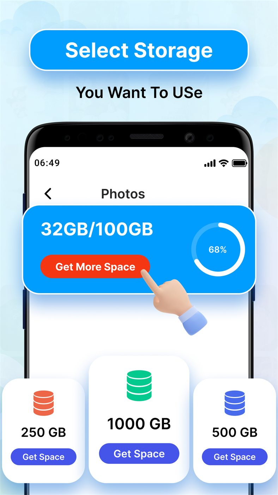

Screenshot 11 · 1080 × 1920 · portrait · Storage plans · [Original image on Google Play ↗](https://play-lh.googleusercontent.com/X8nW6CP89ynL5W_WZkDPHlJ4vlmD3fXPccWGgldr8xX_UU5eXgmSfEIGdOel6IYkXTnH4Ap_gfTjDYkL7i_b)

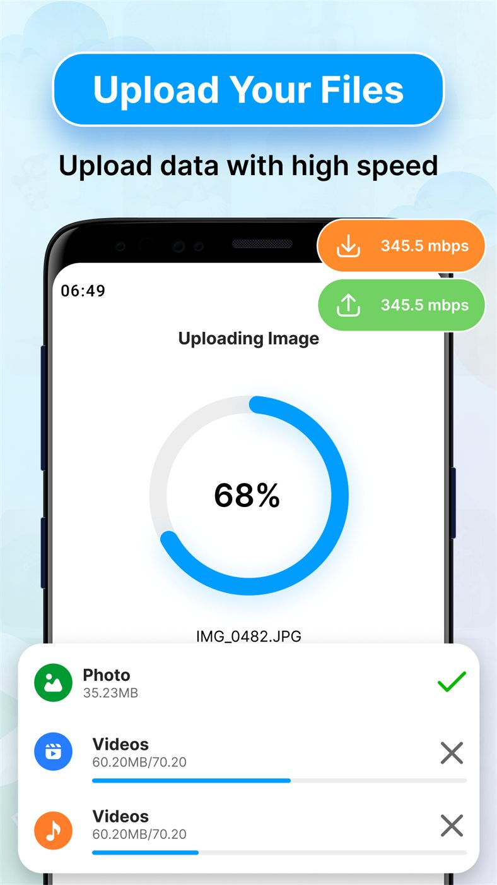

Screenshot 12 · 1080 × 1920 · portrait · Upload progress · [Original image on Google Play ↗](https://play-lh.googleusercontent.com/TF09iRRrPd0ozYFoilegN_WV0Rx8Mh7F3jTvh0azRTXs4tI8FIJG8VlJNYMyYqhIh_B9TJA7WkddVQF0Y8j1)

Landscape screenshots · 3

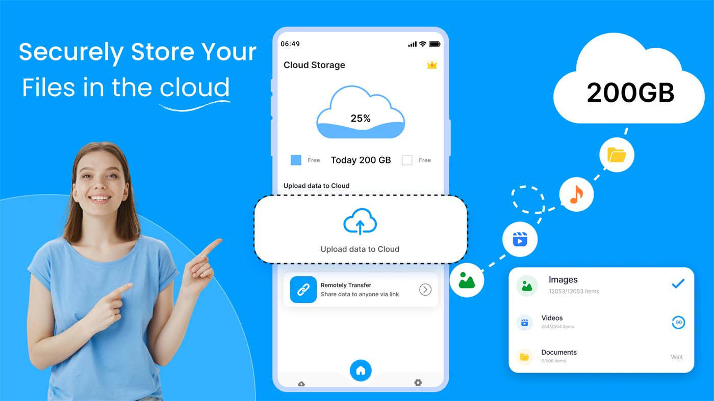

Screenshot 01 · 1920 × 1080 · landscape · Capacity concept · [Original image on Google Play ↗](https://play-lh.googleusercontent.com/g_o02g-C0i-rhLP4IRj6T5OEHW2jJnr16pV_vCdJ-tjYWFCHV5i2bk4rIPTcLIRW7D8PK-MKAYi9ePaYjWHA)

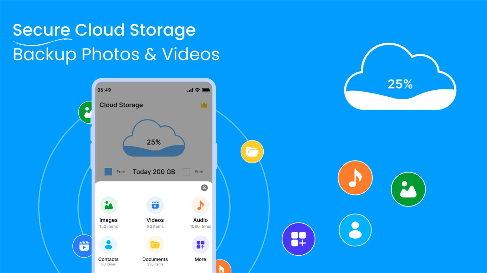

Screenshot 02 · 1920 × 1080 · landscape · Secure media storage · [Original image on Google Play ↗](https://play-lh.googleusercontent.com/63t2MFaqJk9I71v0hlBNR6vQsdMR8xMPKA0FVEK-g4qinhvWLzvAGRonXku6y-iqQw9WS_M_psbGkpgPx7kw)

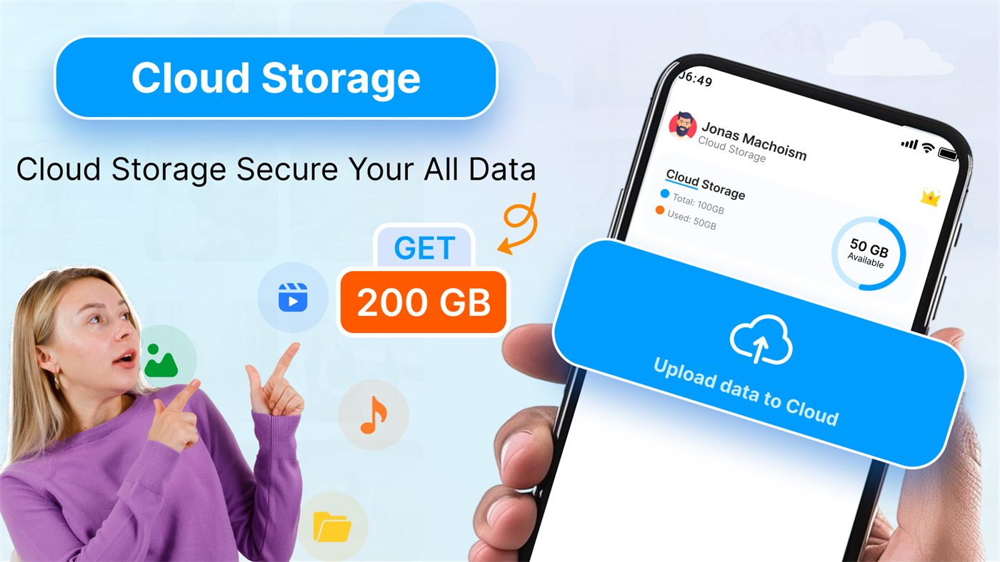

Screenshot 08 · 1920 × 1080 · landscape · Cloud storage promotion · [Original image on Google Play ↗](https://play-lh.googleusercontent.com/TeDSDPUJLY7fROIB0Mcuz00BkM81SoQP7Z2GmW9zmbwtaApNUV44IdhiR_rujtg3krp6XC7eQiVhYmRDkRXAOVg)

10 · Golden Associate Pvt. Ltd.

### Cloud storage

“Cloud Storage App Drive Backup” · 1K+ downloads · rating Not returned · 5 portrait and 0 landscape screenshots

Search visibility, United States (15 Sep): **1** top-10 · **1** placements on 94 keywords

Open listing on Google Play ↗

#### Icon

A large white cloud on blue has a circular upload motif at its lower edge. The arrow's additional chevron detail makes the small badge busier than a plain arrow.

#### Feature graphic

A centered cloud, category name and row of colored file symbols form a simple blue banner. Faint clouds add background texture.

#### Screenshot system

Five portraits maintain blue backgrounds, centered white headings and tall outlined phones. They cover upload, photos, scanning, recovery and capacity breakdown. Lifted gallery tiles and a pointing hand emphasize actions; a multicolor donut chart finishes the sequence.

#### Design assessment

Useful for a compact five-panel feature story and consistent heading placement. The small install bracket provides little evidence for treating it as a market leader. Thin badge details and tiny chart labels should be tested at real listing scale. No landscape screenshot was captured; a public rating was not returned in the captured listing data.

upload badge · blue · five-panel story · scanner · storage chart

Icon and feature graphic

Icon 01 · 512 × 512 · square · Original listing asset · [Original image on Google Play ↗](https://play-lh.googleusercontent.com/MRqQuLz58kqOBxkWcnukDRtb9tJejiovPMV1HvgucDG-tSB5TRcHUSSc7rkMCJ6P_dEVc7z6spbmhdhaa75qAUA)

Feature Graphic 01 · 1024 × 500 · landscape · Original listing asset · [Original image on Google Play ↗](https://play-lh.googleusercontent.com/N0jQNcmBcWc0mFVBYlWN8iW_xGA8Bpi1XWVLtdqedhU_S3O47u2MurP58KAMpNVzAtyqv-8uqBcml9YaDmqt)

Portrait screenshots · 5

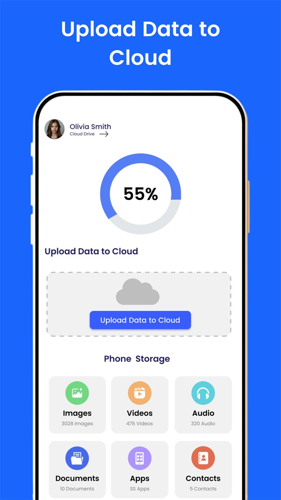

Screenshot 01 · 1080 × 1920 · portrait · Upload dashboard · [Original image on Google Play ↗](https://play-lh.googleusercontent.com/pZxH1lpD3TgNHsy0p_FIFZR8JdjZLqbOY0nyN6Ykhl7gLuJqjcTm5M6rdxtNmIXihhFbHHafrBEWql9oTZNDDQ)

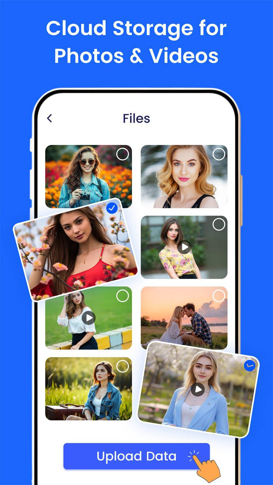

Screenshot 02 · 1080 × 1920 · portrait · Photo and video gallery · [Original image on Google Play ↗](https://play-lh.googleusercontent.com/rjzFVjYSTkbB5mL4W79mjZSPSKh2cZ0O3fJXvJ-KXEaKL5NQPgwssvRZYwVXiJG8vxvheFKVbGD_iXqHKyYbaw)

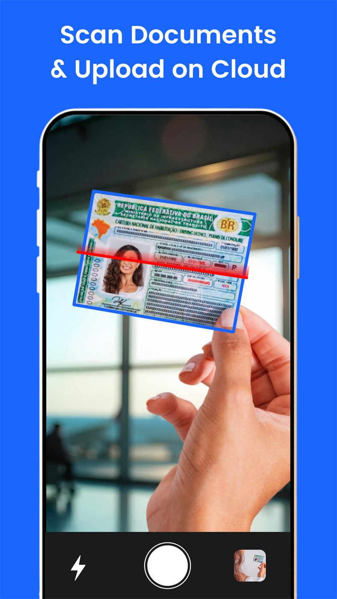

Screenshot 03 · 1080 × 1920 · portrait · Document camera · [Original image on Google Play ↗](https://play-lh.googleusercontent.com/zTfoO6kO8DOPFYzjsQSNDkvAI4tHzj19dBW0kxdtfthKCwZkuxosUZzB5MbDi_kB0WOre1VDOBR65cZzfG1M)

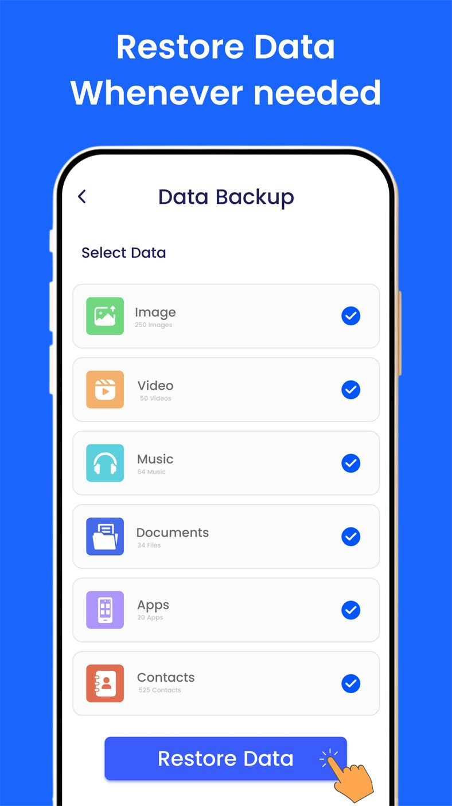

Screenshot 04 · 1080 × 1920 · portrait · Restore categories · [Original image on Google Play ↗](https://play-lh.googleusercontent.com/d0dlULJY6vlwFQOT71XMeLqfB9jP0xi5GK8bxSU-YkYw6-QpZdWHKbH8hvXfnmQhFp-Bqf-R6rnUUJTN4P8l)

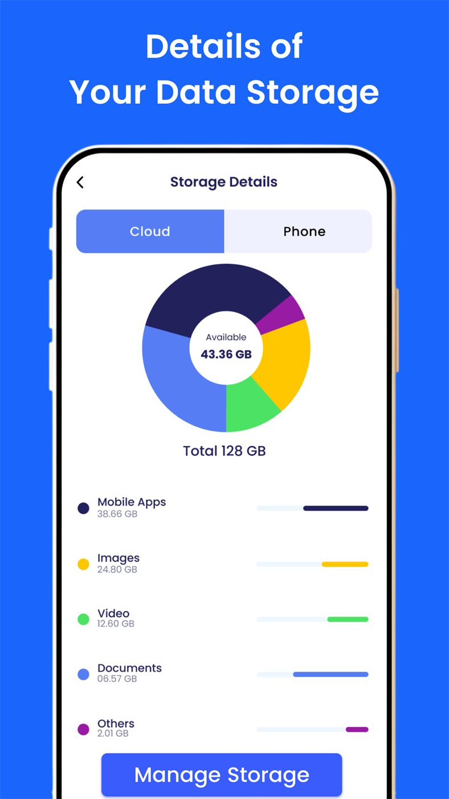

Screenshot 05 · 1080 × 1920 · portrait · Storage breakdown · [Original image on Google Play ↗](https://play-lh.googleusercontent.com/E22ugG1388NTc4bJO3ZJPnF73Nqnt9KHb_o06w7owtSK5efV2TUvMjeMaJorRXgX1w7jlYU-JwcywNisgymtSA)

Landscape screenshots: not observed in this snapshot.

11 · Nova Apps Studios

### Nova Cloud

“Nova Cloud: Storage & Backup” · 5K+ downloads · rating Not returned · 6 portrait and 0 landscape screenshots

Search visibility, United States (15 Sep): **0** top-10 · **0** placements on 94 keywords

Open listing on Google Play ↗

#### Icon

A thick extruded cloud blends purple and cyan around a pale upload arrow. A soft blue-lavender background supports the metallic edge and directional lighting.

#### Feature graphic

A person and angled purple phone occupy the left; the right holds a small cloud, name and supporting copy. The light background connects to the screenshot surfaces.

#### Screenshot system

Six portraits use pale backgrounds, large purple curves and dark purple app UI. The first two phones tilt; later devices stand upright. Transparent-looking category panels and lifted photo thumbnails reinforce the dimensional visual language.

#### Design assessment

The most distinctive glossy purple reference in this sample and the closest material study for a 3D cloud direction. It also has only 5K+ displayed downloads, so visual novelty is not evidence of conversion. Small text over translucent purple panels needs close readability checks. The encryption statement is marketing, not a security audit. No landscape screenshot was captured.

3D cloud · purple and cyan · glass-like panels · pale backgrounds · angled phones

Icon and feature graphic

Icon 01 · 512 × 512 · square · Original listing asset · [Original image on Google Play ↗](https://play-lh.googleusercontent.com/Ze2wmwy2S1upnoYbEMRMCXv1nfh7x5GgxqGhACGhR0LqtfK0_3uYTan6Asf9NsRPhZHoLD54S3428pHyRw-W-f4)

Feature Graphic 01 · 1024 × 500 · landscape · Original listing asset · [Original image on Google Play ↗](https://play-lh.googleusercontent.com/WMyeDEH4ni33Q4BkowqjE01oZnH6hZlwKHL03m1ccamqKIEbQtWhQaOpiDt1NxG4i6BwrqeRzv2WIGi3vktSETo)

Portrait screenshots · 6

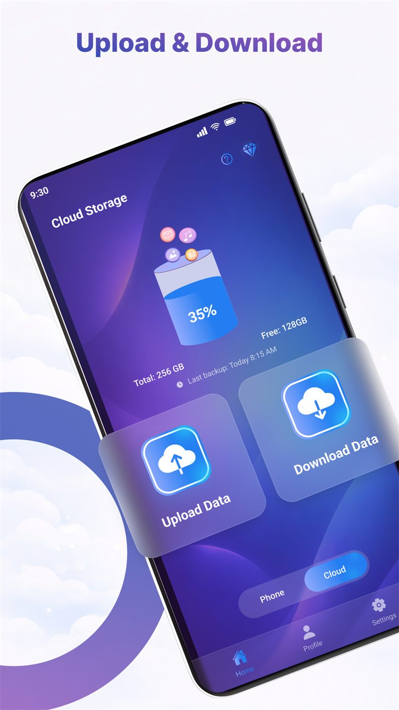

Screenshot 01 · 1080 × 1920 · portrait · Upload and download home · [Original image on Google Play ↗](https://play-lh.googleusercontent.com/1kyDc8Bf1O44WnxlLP2Yi5Q7guV2xdfKr-XJhksH0Qcf69MkjMk0kByyw8nVvvv3mJa6yS1tV1ZB8P8rYRO1Yg)

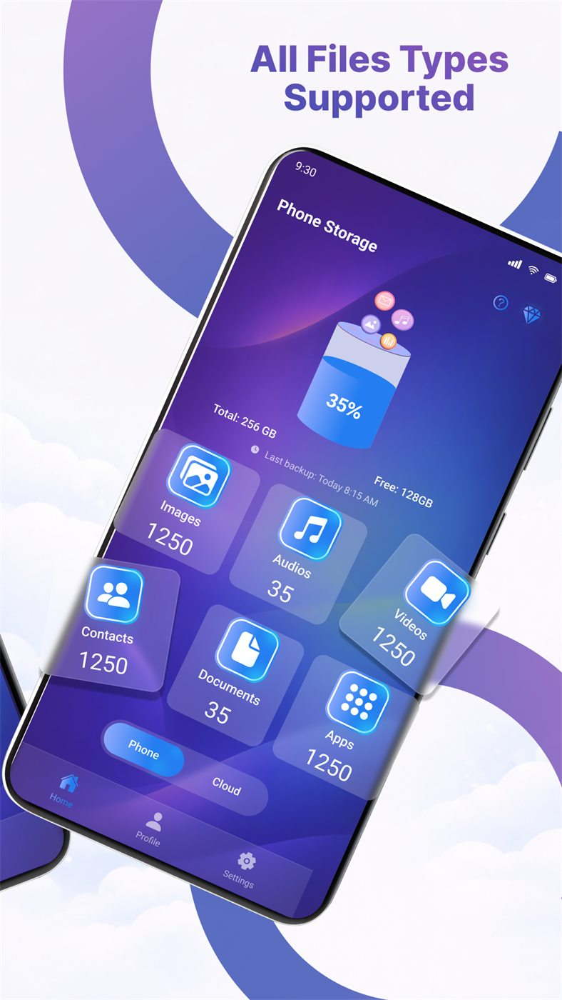

Screenshot 02 · 1080 × 1920 · portrait · File categories · [Original image on Google Play ↗](https://play-lh.googleusercontent.com/9d3v-dKMD1ltxIb-J-jfT4Qm7l2cFhBJm7EiIYL-9zNrBsUqNvk8Bv5DBIyfWEhFG7Q7q6zpRUFz_0FgBkl0N5E)

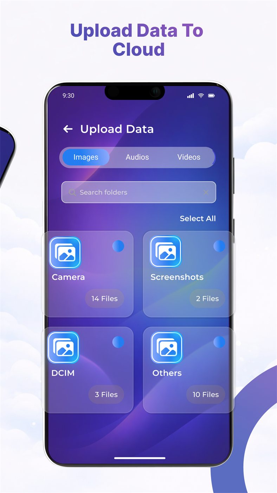

Screenshot 03 · 1080 × 1920 · portrait · Upload folders · [Original image on Google Play ↗](https://play-lh.googleusercontent.com/2tiU146je7Wryr5Yo-ad_OVJ_BYPeYEpcv9PzZTCnPm6N6SdoIfdgUJ3OqiGGppelVFqJ3IJwtzEYH0COd6Rcg)

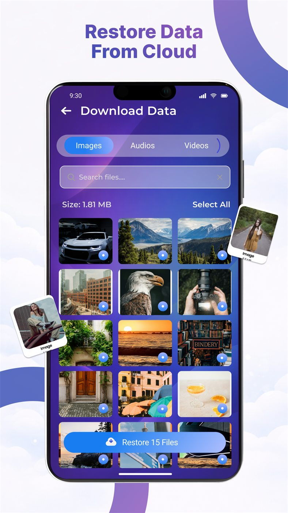

Screenshot 04 · 1080 × 1920 · portrait · Restore media · [Original image on Google Play ↗](https://play-lh.googleusercontent.com/NRWsbOtgHK78dbKHplXsw5S6rZNB3k9rFhksovpw3_SYA8faEvFL602NWHe-Vffp5100TH61mfC5dCzPxmie)

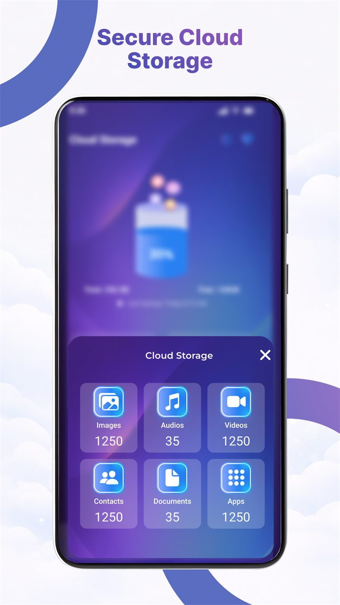

Screenshot 05 · 1080 × 1920 · portrait · Expanded cloud categories · [Original image on Google Play ↗](https://play-lh.googleusercontent.com/oEmQin6Z0dXjgcLD3yBuzd9M3WQOX6T_gktDhAbDiaq6tUuB4P-cR_314CWDdW9pxCaU8r1pwzj2gLW14d40tQ)

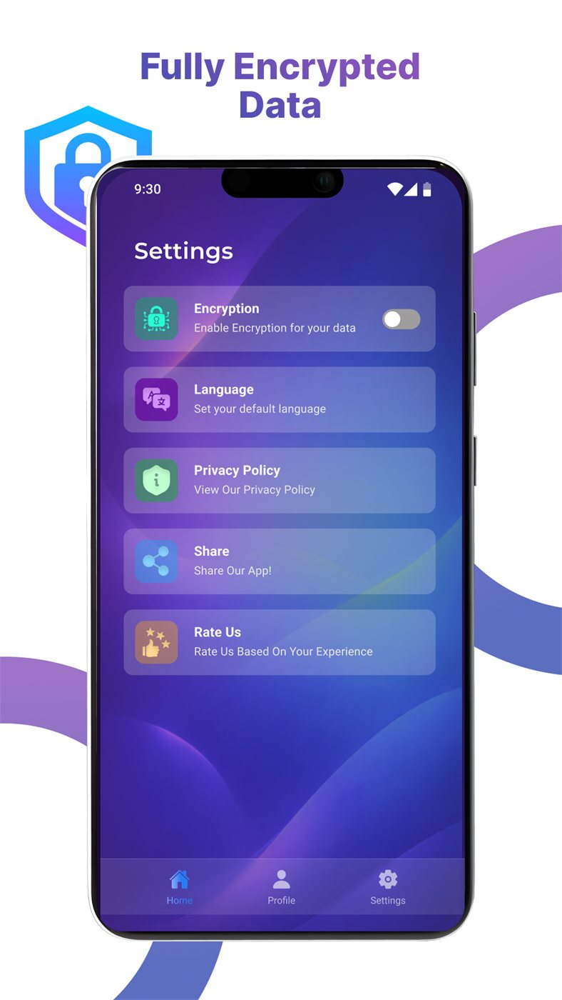

Screenshot 06 · 1080 × 1920 · portrait · Encryption settings · [Original image on Google Play ↗](https://play-lh.googleusercontent.com/Ic55ia4G1EDLvyO7Vk2f-HQzQGQXw0DB_HUC96XKO6LAwUuHzRSFiCfffv5VWBFAAcqB1BmtwfIKowBZ1_xy)

Landscape screenshots: not observed in this snapshot.

Across all 11 competitors

## Cross-app design patterns

Icon silhouette

Large filled clouds survive reduction better than thin strokes and several nested badge details. Preserve a recognizable outer shape and test internal arrows or locks at small sizes. Nova's material depth is visually distinctive, while Daily Utility Apps shows the simplest upload construction. References: [06](#g-06-cloud-storage-backup-drive) [11](#g-11-nova-cloud).

Badge alignment

Fazcon and ANZ place their circular symbols along the lower cloud edge; MAPIDIRECTIONS places its ring inside the cloud. These create different visual balances. For the approved four-lobe concept, keep the badge on the cloud's intended centerline and verify perceived weight as well as coordinates. References: [02](#g-02-fazcon) [03](#g-03-anz-cloud-drive) [04](#g-04-cloud-backup).

Color system

Blue is the category norm across the sample, so it is a familiarity cue rather than a differentiator. White UI, one consistent accent and a distinctive silhouette offer clearer ownership than adding more gradients. Nova provides a useful purple/cyan exception; MindByte provides a quieter white-surface treatment. References: [07](#g-07-cloud-storage-drive-backup) [11](#g-11-nova-cloud).

Portrait composition

Most sets place a short heading above one tall interface. Gallery images or controls occasionally extend beyond the phone. Stable heading position, phone size and surrounding space make a sequence easier to scan than panels that repeatedly switch composition. References: [01](#g-01-cloudgate) [02](#g-02-fazcon) [07](#g-07-cloud-storage-drive-backup) [10](#g-10-cloud-storage).

Landscape adaptation

Fazcon and Fuzon redistribute phone, headline and supporting objects across the width. This is a composition change, not a crop of a portrait. The captured landscapes usually show a portrait phone within a wide marketing canvas; they do not establish native tablet or landscape app support. References: [02](#g-02-fazcon) [05](#g-05-cloud-storage-drive).

Connected popups

Fuzon's category chooser, Daily Utility Apps' completion dialog and MindByte's share-link control retain visible source context. This is the most useful recurring treatment for the requested popup behavior. Enlarge the relevant element only enough to make its function readable. References: [05](#g-05-cloud-storage-drive) [06](#g-06-cloud-storage-backup-drive) [07](#g-07-cloud-storage-drive-backup).

Message hierarchy

Capacity, backup, restore and media are the recurring opening hooks. Vaults, document scanning, sharing and AI organization appear later. Capacity statements vary between assets on several listings; a future set should distinguish available allowance from paid maximum capacity. References: [01](#g-01-cloudgate) [04](#g-04-cloud-backup) [07](#g-07-cloud-storage-drive-backup).

Consistency

DataHatch and Utility Forge publish visibly different screenshot families. These may reflect device sets or updates; no experiment history is available. A new set should deliberately preserve its palette, typography, device proportions and callout treatment across orientations. References: [08](#g-08-datahatch) [09](#g-09-cloud-storage-sync).

For your next graphics set

## Guidance for future graphics

Keep the approved icon identity

Use the latest approved four-circle cloud as the source. Carry forward only authorized adjustments: center circular arrow/lock badges, remove unwanted 3D frame outlines, keep the 2D cloud silhouette consistent, match background shades within the 2D and 3D groups, and keep the area outside rounded corners white in comparison presentations. These are recorded preferences, not changes performed by this research.

Choose one screenshot system

For a calm productivity direction, start with MindByte's hierarchy: a short dark heading, a large real screen, a restrained blue emphasis and one connected callout. If stronger category color is preferred, use Fazcon's consistent portrait structure. Do not mix two heading systems within one approved sequence.

Build a six-screen narrative

A practical sequence is: core backup value and home screen; photo/video preservation; visible backup progress and completion; restore selection; private files or vault if implemented; and document scanning or link sharing if implemented. Use actual app screens, real feature names and verified storage terms.

Design landscape separately

For each selected portrait message, create a wide composition with the screen on one side and a short benefit on the other. Keep the same colors, source UI and feature-associated popup. Do not rotate the phone UI or imply a tablet interface that the app does not have.

Treat the feature graphic as its own asset

Use one clear benefit and a restrained visual narrative at 1024 x 500. It should complement the icon rather than become an enlarged duplicate. The earlier rulebook's 1920 x 1080 size can be used for a custom landscape marketing image; it is not the Google Play feature-graphic upload size.

Evaluate at realistic sizes

Before selecting an icon, compare the exact assets at 32, 48, 64 and 96 pixels on a white surface. These are proposed inspection sizes, not guaranteed Play Store layout dimensions. Check arrow direction, badge alignment, cloud separation and whether thin frame lines disappear unevenly.

Test one variable at a time

A future comparison can hold the four-lobe cloud fixed while testing 2D versus 3D materials, or hold the material fixed while testing arrows versus lock. For screenshots, hold the message and source screen fixed while testing white versus blue framing. No uplift estimate is supported by this archive.

Use references as design evidence

Study composition, contrast, scale and feature emphasis. Generate new artwork around the app's own UI and approved identity. Competitor storage, security, speed and AI claims are not requirements or verified capabilities of the app being designed.

Google Play

## Play Store production requirements

Google Play's current preview-asset guidance specifies a 512 x 512 PNG app icon and a 1024 x 500 JPEG or 24-bit PNG feature graphic. The feature graphic and landscape screenshots are distinct asset roles.

Google recommends keeping feature-graphic focal content away from cutoff zones and avoiding tiny details, prominent icon duplication, device imagery and promotional wording such as free offers. Several references use these treatments; observed competitor practice is not a template for compliance.

Google permits up to eight screenshots per supported device type. More than eight unique images in this archive therefore does not establish that a listing violates that limit. Device-specific screenshots have additional requirements; check the intended upload slot before production.

[Google Play preview asset guidance](https://support.google.com/googleplay/android-developer/answer/9866151?hl=en)

How this library was made

## Scope, evidence and limitations

Competitor snapshot collected on 14 September 2026 from the 11 supplied public Google Play URLs, and our own listing re-read on 25 September 2026, both requesting English and US listing context. User aliases and package IDs are retained alongside current listing titles and publishers. Market figures come from the directly retrieved listing data; cached web readings sometimes displayed slightly different rating values. Figures are a dated snapshot, not a live dashboard.

Original image responses were archived without redesign, cropping or recoloring. Dimensions and orientation were measured from saved files. Asset roles follow the listing's icon, feature-graphic and screenshot fields, with role-specific dimensions used as a consistency check. The feature graphic was not inferred merely from a landscape aspect ratio.

Repeated screenshot URLs across device markup were deduplicated within each app, retaining first encounter order. Numbering is an archive identifier; it is not a promise that every device or locale displays the same carousel order. Counts describe unique published assets, not a single device's eight-image allowance. Device labels and custom listing variants were not conclusively resolved.

All 131 images were visually reviewed through labeled contact sheets. The saved originals remain available for close examination. The report assesses composition and messaging, not the installed apps, security implementation, service reliability or measured conversion. Exact typeface names, experiment history and the cause of download counts cannot be established from these assets.

The library is reusable project memory: an index, per-app notes, local original assets and a machine-readable manifest containing URLs, dimensions and file hashes. It is not an assertion of account-wide memory or ongoing monitoring. Recheck listings before a new production campaign because graphics, names, ratings and download brackets can change.

In this tab, screenshots and feature graphics are recompressed copies (screenshots up to 1400 px on the long side) so all 112 assets fit in one page. Icons are the original files. Each caption links to the full-resolution original on Google Play.

Links

## Sources

1. CloudGate Technologies. [Cloudgate: Cloud Storage Drive](https://play.google.com/store/apps/details?id=com.cloudgate.cloudstorage&hl=en&gl=US). Google Play. Captured 14 September 2026.
2. Fazcon Apps. [Cloud Storage: Cloud Drive App](https://play.google.com/store/apps/details?id=com.fazconapps.backup.restore.data&hl=en&gl=US). Google Play. Captured 14 September 2026.
3. Auzi Apps Studios. [ANZ Cloud Drive: Cloud Storage](https://play.google.com/store/apps/details?id=com.filestorage.cloudbackup.clouddrive.photosbackup.storagespace&hl=en&gl=US). Google Play. Captured 14 September 2026.
4. MAPIDIRECTIONS STUDIOS. [Cloud Backup : Cloud Storage](https://play.google.com/store/apps/details?id=com.backup.restore.clould.backup.freecloud.storage&hl=en&gl=US). Google Play. Captured 14 September 2026.
5. Fuzon Apps. [Cloud Storage & Cloud Drive](https://play.google.com/store/apps/details?id=com.cloudstorageapp.cloudbackup.storagespace.databackup&hl=en&gl=US). Google Play. Captured 14 September 2026.
6. Daily Utility Apps. [Cloud Storage Backup & Drive](https://play.google.com/store/apps/details?id=com.backup.and.restore.all.apps.photo.backup&hl=en&gl=US). Google Play. Captured 14 September 2026.
7. MindByte Studios L.L.C-FZ. [Cloud Storage Drive Backup app](https://play.google.com/store/apps/details?id=com.cloudstorage.backupapp.storagespace.mycloud.clouldbackup&hl=en&gl=US). Google Play. Captured 14 September 2026.
8. Appseen Studio. [Cloud Storage Drive: DataHatch](https://play.google.com/store/apps/details?id=com.datahatch.cloud.storage.drive.data.backup&hl=en&gl=US). Google Play. Captured 14 September 2026.
9. Utility Forge. [Cloud Storage: Drive Backup](https://play.google.com/store/apps/details?id=com.cloud.storage.extrastorage.gbsfreespace&hl=en&gl=US). Google Play. Captured 14 September 2026.
10. Golden Associate Pvt. Ltd.. [Cloud Storage App Drive Backup](https://play.google.com/store/apps/details?id=com.cloudstorage.cloudbackup.storagespaceapp&hl=en&gl=US). Google Play. Captured 14 September 2026.
11. Nova Apps Studios. [Nova Cloud: Storage & Backup](https://play.google.com/store/apps/details?id=com.securebackup.cloudstorage.drivebackup.filestorage&hl=en&gl=US). Google Play. Captured 14 September 2026.
12. Google. [Add preview assets to showcase your app](https://support.google.com/googleplay/android-developer/answer/9866151?hl=en). Play Console Help. Accessed 14 September 2026.
