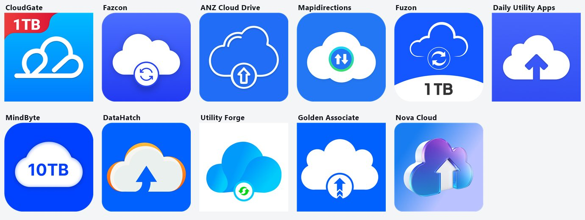
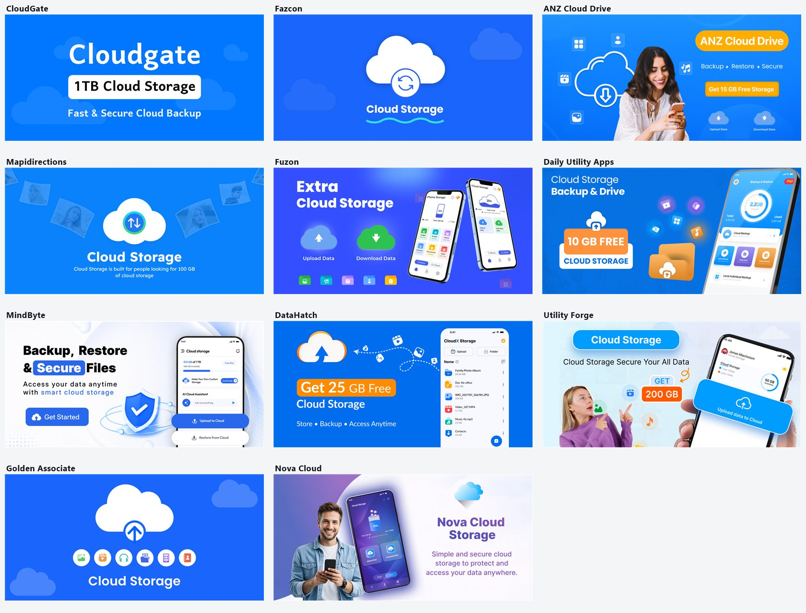
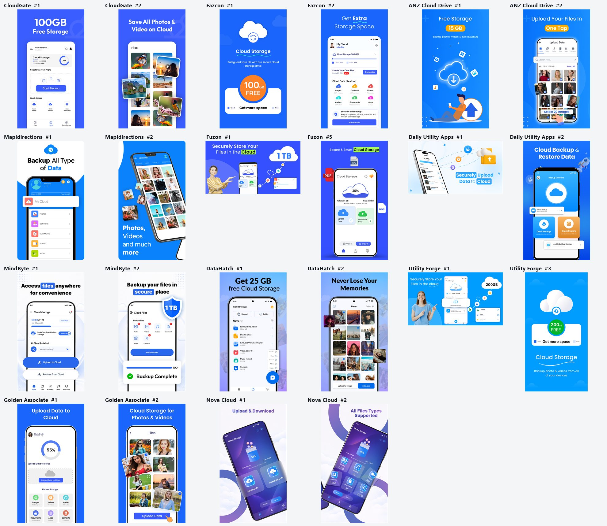

# Free 100 GB Offer

> **Generated file: do not edit by hand.** Full visible text of the tab as it renders by default, produced by `node tools/export-docs.js` on 2026-09-22.
> Live page: https://zaeem-ahmad-growth.github.io/Cloud-Storage-App/tabs/05-free-100-gb-offer/ · Source: [tabs/05-free-100-gb-offer/index.html](../../tabs/05-free-100-gb-offer/index.html) · Where each section comes from: [code map](../code-map.md#05-free-100-gb-offer)
> Controls on the page (market pickers, version switches, filters, "show more") change the view; this snapshot shows their default state. The data behind every state is in [assets/data.js](../../assets/data.js), described in the [data dictionary](../data-dictionary.md).

Google Play US · 11 competitors · pulled 22 Sep 2026

# What is actually driving installs for each competitor

Third-party tools, ad transparency records and live store data, read against the free-GB question.

The answer

## Four engines. Only one of them is the storage offer — and it is the weakest.

3 · Paid ads · MindByte, Utility Forge, Mapidirections. Confirmed running ads.

2 · Search rank · Fazcon, Fuzon. Ranking on real searches.

2 · Old install base · Daily Utility, CloudGate. Coasting, not growing.

4 · No engine · DataHatch, Nova, Golden, ANZ. Under 900 a month.

**The headline:** the three apps carrying the heaviest free-GB graphics — CloudGate (3 placements), Fuzon (3), ANZ (2) — pull **6,900**, **29,000** and **0** downloads a month. The offer is on the listing of winners and losers alike. What separates them is ad spend and keyword rank.

Per competitor

## The engine map

App · monthly downloads · Engine · What proves it

**Fazcon** · 75,000 / mo · 6.1M total

Search rank

The only one of the 11 with a real US chart position: **#81 in Productivity**, top-grossing **#82**. Sensor Tower marks it **not advertising** in the last 28 days. Holds 8 top-10 keyword ranks — more than the other ten combined. Live since Mar 2021; took until Sep 2025 to reach 5M.

**Utility Forge** · 38,000 / mo · 220K total

Paid ads

Sensor Tower flags it **newly advertising within the last 28 days**. Top countries **Kazakhstan, Indonesia, Russia** — low-cost install markets, not the US. Ratings grew **39.4% in 30 days**, the fastest in the set. Released Dec 2025, hit 100K in Jul 2026.

**MindByte** · 36,000 / mo · 660K total

Paid ads

Sensor Tower: **actively advertising**. I pulled **219 live US ad creatives** from Google's Ads Transparency Center, all video. 10K installs in Feb 2026 to 500K by Aug 2026. Earns **$60,000 a month** — the most in the set — on the worst rating (3.67).

**Fuzon** · 29,000 / mo · 540K total

Search rank

The only app besides Fazcon ranking on numbered storage searches: **#6 "100gb cloud storage"**, #7 "100gb free cloud storage", #9 "1tb free cloud storage". Ratings +18.1% in 60 days. But earns just **$1,000 a month** — it converts installs to nothing.

**Daily Utility Apps** · 7,000 / mo · 3.8M total

Old install base

Passed 1M back in **Nov 2022**. Ratings grew **0.14% in 30 days** — effectively flat. A 3.8M-install base now producing 230 a day. Its "10 GB FREE" banner is not moving anything.

**CloudGate** · 6,900 / mo · 440K total

Old install base

Top-grossing **#315** but **not ranked on any of the 94 keywords** I tracked, and no ads found. Carries the heaviest offer load in the set — 1TB icon, 1TB banner, "100GB Free Storage" screenshot — and still returns 230 a day.

**Mapidirections** · 6,600 / mo · 450K total

Paid ads

One video ad has run continuously since **Aug 2022 — 1,492 days**. Top countries Indonesia, Algeria, India. Has the **weakest offer messaging of all 11** (one line of small banner text) and the **fewest offer complaints** (6.4% of its 1–2★ vs 30–35% for the badge apps).

**DataHatch** · 850 / mo · 19K total · No engine · "Get 25 GB Free" on both banner and first screenshot. 28 installs a day, rating **3.33** — the lowest here. No rank, no ads found.

**Nova Cloud** · 560 / mo · 8.7K total · No engine · The best-looking listing in the set (3D purple, a video trailer) and **no storage offer anywhere**. Released May 2026. 19 a day. Design alone does nothing.

**Golden Associate** · 540 / mo · 3.6K total · No engine · No offer, no ads, no rank. 18 a day.

**ANZ Cloud Drive** · 0 / mo · 5.5K total

No engine

**AppBrain reports 0 downloads in the last 30 days.** Yet it runs "Get 15 GB Free Storage" on the banner *and* "Free Storage 15 GB" as screenshot 1. The clearest single disproof of the offer hypothesis in this data.

The hypothesis, tested

## Offer load against actual downloads

### Monthly downloads, coloured by engine

Squares show how many of the three prime slots — icon, banner, first screenshot — carry a free-GB offer.

Paid ads · Search rank · Old install base · No engine · Offer slot used

App · Offer · Downloads in the last 30 days

Fazcon · 75,000 · Utility Forge · 38,000 · MindByte · 36,000 · Fuzon · 29,000 · Daily Utility · 7,000 · CloudGate · 6,900 · Mapidirections · 6,600 · DataHatch · 850 · Nova Cloud · 560 · Golden · 540 · ANZ · 0

Sorted by downloads, the offer squares scatter at random. The top four average **1.75** offer slots; the bottom seven average **1.28**. Two of the four dead apps push the offer hard; the fastest riser, Utility Forge, is winning on ad spend in cheap markets rather than on its "200 GB FREE" banner.

Third-party tools

## The raw numbers, per tool

| App | AppBrain 30-day DL | Sensor Tower month DL | Sensor Tower month revenue | Sensor Tower advertising | Sensor Tower top countries | AndroidRank ratings +30d |
| --- | --- | --- | --- | --- | --- | --- |
| **Fazcon** | 75,000 | 60,000 | $40,000 | Inactive <28d | US, IN, BR | 1.2% |
| **Utility Forge** | 38,000 | 10,000 | $1,000 | New <28d | KZ, ID, RU | **39.4%** |
| **MindByte** | 36,000 | 40,000 | **$60,000** | Active | US, IN, NG | **14.8%** |
| **Fuzon** | 29,000 | 60,000 | $1,000 | not flagged | ES, ZA, GB | 8.9% |
| **Daily Utility** | 7,000 | no data | no data | no data | no data | 0.1% |
| **CloudGate** | 6,900 | 1,000 | $1,000 | not flagged | US, IN, MX | not tracked |
| **Mapidirections** | 6,600 | 1,000 | $1,000 | New <28d | ID, DZ, IN | 1.1% |
| **DataHatch** | 850 | no data | no data | no data | no data | 7.4% |
| **Nova Cloud** | 560 | 1,000 | $1,000 | not flagged | BD, TN, LB | not tracked |
| **Golden** | 540 | 1,000 | $1,000 | not flagged | — | not tracked |
| **ANZ** | **0** | 1,000 | $1,000 | not flagged | — | not tracked |

**Reading these:** Sensor Tower's free tier rounds hard — 1,000 is its floor, so treat it as "small", not literal. AppBrain's 30-day figure is the better velocity signal. AndroidRank's growth percentage counts *ratings*, not installs, so it is a proxy. Sensor Tower had no record for Daily Utility or DataHatch; AndroidRank does not track CloudGate, Nova, Golden or ANZ. Where two tools disagree, both are shown rather than averaged.

Proof · Google Ads Transparency Center

## What the paid ads actually say

These are frames from the live US video ads of the two advertisers I could identify by name. Note what leads: photo memories, a phone running out of space, backup and restore. **Not free gigabytes.** Only MindByte's newest ad opens on capacity.

Mapidirections has run its ad since Aug 2022. MindByte's ads for this app ran to 9 Sep, and from 11 Sep its spend moved to a brand-new app, "AI Cloud Storage & Backup".

I could only match **2 of the 11** developers in the Ads Transparency Center by name. The others may advertise under a personal legal name, so "not found" is not proof they do not advertise — which is why the Sensor Tower advertising column above matters.

Which features earn the installs

## Backup and restore wins the searches. Free storage wins none.

### Competitor top-10 Play search ranks, by feature family

Across 94 tracked US keywords: how many top-10 positions the 11 competitors hold in each theme.

Feature family · Top-10 ranks held

Backup & restore · 13 ranks · Cloud / drive · 3 ranks · Offer / free GB · 2 ranks · Photos & videos · 1 rank · Security / vault · 0 ranks

| Live search, US | Which competitors are on page 1 | Who owns the top |
| --- | --- | --- |
| **cloud storage drive backup** | Utility Forge #1 MindByte #3 | This competitor set |
| **cloud storage backup and restore** | Fazcon #8 Daily Utility #14 | Mixed |
| 100gb free cloud storage | Fazcon #4 Fuzon #7 | Dropbox, MobiDrive |
| 100gb cloud storage | Fuzon #6 Fazcon #8 | Dropbox, MEGA |
| free cloud storage | none of the 11 | Dropbox, TeraBox, OneDrive, MEGA |
| cloud storage free | none of the 11 | Dropbox, TeraBox, OneDrive |
| 1tb cloud storage | none of the 11 | TeraBox, Dropbox, OneDrive |
| free storage | none of the 11 | Dropbox, TeraBox, Google One |
| unlimited cloud storage | none of the 11 | Unlim, Dropbox, pCloud |
| extra storage | none of the 11 | Self-storage and cleaner apps |

Generic free-storage searches belong entirely to Dropbox, TeraBox, OneDrive and MEGA. Your competitors only break through when a **specific number** is in the query — and they win that with words in their title and description, never with a badge drawn on an image. **Security and vault keywords returned zero top-10 ranks for any of the 11**, which is open ground for your app's name.

Where the money is

## Revenue per download tells you what the offer is really for

### Monthly revenue per download, Sensor Tower worldwide

App · Revenue ÷ downloads

MindByte · $1.50 · Fazcon · $0.67 · Fuzon · $0.02

MindByte earns roughly **75× more per download than Fuzon** from a similar install volume. Both advertise a huge free tier. The difference is what happens after install: MindByte funnels hard into subscriptions and absorbs a 3.67 rating and a wave of "it said 100GB, I got 25GB" reviews. Fuzon gives space away and earns almost nothing. **The free-GB number is a monetisation funnel, not an acquisition channel.**

Source graphics

## The listings these scores were read from

**Open the icons, banners and first screenshots of all 11**

**Icons.** Three carry a capacity number. None writes the word "free" — Google Play's metadata policy forbids price and promotional text on icons.

**Banners.** Seven of eleven carry an offer. ANZ's "Get 15 GB Free Storage" sits on an app with zero downloads last month.

**Opening screenshots.** The number after # is the position in the listing carousel.

Cloud Storage: Secure Vault · 600 installs

## What this means for your app

| Decision | Do | Because |
| --- | --- | --- |
| **Your growth engine** | Paid ads first, rank second. | Every app above 29,000 a month is either advertising now or has held rank for years. At 600 installs you have neither. Nothing in your listing graphics can substitute. |
| **Icon** | No GB badge. | The three badge apps hold the worst ratings here (3.67, 3.95, 3.9) and 30–35% of their 1–2★ reviews are offer complaints. Play policy bars promotional text on icons anyway. |
| **Screenshot 1** | Backup & restore as the headline, "100 GB free" as support. | Backup-and-restore terms hold **13 of the 18** competitor top-10 ranks. Free-storage terms hold two. The ad creatives that are actually running lead the same way. |
| **Title & description** | Write "100GB", "free cloud storage", "backup and restore" as text. | Search reads words, not images. That is exactly how Fazcon and Fuzon got their offer-keyword ranks. |
| **Your opening** | Target security and vault terms. | **Zero** of the 11 hold a top-10 rank on any vault, secure or private keyword, and your app is already named for it. |
| **The 100 GB promise** | Only show what a user really gets free. | Reviewers report real free tiers of ~2GB (Mapidirections), 10GB (Fuzon) and 25GB (MindByte) behind "unlimited", "1TB" and "100GB" artwork. If your 100 GB is genuinely free, that is a claim they cannot honestly match. |

### To get your own number instead of an estimate

1. **Google Ads, ~2 weeks.** Run "100 GB Free Cloud Storage" against "Backup & Restore Photos" as competing assets in one ad group, then read installs per asset in the asset report.
2. **Play Console store listing experiment.** Screenshots only — A is your current set, B leads screenshot 1 with backup & restore. Play reports the lift with a confidence range.
3. **Leave the icon out of both tests.** Nothing in this data justifies the risk.

**One conflict worth knowing:** Play's own exact install counter for MindByte read 655,989 on both 15 and 21 Sep — no movement. But Sensor Tower, AppBrain and AndroidRank all independently show it growing fast and advertising actively. The frozen counter is almost certainly a stale cache on Google's side, so I have gone with the three tools over the single reading. Figures here are a 22 Sep 2026 snapshot; brackets, ratings and graphics change.
