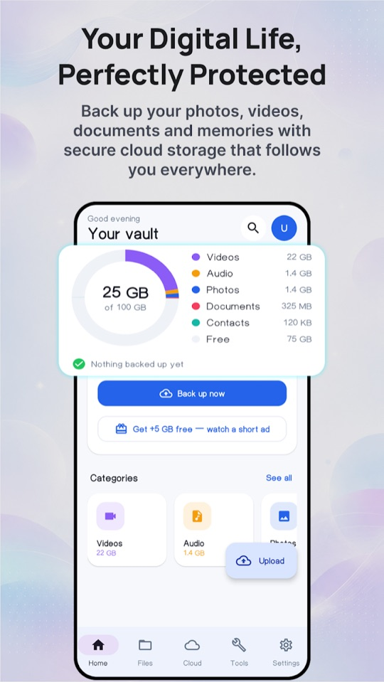
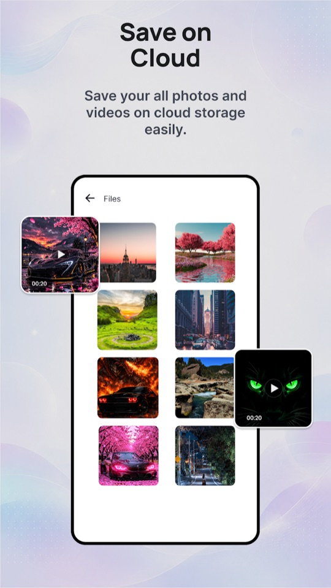
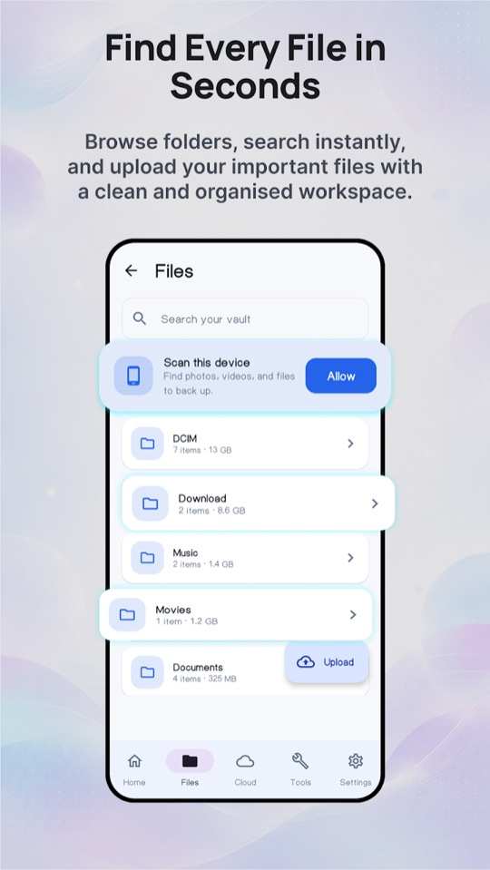
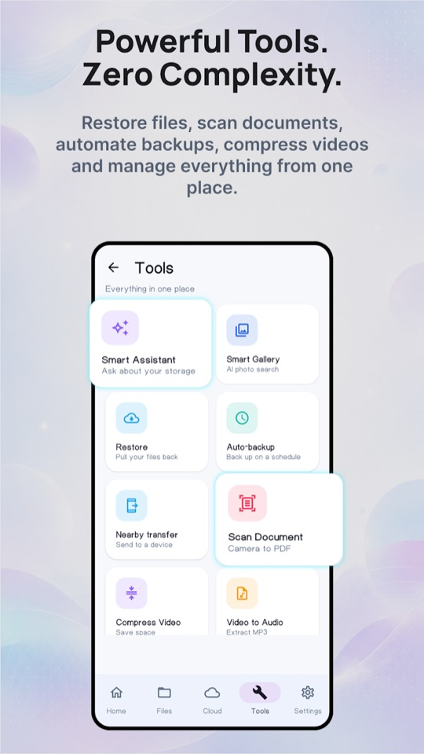
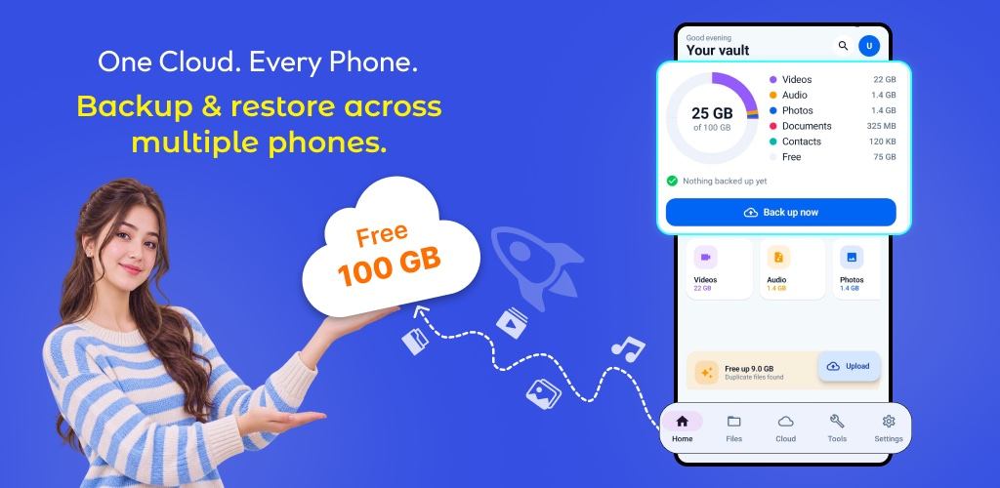

# Cloud Storage

> **Generated file: do not edit by hand.** Full visible text of the tab as it renders by default, produced by `node tools/export-docs.js`, which GitHub runs after every push.
> Live page: https://zaeem-ahmad-growth.github.io/Cloud-Storage-App/tabs/07-cloud-storage/ · Source: [tabs/07-cloud-storage/index.html](../../tabs/07-cloud-storage/index.html) · Where each section comes from: [code map](../code-map.md#07-cloud-storage)
> Controls on the page (market pickers, version switches, filters, "show more") change the view; this snapshot shows their default state. The data behind every state is in [assets/data.js](../../assets/data.js), described in the [data dictionary](../data-dictionary.md).

Android app · Product dossier · com.softwarealliance.cloudvault

# Cloud Storage: Secure Vault

Back up photos, videos, audio, documents, contacts and WhatsApp media to the cloud, encrypted on the phone first, then restore them on any phone by signing in.

QA score · 23 Sep 2026 · **94** / 100 · Started at 84 · 14 of 16 fixed, 2 scheduled for the next update · Target line at 90

Version · **0.2.6 (17)** · Runs on · **Android 7.0+** · Languages · **18** · Tools · **14** · Release AAB · **33.9 MB**

### Back up

- Photos, videos, audio, documents, contacts and WhatsApp media
- Runs as a foreground data-sync job, keeps going with the screen off
- Auto-backup on a schedule, Wi-Fi only switch

### Restore anywhere

- Sign in on a new phone and the files decrypt on their own (key recovery at sign-in since 0.2.1)
- Restore by category, share a file by link

### Tools

- Scanner, video compressor, video to audio, photo editor, duplicate cleaner, nearby transfer
- Local tools run on the phone and stay open without an account

### Encryption and guest mode

- AES-256-GCM on the phone before upload; biometric app lock
- Guest mode (since 0.2.4) opens the local tools without an account

### The Tools tab, as it ships

14 tiles

Smart Assistant · Ask about your storage

Smart Gallery · AI photo search

Restore · Pull your files back

Auto-backup · Back up on a schedule

Nearby transfer · Send to a device

Scan Document · Camera to PDF

Compress Video · Save space

Video to Audio · Extract MP3

Photo Editor · Crop & filter

Clean Duplicates · Find & remove copies

Share Link · Send a file

Trash · Recently deleted

WhatsApp Backup · Save chat media

Contacts Backup · Back up & restore

Names and subtitles are the English strings in the app. In guest mode the cloud tiles (Restore, Auto-backup, WhatsApp, Contacts, Share Link, Trash, Smart Assistant) ask the user to create an account; the rest stay open.

Spec

## What ships inside the build

From the build configuration, manifest and resources of the current release branch.

Identity

- **Play title**: Cloud Storage: Secure Vault
- **Draft title**: Cloud Backup: Photo Storage (7 to 11 Sep reports)
- **In-app name**: Cloud Vault (launcher, splash, paywall)
- **Package**: com.softwarealliance.cloudvault
- **Version**: versionName 0.2.6 · versionCode 17
- **Developer**: Cell Cave · on Play since 8 Sep 2026

Platform

- **minSdk**: 24 · Android 7.0
- **target / compile**: 36 / 36 (Play's floor from 31 Aug 2026)
- **UI**: Kotlin 1.9.22, Jetpack Compose (BOM 2024.02.00), Material 3
- **Build**: Android Gradle Plugin 8.6.1, Gradle 8.7, Java 17 · release is R8-minified with resource shrinking
- **Backend**: The cloud backend: email and Google sign-in, file storage through short-lived signed links, and an API
- **Languages in the AAB**: Every language ships in every install (language split turned off, publisher round 17)

Key libraries

- **Google Mobile Ads**: 22.6.0 · UMP consent 2.2.0
- **Play Billing**: 8.0.0
- **Firebase BoM**: 32.7.0 · Analytics, Remote Config, Crashlytics, Messaging
- **WorkManager**: 2.9.0 · backups and schedules
- **CameraX**: 1.4.2 · document scanner
- **ML Kit**: image labeling 17.0.9 · Smart Gallery
- **Media**: Media3 ExoPlayer 1.2.1 · Coil 2.5.0 (images, video frames)
- **Network**: OkHttp 4.12.0 · Custom Tabs 1.8.0 (Google sign-in)
- **Other**: Nearby 19.3.0 · ZXing 3.5.3 · Biometric 1.1.0 · DataStore 1.0.0

Permissions · 27 declared in the manifest

INTERNET

ACCESS_NETWORK_STATE

ACCESS_WIFI_STATE

CHANGE_WIFI_STATE

CHANGE_NETWORK_STATE

BLUETOOTH ≤30

BLUETOOTH_ADMIN ≤30

BLUETOOTH_ADVERTISE

BLUETOOTH_CONNECT

BLUETOOTH_SCAN

NEARBY_WIFI_DEVICES

ACCESS_COARSE_LOCATION ≤32

ACCESS_FINE_LOCATION ≤32

READ_MEDIA_IMAGES

READ_MEDIA_VIDEO

READ_MEDIA_AUDIO

READ_MEDIA_VISUAL_USER_SELECTED

READ_EXTERNAL_STORAGE ≤32

READ_CONTACTS

WRITE_CONTACTS

CAMERA

USE_BIOMETRIC

POST_NOTIFICATIONS

FOREGROUND_SERVICE

FOREGROUND_SERVICE_DATA_SYNC

WAKE_LOCK

REQUEST_IGNORE_BATTERY_OPTIMIZATIONS

≤30 and ≤32 mark permissions requested only up to that Android API level. Bluetooth, Wi-Fi and the old location grants exist only for Nearby transfer and are declared as not used for location where Android allows. Contacts are asked for only inside the Contacts flow. Permissions added by libraries at merge time (for example the ads SDK) are not counted here.

App languages · 18

English · العربية · Arabic · বাংলা · Bengali · Deutsch · Español · Français · हिन्दी · Hindi · Bahasa Indonesia · Italiano · 日本語 · Japanese · 한국어 · Korean · Português · Русский · Russian · ไทย · Thai · Türkçe · اردو · Urdu · Tiếng Việt · 中文 · Chinese

English plus 17 locales: ar bn de es fr hi in it ja ko pt ru th tr ur vi zh. Every build round runs a placeholder and plural checker over all 18; it passed for 0.2.6.

Market research

## The most complete build in a crowded search

The 11 competitors this site already tracks. Installs and ratings from Google Play US on 15 Sep 2026, feature scores from the Features Comparison tab, monthly downloads and growth engine from the Free 100 GB Offer tab (22 Sep).

| App | Developer | Installs | Rating | Features | Downloads / mo | Growth engine |
| --- | --- | --- | --- | --- | --- | --- |
| [Cloud Storage: Cloud Drive App](https://play.google.com/store/apps/details?id=com.fazconapps.backup.restore.data) | Fazcon Apps | 6.1M | 4.1 15K ratings | 5.5 / 14 | 75,000 | Search rank |
| [Cloud Storage Backup & Drive](https://play.google.com/store/apps/details?id=com.backup.and.restore.all.apps.photo.backup) | Daily Utility Apps | 3.8M | 4.1 10K ratings | 3.5 / 14 | 7,000 | Old install base |
| [Cloud Storage Drive Backup app](https://play.google.com/store/apps/details?id=com.cloudstorage.backupapp.storagespace.mycloud.clouldbackup) | MindByte Studios | 656K | 3.7 1.9K ratings | 3 / 14 | 36,000 | Paid ads |
| [Cloud Storage & Cloud Drive](https://play.google.com/store/apps/details?id=com.cloudstorageapp.cloudbackup.storagespace.databackup) | Fuzon Apps | 542K | 4.1 1.2K ratings · no ads | 5 / 14 | 29,000 | Search rank |
| [Cloud Backup : Cloud Storage](https://play.google.com/store/apps/details?id=com.backup.restore.clould.backup.freecloud.storage) | Mapidirections Studios | 452K | 4.3 1.5K ratings | 2 / 14 | 6,600 | Paid ads |
| [Cloudgate: Cloud Storage Drive](https://play.google.com/store/apps/details?id=com.cloudgate.cloudstorage) | CloudGate Technologies | 441K | 3.9 1.9K ratings | 5.5 / 14 | 6,900 | Old install base |
| [Cloud Storage: Drive Backup](https://play.google.com/store/apps/details?id=com.cloud.storage.extrastorage.gbsfreespace) | Utility Forge | 211K | 4.4 2.6K ratings | 2 / 14 | 38,000 | Paid ads |
| [Cloud Storage Drive: DataHatch](https://play.google.com/store/apps/details?id=com.datahatch.cloud.storage.drive.data.backup) | Appseen Studio | ~20K | 3.6 77 ratings | 2 / 14 | 850 | None |
| [Nova Cloud: Storage & Backup](https://play.google.com/store/apps/details?id=com.securebackup.cloudstorage.drivebackup.filestorage) | Nova Apps Studios | 8.7K | not enough ratings to show | 1 / 14 | 560 | None |
| [ANZ Cloud Drive: Cloud Storage](https://play.google.com/store/apps/details?id=com.filestorage.cloudbackup.clouddrive.photosbackup.storagespace) | Auzi Apps Studios | 5.5K | not returned | 4.5 / 14 | 0 | None |
| [Cloud Storage App Drive Backup](https://play.google.com/store/apps/details?id=com.cloudstorage.cloudbackup.storagespaceapp) | Golden Associate | 3.6K | not enough ratings to show | 2 / 14 | 540 | None |
| [**Cloud Storage: Secure Vault**](https://play.google.com/store/apps/details?id=com.softwarealliance.cloudvault) our live listing | Cell Cave | 600 | none yet | **14 / 14** | not measured | Not ranking yet |

Our install count is the 22 Sep figure from the Free 100 GB Offer tab. The live US listing shows in-app purchases of $9.99 to $49.99 per item (15 Sep).

Where we are stronger

- Files are encrypted on the phone with AES-256-GCM before they leave it. The Features Comparison audit found 6 of 11 competitors with a basic version and none with a full one.
- WhatsApp media backup and contacts backup and restore are built in. Contacts are encrypted on the device too.
- The local tools (scanner, compressor, video to audio, photo editor, duplicates, nearby transfer) run on the phone and stay open without an account.
- Guest mode lets a new user look around with their real files before signing up. It is behind a Remote Config switch, so it can be turned off without a release.
- 18 app languages, including Urdu and Arabic.

Where we are weaker

- Young listing: 600 installs and no ratings, against 3.6K to 6.1M installs for the set.
- Android only. No desktop or web client for reaching the files from a computer.
- Contacts are a one-shot backup and restore, not a live sync.
- Premium tiers on this page follow the app's Play products; the Features Comparison tab lists a different tier set, to be reconciled with the live Play Console.

Play policies that apply

- [User Data](https://support.google.com/googleplay/android-developer/answer/10144311): the Data safety form and the privacy policy must match what the app collects, including contacts, media and the key recovery copy held by the service.
- [Ads](https://support.google.com/googleplay/android-developer/answer/9857753): 46 placements are available; any that is switched on must not cover controls users need.
- [Deceptive behavior](https://support.google.com/googleplay/android-developer/answer/9888077): storage claims in the listing (100 GB free) have to match the quota the app really grants.
- [Subscriptions](https://support.google.com/googleplay/android-developer/answer/9900533): the paywall must show the price, the billing period and the Terms and Privacy links on the screen that takes payment.

Versions & APK

## From the first commit to 0.2.6

Dates are the commits in the app repository that set each version, and our build notes.

1. 07 Sep 2026 · 0.2.6 code 17 · current · Guest Home shows the phone's media as "on this device", "Backed up" line per account, the Google sign-in redirect returns to the running app, delete account treats an already-deleted user as success, sign-in error line centred.
2. 04 Sep 2026 · 0.2.5 code 16 · Guest mode shows real files instead of the sample library, Back fixes around sign-in, a retry message when the cloud usage read fails, the publisher's new cloud icon. Guest mode became session-only the same day.
3. 03 Sep 2026 · 0.2.4 code 15 · Guest mode behind Remote Config, banners sized to their slot, sign-in telemetry, Google sign-in pinned to a browser with working Custom Tabs.
4. 03 Sep 2026 · 0.2.3 code 14 · Moved to the publisher's new AdMob account. Ad unit ids come from Remote Config by build number, so older installs kept serving.
5. 26 Aug 2026 · 0.2.2 code 13 · Quota follows the purchased plan, notification controls (pause, resume, cancel), manual recovery passphrase removed.
6. 25 Aug 2026 · 0.2.1 code 12 · Automatic key recovery on any phone, push notifications, Crashlytics and the full analytics event map.
7. 24 Aug 2026 · 0.1.7 to 0.1.9 code 8 to 10 · Publisher round 17: ad preload and expiry rules, every language delivered on Play installs, Smart Gallery fixes.
8. 20 to 21 Aug · 0.1.2 to 0.1.6 code 3 to 7 · Per-tier limits and reward caps, restore and vault listing fixes, a test-ads build that follows the real ad switches, QA round 16.
9. 17 Aug 2026 · 0.1.1 code 2 · Email verification at sign-up, Google account deletion, free-tier quota leak, Play Billing 8. Play then had 0.1.0 (code 1).
10. 15 Jun 2026 · MVP first commit · Client and domain core running on mocks; the live cloud backend landed the same day.

Latest build · Play upload

CloudVault-0.2.6-vc17-release.aab

- **Size**: 33.9 MB · 33,904,602 bytes
- **Variant**: release · signed with the upload key · R8 minified · production ads, test flag off
- **Built**: 7 Sep 2026, 11:04
- **Checked**: aapt2 and bundletool: version 0.2.6, sign-in redirect launch mode, correct ads app id for the build

MD5

35eb9fe3bab621bc3ae7b7a968c50ceb

QA build

CloudVault-0.2.6-vc17-TEST-ADS.apk

- **Size**: 52.3 MB · 52,332,041 bytes
- **Ads**: Google test app id and test units only; every ad carries the "Test Ad" label. Never for Play.

MD5

3dfacb10cbdf21841fcf55312ad14965

**Not in this repository:** the AAB and APK files themselves. The site is public, so only names, sizes and hashes are listed here.

Earlier Play uploads · MD5

- **0.2.5 (16) · 56971029…**: 04 Sep 2026
- **0.2.4 (15) · c5537f51…**: 03 Sep 2026
- **0.2.3 (14) · 0fcfa2ae…**: 03 Sep 2026
- **0.2.2 (13) · d575d400…**: 26 Aug 2026
- **0.2.1 (12) · 19bd1d04…**: 25 Aug 2026
- **0.1.9 (10) · 20047eb5…**: 24 Aug 2026

Monetization

## 46 ad slots, each with its own switch

From the app's monetization code and its Remote Config key guide. Which slots are switched on in production is set in Firebase and was not read for this page.

ADS_ENABLED **build flag**

<placement>_control **default false**

<placement>_id **Remote Config**

guest_mode_control **Remote Config**

Each placement has an on/off key and a unit id key, 92 keys in all. With every _control off, no ad shows; turning one on needs no release. Premium removes ads. Consent runs through Google's UMP form.

| Format | Placements | Where | Rules |
| --- | --- | --- | --- |
| **App open** | 2 | Cold start (splash) and return from background | Only the cold-start one loads at launch; the resume ad keeps a Remote Config gap between ads (45 s by default) |
| **Banner** | 10 | Splash, language, onboarding, Home, and during each upload by type (photo, video, audio, document, contact, app) | Adaptive size requested for the exact width of the slot since 0.2.4, so it cannot be clipped |
| **MREC** | 15 | Language, onboarding, Home, while uploading and while downloading each file type | Home MREC kept clear of the Upload button (46 px gap measured, 0.2.4) |
| **Interstitial** | 18 | Language and onboarding, Cloud and Files tabs, upload buttons by type, downloads by type, backup finished | Frequency caps checked when the ad loads; preloads wait for the moment of intent, not app launch (0.1.9) |
| **Rewarded** | 1 | "Get +5 GB free, watch a short ad" on Home | 5 GB per completed view by default; GB per ad, lifetime cap and views per day are Remote Config keys; the bonus is cleared on sign-out |

Counted from the app's placement list: 2 + 10 + 15 + 18 + 1 = 46 keys. Placements that belong to one file type share a format, so turning on "uploading banner" means six keys, one per type.

Free tier and Premium

Free · **100 GB** · default quota · 1 TB yearly · seen 17 Aug · **Rs 13,900** · 1tb_yearly_plan

Six Play products: 100gb, 200gb and 1tb, each monthly and yearly. Prices are set in Play Console, not in the code. On 17 Aug the paywall showed six tiers from Rs 2,750 (monthly) to Rs 13,900 (1 TB a year). A plan adds to the free space: the 200 GB plan gives 300 GB in total (0.2.2). The paywall promises three things: more storage, no ads, priority restore.

The Features Comparison tab lists a different tier set (Plus 250 GB, Pro 500 GB and Family 1 TB at Rs 5,600, Rs 8,400 and Rs 19,600 a year), to be reconciled with the live Play Console.

**Rewarded storage**"Get +5 GB free" under Back up now

Screenshots

## What the Play listing shows

The four phone screenshots on the live listing, built from real app screens. The device captures from the 7 Sep QA round were kept in a temporary folder that no longer exists, so they are not on this page; the next device round should save a set here.

### Play listing

4 of 8 slots used

**1 · Home**Storage ring by category, Back up now, rewarded +5 GB

**2 · Save on Cloud**Photo and video grid

**3 · Files**Device folders, search, scan prompt

**4 · Tools**The first 8 of 14 tiles

Checked on a device on 7 Sep (from the build notes, no pictures kept)

- Signed-in Home: ring "5.3 GB of 100 GB", matching 567 objects and 5,314,394,494 bytes read from the cloud.
- Guest Home: ring "4.1 GB on this device", no Free row, status "Nothing backed up yet. Sign up to back these up."
- Guest Files: the phone's real folders (DCIM, Download, Movies, Music, Pictures).
- Back on signed-in Home opens "Exit Cloud Vault?"; Back on guest Home returns to sign-in; Back on sign-in shows a toast, a second Back exits.
- Delete account for a user already removed on the server: receipt "Your account and data are deleted", lands on sign-in.
- Sign-in error line, "Forgot password?" and "Continue without an account" all centred at x = 540 on the 1080 px screen.

Graphics

## Brand assets and store readiness

The icon is the publisher's, added in 0.2.5 as an adaptive icon with round and themed variants; the one shown here is the live listing icon as read on 25 Sep 2026. The feature graphic and screenshots are the live listing's, from this site's listing assets.

**Play icon**

512 × 512 PNG

Meets Play spec

**Phone screenshot 1**

788 × 1400 · 4 in the set

Live

**Phone screenshot 4**

788 × 1400

4 of 8 slots

**Feature graphic**

1024 × 500

Carries "Free 100 GB"

Palette, from the icon and the app theme

Icon blue · `#0048FF` · Blue500 · photos · `#2563EB` · Blue700 · `#1E40AF` · Sky500 · `#0EA5E9` · Teal500 · contacts · `#14B8A6` · Violet500 · videos · `#8B5CF6` · Amber500 · audio · `#F59E0B` · Rose500 · documents · `#F43F5E`

Each file category keeps one colour across the storage ring, the tiles and the file list. The code still marks this palette as a placeholder for the publisher's artist. The Competitor’s Graphics tab advises keeping promo wording like "Free 100 GB" off the feature graphic.

QA history

## 14 bugs fixed, 2 improvements scheduled

Every bug from the publisher's rounds on 3, 4 and 7 Sep and our own QA, counted once. Taken from our QA build notes and the testing scorecard, with the publisher's retests from the owner's statement on 23 Sep 2026. Our checks run on a Samsung A17 (SM-A176W, Android 16).

Bugs found · **16** · Across 3 publisher rounds and our own QA, 3 to 18 Sep 2026

Fixed · **14** · All checked on a device, 4 retested by the publisher on 23 Sep

Scheduled · **2** · Improvements planned for the next update

QA score · **94 / 100** · Target 90 · started at 84

Fixed vs scheduled · all rounds · 14 fixed · 2 scheduled · Fixed 14 · Scheduled 2

| Round | What the publisher reported | Fixed in | Status |
| --- | --- | --- | --- |
| **3 Sep 2026** | Google sign-in opened a black tab on a Xiaomi phone; banner clipped in padded screens; a false "No internet" dialog for guests | 0.2.4 (15) | Fixed |
| **4 Sep 2026** | Guest dashboard showed sample data; Back from sign-in and on the sign-in screen exited the app; guest mode survived a relaunch; a 20 GB account showed 0 B | 0.2.5 (16) | Fixed |
| **7 Sep 2026** | Galaxy S7 Edge replayed onboarding after Google sign-in; delete account reported a failure; "Backed up 3 hours ago" on a new account; guest ring shown as vault usage; sign-in error line misaligned | 0.2.6 (17) | Fixed |

QA score · out of 100

Publisher round 1, 3 Sep 2026 · **84**

Round 2 fixes, 4 Sep 2026 · **97**

Round 3 fixes, 7 Sep 2026 · **94**

Publisher retests, 23 Sep 2026 · **94**

0 · 50 · 90 target · 100

How the score works: each of the 18 scored categories starts at 100 and loses 25 per open critical, 12 per high, 6 per medium, 2 per low and 4 per unrated bug, 3 per fix not yet checked on a device, and 5 per planned test that could not be run. The total is the average, capped while serious items remain: at most 69 with an open critical, 84 with an open high, 94 with an open medium, 95 with an unrated bug, 98 with an open low, and 99 until every fix is device-checked and every planned test has run. Now: average 97, capped at 94 pending two scheduled improvements in the next update (ad pacing after a full-screen ad; onboarding wording). Not scored: Load (managed backend, single-digit testers).

| Category | Score | Why not 100 |
| --- | --- | --- |
| Functional | 94 | −6 scheduled: ad pacing after a full-screen ad, next update |
| UI | 100 | no deduction |
| UX | 100 | no deduction |
| Compatibility | 100 | no deduction: A17 in our lab, S7 Edge and Xiaomi retested by the publisher |
| Installation | 95 | −5 not tested: measurement pass scheduled |
| Performance | 95 | −5 not tested: measurement pass scheduled |
| Load | n/a | managed backend, single-digit testers; no load to generate |
| Stress | 95 | −5 not tested: measurement pass scheduled |
| Network | 95 | −5 not tested: measurement pass scheduled |
| Security | 94 | −6 scheduled: onboarding wording aligned with the privacy policy, next update |
| Usability | 100 | no deduction |
| Regression | 100 | no deduction |
| Smoke | 100 | no deduction |
| Sanity | 100 | no deduction |
| Interrupt | 95 | −5 not tested: measurement pass scheduled |
| Battery | 95 | −5 not tested: measurement pass scheduled |
| Permission | 95 | −5 not tested: measurement pass scheduled |
| Localization | 100 | no deduction |
| Accessibility | 95 | −5 not tested: measurement pass scheduled |

### Verification coverage, 0.2.6 (17)

10 verified · 1 by publisher · 4 in the 23 Sep pass · 1 not measured

| Test type | What was checked | Evidence | Status |
| --- | --- | --- | --- |
| **Functional** | 1,136 unit tests; device checks of signed-in Home, guest Home, guest Files, guest "Back up now" and the sign-in screen | All unit tests pass, lint 0 errors; every device check passed on the A17 (7 Sep notes) | Verified |
| **Installation, update** | Test-ads build installed over 0.2.5 (16) with app data kept | Still signed in after the update, Home reads "5.3 GB backed up" | Verified |
| **Installation, fresh** | Fresh install of 0.2.6 | Scheduled: [measurement pass](#qa-score) | Measurement pass |
| **Compatibility, our lab** | Samsung A17 (SM-A176W, Android 16) | Every device check in this table ran on it | Verified |
| **Compatibility, publisher** | Samsung Galaxy S7 Edge and a Xiaomi phone: Google sign-in and delete account | Publisher retests completed and passed (owner statement, 23 Sep 2026) | Verified by publisher |
| **Sign-in and auth** | Google sign-in through the browser tab; the redirect on 0.2.5 (16) against 0.2.6 (17) | 16 created a second app screen and replayed onboarding; 17 returned to the running app with one screen; Continue with Google lands on Home | Verified |
| **Network, offline** | Custom Tab held open with the network cut during Google sign-in; delete reply lost on the network | Sign-in screen shows "Google sign-in was cancelled"; the backend log shows the S7 Edge delete succeeded at 16:22:45 PKT; 0.2.6 counts the retry's "User does not exist" reply as success | Verified |
| **Network, expired token** | 401 handling for an expired session | Scheduled: [measurement pass](#qa-score) | Not measured |
| **Interruption** | Back on every entry screen, warm relaunch from the launcher, relaunch with the process alive | "Exit Cloud Vault?" on signed-in Home, sign-in from guest Home, toast then exit on sign-in; one app screen, same process, no splash replay; process-alive relaunch lands on onboarding | Verified |
| **Data integrity** | Cloud usage ring against the backend object list | Ring "5.3 GB of 100 GB" matches the cloud backend's usage count: 567 objects, 5,314,394,494 bytes | Verified |
| **Account deletion** | Delete for a user already removed on the server (throwaway test account) | Receipt "Your account and data are deleted", lands on sign-in, relaunch does not restore the session | Verified |
| **Localization** | 18 app languages | All 18 locales pass the placeholder and plural checker | Verified |
| **Ads** | Test-ads APK on Google's test ids; release AAB on the production app id | "Test Ad" labels visible on signed-in Home on the A17; production id and test flag off confirmed in the AAB with bundletool and the build configuration | Verified |
| **Accessibility** | Font scale 1.3, unlabeled controls | Scheduled: [measurement pass](#qa-score) | Measurement pass |
| **Battery** | Drain during backup (batterystats) | Scheduled: [measurement pass](#qa-score) | Measurement pass |
| **Stress** | Large uploads, process death | Scheduled: [measurement pass](#qa-score) | Measurement pass |

From our QA build notes of 3 and 7 Sep; type names from the publisher's testing taxonomy. This table is the evidence behind the scored categories above; the 23 Sep pass also covers performance, network switching, interrupts and the permission deny path.

1. 23 Sep · Publisher retests passed, measurement pass started · S7 Edge Google sign-in, S7 Edge delete account, the Xiaomi sign-in from 3 Sep and the publisher's own account all passed (owner statement). The two fixes that only the publisher's phones could reproduce now count as device-checked. A measurement pass on the A17 covers fresh install, performance, stress, network switching, interrupts, accessibility, battery and the permission deny path. Category average 97, capped at 94 pending two improvements scheduled for the next update.
2. 07 Sep · 0.2.6 (17) handed over · Answers the four QA videos filmed that day. 1,136 unit tests pass, lint reports 0 errors, all 18 locales pass the checker, and both files were inspected with aapt2 and bundletool. Device checks on the A17 with the test-ads build installed over 0.2.5. Category average 97, capped at 94.
3. 04 Sep · 0.2.5 (16) handed over · Guest mode shows real files, Back fixes, the 0 B guard and logging, the publisher's new icon. Guest mode made session-only and guest Back routed to sign-in the same day. Nothing open; score 97, held under 99 by the planned tests and two fixes only the publisher's phones could check.
4. 03 Sep · 0.2.4 (15) handed over · Guest mode, banner width fix, Google sign-in browser pinning and telemetry. 9 of 9 guest-flow steps passed on the A17; the offline dialog found that day was fixed before handoff. Score 84 on the day the round came in, held down by the Xiaomi sign-in.
5. 03 Sep · 0.2.3 (14) and the test taxonomy · AdMob account move; new units requested and filled on the device. The publisher's 19-type testing taxonomy arrived the same day.

Publisher retests · 23 Sep 2026

- S7 Edge Google sign-in (guest, Settings, Sign in, Continue with Google, Home, then Back shows "Exit Cloud Vault?"): done, passed.
- S7 Edge delete account: done, passed.
- Xiaomi Google sign-in from 3 Sep: done, passed.
- The publisher's own account was tested. Owner statement, 23 Sep 2026.
- Guest ring shows on-device totals since 0.2.6; publisher informed that these are the phone's own files.

Cloud Storage: Secure Vault 0.2.6 (17) · compiled 23 Sep 2026 from the app repository (branch feature/contacts-ads-flow-control) and its build notes, device testing on a Samsung SM-A176W, competitor figures from the other tabs of this site (15 and 22 Sep).
